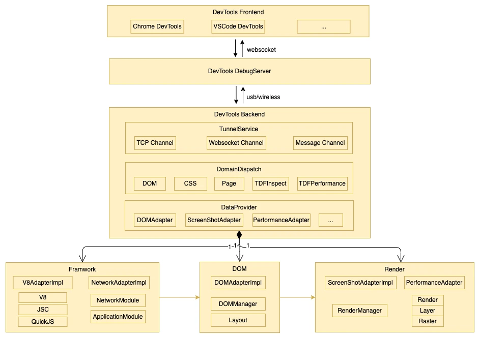

## Introduction

DevTools Backend is the Backend Service of Hippy Debugging DevTools, that mainly to establish connecting channel which support websocket and tcp, distributes debugging [CDP and TDF protocol](https://devtools.qq.com/devtools-protocol/), and collect debugging data of frameworks and Renderers.

## Getting started

### Architecture



- Tunnel Service, /tunnel dir, to handle connecting channel with frontend, which support websocket and tcp.
- Domain Dispatch, /module dir, to dispatch debugging [CDP and TDF protocol](https://devtools.qq.com/devtools-protocol/) by `Domain.Method`.
- Data Provider, /api dir, to collect debugging data of frameworks and Renderers. There has two ways to inject debugging data, one is to implement `adapter` interface which received from frontend, and the other is the notification to notify frontend.

### Unit Test

1. first install test tools: 

```shell
brew install lcov
```

2. open terminal and run:

```shell
cmake .
cd test
sh build.sh
```
