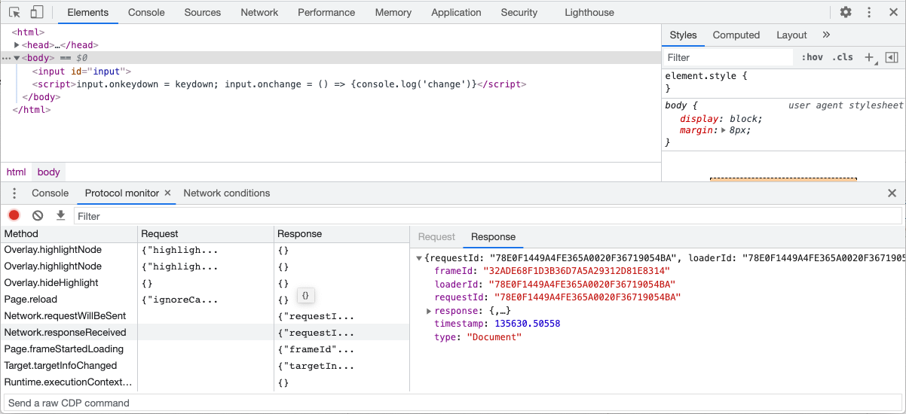

The <b>Chrome DevTools Protocol</b> allows for tools to instrument, inspect, debug and profile Chromium, Chrome and other Blink-based browsers.
Many existing projects <a href="https://github.com/ChromeDevTools/awesome-chrome-devtools">currently use</a> the protocol.
The <a href="https://developers.google.com/web/tools/chrome-devtools/">Chrome DevTools</a> uses this protocol and the team maintains its API.

Instrumentation is divided into a number of domains (DOM, Debugger, Network
etc.). Each domain defines a number of commands it supports and events it
generates. Both commands and events are serialized JSON objects of a fixed
structure.

<h3>Protocol API Docs</h3>

<b><a href="tot/">The latest (tip-of-tree) protocol (tot)</a></b> —
It <a href="https://chromium.googlesource.com/chromium/src/+log/HEAD/third_party/blink/renderer/core/inspector/browser_protocol.pdl">changes frequently</a>
and can break at any time. However it captures the full capabilities of the Protocol, whereas the stable release is a subset.
There is no backwards compatibility support guaranteed for the capabilities it introduces.

<b><a href="v8/">v8-inspector protocol (v8)</a></b> —
It is available in <a href="https://nodejs.org/en/blog/release/v6.3.0/">node 6.3+</a> and enables
<a href="https://medium.com/@paul_irish/debugging-node-js-nightlies-with-chrome-devtools-7c4a1b95ae27">debugging & profiling</a>
of Node.js apps.

<b><a href="1-3/">stable 1.3 protocol (1-3)</a></b> —
The stable release of the protocol, tagged at Chrome 64. It includes a smaller subset of the complete protocol compatibilities.

<b><a href="1-2/">stable 1.2 protocol (1-2)</a></b> —
The stable release of the protocol, tagged at Chrome 54. It includes a smaller subset of the complete protocol compatibilities.

<h3>Resources</h3>

<a href="https://github.com/aslushnikov/getting-started-with-cdp/blob/master/README.md">Getting Started with CDP</a>

The <a href="https://github.com/chromedevtools/devtools-protocol">devtools-protocol repo</a> issue tracker can also be
used for concerns with the protocol. It also hosts the canonical copy of the json files.

Useful: <a href="https://developers.google.com/web/updates/2017/04/headless-chrome">Getting Started with Headless Chrome</a>
and the <a href="https://chromium.googlesource.com/chromium/src/+/lkgr/headless/README.md">Headless Chromium readme</a>.

The <a href="https://github.com/cyrus-and/chrome-remote-interface/">chrome-remote-interface</a> node module is recommended,
and its <a href="https://github.com/cyrus-and/chrome-remote-interface/wiki">wiki</a> and
<a href="https://github.com/cyrus-and/chrome-remote-interface/issues?utf8=%E2%9C%93&q=is%3Aissue%20">issue tracker</a> are full of useful recipes.

The <a href="https://github.com/ChromeDevTools/awesome-chrome-devtools#chrome-devtools-protocol">awesome-chrome-devtools</a> page links to many of the tools in the protocol ecosystem, including protocol API libraries in JavaScript, TypeScript, Python, Java, and Go.

Consider subscribing to the <a href="https://groups.google.com/d/forum/chrome-debugging-protocol">chrome-debugging-protocol</a> mailing list.

<h3 id="remote">Basics: Using DevTools as protocol client</h3>

The Developer Tools front-end can attach to a remotely running Chrome instance for debugging.
For this scenario to work, you should start your <i>host</i> Chrome instance with the remote-debugging-port
command line switch:

<pre class="summary">chrome.exe --remote-debugging-port=9222</pre>

Then you can start a separate <i>client</i> Chrome instance, using a distinct user profile:

<pre class="summary">chrome.exe --user-data-dir=&lt;some directory&gt;</pre>

Now you can navigate to the given port from your <i>client</i> and attach to
any of the discovered tabs for debugging: <a href="http://localhost:9222">http://localhost:9222</a>

You will find the Developer Tools interface identical to the embedded one and here is why:

<ul>
  <li>When you navigate your <i>client</i> browser to the remote's Chrome port,
    Developer Tools front-end is being served from the <i>host</i> Chrome
    as a Web Application from the Web Server.
  </li>
  <li>It fetches HTML, JavaScript and CSS files over HTTP
  </li>
  <li>Once loaded, Developer Tools establishes a Web Socket connection to its
    host and starts exchanging JSON messages with it.
  </li>
</ul>

In this scenario, you can substitute Developer Tools front-end with your
own implementation. Instead of navigating to the HTML page at
http://localhost:9222, your application can discover available
pages by requesting: <a href="http://localhost:9222/json">http://localhost:9222/json</a>
and getting a JSON object with information about inspectable pages along
with the WebSocket addresses that you could use in order to start
instrumenting them. See the <a href="#endpoints">HTTP Endpoints</a> section below for more.

<h3 id="monitor">Listening to the protocol</h3>

This is especially handy to understand how the DevTools frontend makes use of the protocol.
You can view all requests/responses and methods as they happen.

<figure class="screenshot">
  
</figure>

Click the gear icon in the top-right of the DevTools to open the <i>Settings</i> panel.
Select <i>Experiments</i> on the left of settings. Turn on "Protocol Monitor", then close and reopen DevTools.
Now click the ⋮ menu icon, choose <i>More Tools</i> and then select <i>Protocol monitor</i>.

You can also issue your own commands using Protocol Monitor (verion 92.0.4497.0+). If the command does not require any parameters,
type the command into the prompt at the bottom of the Protocol Monitor panel and press Enter, for example, 
<code>Page.captureScreenshot</code>. If the command requires parameters, provide them as JSON, for example,
<code>{"command":"Page.captureScreenshot","parameters":{"format": "jpeg"}}</code>.

Alternatively, you can execute commands from the DevTools console. First, <a href="https://stackoverflow.com/a/12291163/89484">open devtools-on-devtools</a>,
then within the inner DevTools window, use <code>Main.MainImpl.sendOverProtocol()</code> in the console:

<pre>let Main = await import('./entrypoints/main/main.js'); // or './main/main.js' depending on the browser version
await Main.MainImpl.sendOverProtocol('Emulation.setDeviceMetricsOverride', {
  mobile: true,
  width: 412,
  height: 732,
  deviceScaleFactor: 2.625,
});

const data = await Main.MainImpl.sendOverProtocol("Page.captureScreenshot");</pre>

<h3 id="extension">DevTools protocol via Chrome extension</h3>

To allow chrome extensions to interact with the protocol, we introduced
<a href="https://developer.chrome.com/extensions/debugger/">chrome.debugger</a>
extension API that exposes this JSON message
transport interface. As a result, you can not only attach to the remotely
running Chrome instance, but also instrument it from its own extension.

Chrome Debugger Extension API provides a higher level API where command
domain, name and body are provided explicitly in the <code>sendCommand</code>
call. This API hides request ids and handles binding of the request with its
response, hence allowing <code>sendCommand</code> to report result in the
callback function call. One can also use this API in combination with the other
Extension APIs.

If you are developing a Web-based IDE, you should implement an extension that
exposes debugging capabilities to your page and your IDE will be able to open
pages with the target application, set breakpoints there, evaluate expressions
in console, live edit JavaScript and CSS, display live DOM, network interaction
and any other aspect that Developer Tools is instrumenting today.

Opening embedded Developer Tools will <a href="#simultaneous">terminate</a> the
remote connection and thus detach the extension.

<h3 id="faq">Frequently Asked Questions</h3>

<h4 id="how-is-the-protocol-defined">How is the protocol defined?</h4>

The canonical protocol definitions live in the Chromium source tree:
(<a href="https://cs.chromium.org/chromium/src/third_party/blink/public/devtools_protocol/browser_protocol.pdl">browser_protocol.pdl</a>
and <a href="https://cs.chromium.org/chromium/src/v8/include/js_protocol.pdl">js_protocol.pdl</a>).
They are maintained manually by the DevTools engineering team. The declarative protocol definitions are used across tools;
for instance, a binding layer is created within Chromium for the Chrome DevTools to interact with,
and separately bindings generated for
<a href="https://chromium.googlesource.com/chromium/src/+/lkgr/headless/README.md#client_devtools-api">Chrome Headless’s C++ interface</a>.

<h4 id="json">Can I get the protocol as JSON?</h4>

These canonical .pdl files are mirrored on GitHub <a href="https://github.com/ChromeDevTools/devtools-protocol/">in the devtools-protocol repo</a>
where JSON versions, TypeScript definitions and closure typedefs are generated. Most tools rely on
<a href="https://github.com/ChromeDevTools/devtools-protocol/tree/master/json">these JSON versions</a>.

Also, if you've set <code>--remote-debugging-port=9222</code> with Chrome, the complete protocol version it speaks
is available at <code>localhost:9222/json/protocol</code>.

<h4 id="how-do-i-access-the-browser-target">How do I access the browser target?</h4>

The endpoint is exposed as <code>webSocketDebuggerUrl</code> in <code>/json/version</code>.
Note the <code>browser</code> in the URL, rather than <code>page</code>.
If Chrome was launched with <code>--remote-debugging-port=0</code> and chose an open port,
the browser endpoint is written to both stderr and the <code>DevToolsActivePort</code> file in browser profile folder.

<h4 id="simultaneous">Does the protocol support multiple simultaneous clients?</h4>

Chrome 63 introduced support for multiple clients. See
<a href="https://developers.google.com/web/updates/2017/10/devtools-release-notes#multi-client">this article</a> for details.

Upon disconnection, the outgoing client will receive a <code>detached</code> event.
For example: <code>{"method":"Inspector.detached","params":{"reason":"replaced_with_devtools"&#125;}</code>.
View the <a href="https://code.google.com/p/chromium/codesearch#chromium/src/out/Debug/gen/chrome/common/extensions/api/debugger.cc&q=file:debugger.cc%20Reason%20ParseReason&sq=package:chromium&type=cs&">enum of
possible reasons.</a>
(For reference: the <a href="https://chromiumcodereview.appspot.com/11361034/">original patch</a>).
After disconnection, some apps have chosen to pause their state and offer a reconnect button.

<h3 id="endpoints">HTTP Endpoints</h3>

If started with a remote-debugging-port, these HTTP endpoints are available on the same port.
(<a href="https://cs.chromium.org/search/?q=f:devtools_http_handler.cc+%22command+%3D%3D+%22&amp;sq=package:chromium&amp;type=cs">Chromium implementation</a>)

<h4 id="get-jsonversion">GET <code>/json/version</code></h4>

Browser version metadata

<pre class="sourceCode js">
{
    "Browser": "Chrome/72.0.3601.0",
    "Protocol-Version": "1.3",
    "User-Agent": "Mozilla/5.0 (Macintosh; Intel Mac OS X 10_13_6) AppleWebKit/537.36 (KHTML, like Gecko) Chrome/72.0.3601.0 Safari/537.36",
    "V8-Version": "7.2.233",
    "WebKit-Version": "537.36 (@cfede9db1d154de0468cb0538479f34c0755a0f4)",
    "webSocketDebuggerUrl": "ws://localhost:9222/devtools/browser/b0b8a4fb-bb17-4359-9533-a8d9f3908bd8"
}</pre>

<h4 id="get-json-or-jsonlist">GET <code>/json</code> or <code>/json/list</code></h4>

A list of all available websocket targets.
<pre class="sourceCode js">
[ {
  "description": "",
  "devtoolsFrontendUrl": "/devtools/inspector.html?ws=localhost:9222/devtools/page/DAB7FB6187B554E10B0BD18821265734",
  "id": "DAB7FB6187B554E10B0BD18821265734",
  "title": "Yahoo",
  "type": "page",
  "url": "https://www.yahoo.com/",
  "webSocketDebuggerUrl": "ws://localhost:9222/devtools/page/DAB7FB6187B554E10B0BD18821265734"
} ]</pre>

<h4 id="get-jsonprotocol">GET <code>/json/protocol/</code></h4>

The current devtools protocol, as JSON:
<pre class="sourceCode js">
{
  "domains": [
      {
          "domain": "Accessibility",
          "experimental": true,
          "dependencies": [
              "DOM"
          ],
          "types": [
              {
                  "id": "AXValueType",
                  "description": "Enum of possible property types.",
                  "type": "string",
                  "enum": [
                      "boolean",
                      "tristate",
// ...</pre>

<h4 id="get-jsonnewurl">GET <code>/json/new?{url}</code></h4>

Opens a new tab. Responds with the websocket target data for the new tab.

<h4 id="get-jsonactivatetargetid">GET <code>/json/activate/{targetId}</code></h4>

Brings a page into the foreground (activate a tab).

For valid targets, the response is 200: <code>&quot;Target activated&quot;</code>.
If the target is invalid, the response is 404: <code>&quot;No such target id: {targetId}&quot;</code>
<h4 id="get-jsonclosetargetid">GET <code>/json/close/{targetId}</code></h4>

Closes the target page identified by <code>targetId</code>.

For valid targets, the response is 200: <code>&quot;Target is closing&quot;</code>.
If the target is invalid, the response is 404: <code>&quot;No such target id: {targetId}&quot;</code>

<h4 id="websocket-devtoolspagetargetid">WebSocket <code>/devtools/page/{targetId}</code></h4>

The WebSocket endpoint for the protocol.

<h4 id="get-devtoolsinspector.html">GET <code>/devtools/inspector.html</code></h4>

A copy of the DevTools frontend that ship with Chrome.

<h3 id="endpoints">Protocol Adaptor</h3>

Protocol adaptor convert WebKit Debug Protocol to Chrome Debug Protocol, so we could debug JSCore in Chrome DevTools, find full debug protocol adaptor <a target="_blank" href="https://doc.weixin.qq.com/sheet/e3_AIEAXwYkACknrJw0US0S8y8B91F5G?scode=AJEAIQdfAAohg70lk2AIEAXwYkACk&tab=BB08J2">here</a>

