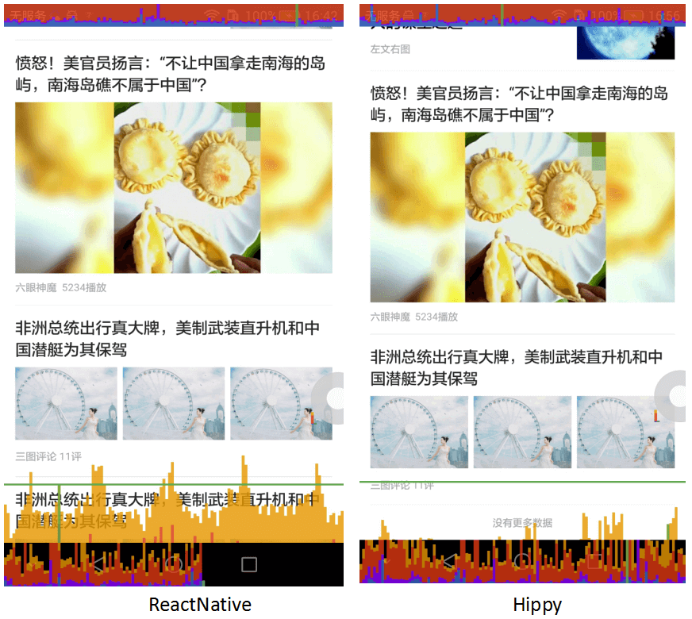
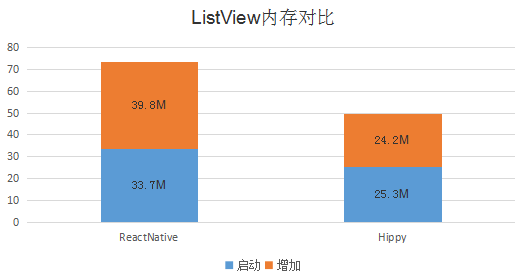
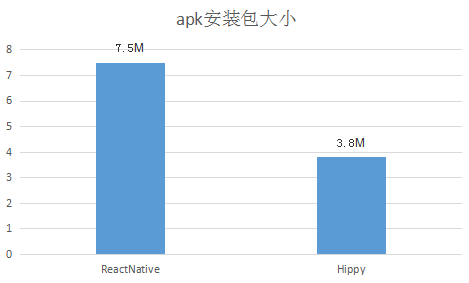
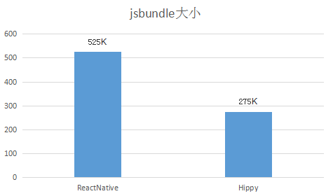
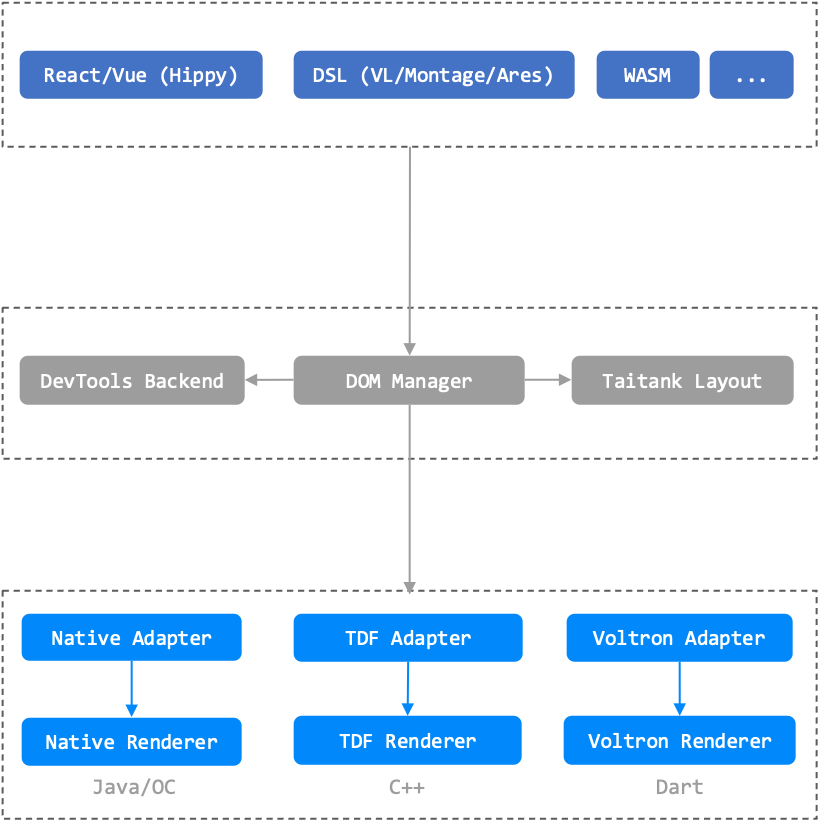

# Hippy 简介

版本：3.3.0

更新时间：2024-6-26

SDK介绍：Hippy 是 TDF 腾讯端框架（Tencent Device-oriented Framework）下的开源跨平台应用开发解决方案。Hippy 可以理解为一个精简版的浏览器，从底层做了大量工作，抹平了 iOS 和 Android 双端差异，提供了接近 Web 的开发体验，目前上层支持了 React 和 Vue 两套界面框架，前端开发人员可以通过它，将前端代码转换为终端的原生指令，进行原生终端 App 的开发。同时，Hippy 从底层进行了大量优化，在启动速度、渲染性能、动画速度、内存占用、包体积等方面都提供了业内顶尖的性能表现。

更新日志：[Change log](https://github.com/Tencent/Hippy/releases)

服务提供方：深圳市腾讯计算机系统有限公司

[接入指引](development/react-vue-integration-guidelines.md)

[Hippy SDK隐私保护指引](development/privacy.md)

## 和 Web 接近的开发体验

* Hippy 对齐浏览器 DOM 的事件、网络、日志、定时器、Performance 等API, 前端开发同学没有太高的学习成本。

* Hippy-Vue、Hippy-React兼容 Vue 和 React 框架, 使用 Vue、React 开发的 Web 项目基本无缝迁移。

* 完全支持 Flex 布局, 和常用的 CSS 属性。

* 兼容 Webpack/Rollup 等打包工具, 支持分包, 代码动态加载, 有完善的 devtools 工具, 对齐前端的开发体验。

## 一次开发，多端运行

使用 Hippy 框架开发后，代码可以同时运行在 Android、iOS、 Web等多个平台。

## 出色的性能表现

Hippy 有比竞品更出色的性能表现。

### 渲染性能

ListView 在滑动时的性能对比，Hippy 可以一直保持十分流畅的状态。

### 内存占用

而在内存占用上，初始化 List 时 Hippy 就略占优势，在滑动了几屏后内存开销的差距越来越大。

### 包体积

Hippy 的包体积在业内也是非常具有竞争力的。

上图是一个空的APK，在引入后终端包大小对比。

上图是在前端搭建了一个最简单的 ListView 后，前端打出的 JS 的包大小对比。

## 可扩展的架构设计

在Hippy 3.0版本，我们对 Hippy 架构做了一次比较大的重构, 采用 Driver，Dom Manager，Renderer 分层解耦的设计理念，其设计目标就是希望框架在未来具有很好的可扩展性，以复用的 DOM 管理、排版布局为核心连接上层 Driver 和下层 Renderer，同时支持不同 Driver 和 Renderer 的接入和自由切换。 

### 驱动层

驱动层为业务封装了对接DOM层的渲染指令和底层接口, 用户可以使用 Hippy 框架提供的 React/Vue 驱动层来开发业务，也支持扩展其它任意 DSL 语言进行驱动。详见 [Hippy-React](api/hippy-react/introduction)、[Hippy-Vue](api/hippy-vue/introduction)。

### DOM层

DOM Manager 从 Java/OC 抽离到 C++，作为中间枢纽，除了接收处理来自上层的消息，进行 DOM Tree 的创建和维护外，还负责与不同渲染引擎，排版引擎和调试工具的对接通信。

### 渲染层

* Native Renderer：使用 Android/iOS 原生组件进行渲染, 详见 [Android](architecture/render/android/native-render)、[iOS](architecture/render/ios/native-render)。
* Voltron Renderer：使用 Flutter 渲染, 详见 [Voltron](architecture/render/voltron/voltron-render)。
* Web Renderer：使用 WebView 渲染（Web 同构）, 详见 [Web](architecture/render/web/web-render)。

## 交流链接

* [文章专栏](https://cloud.tencent.com/developer/column/84006)
* 企业微信交流群，使用微信或者企业微信扫描加入

 

## 总结

如果您准备好了，那就 [开始接入 Hippy](development/demo.md) 吧。
