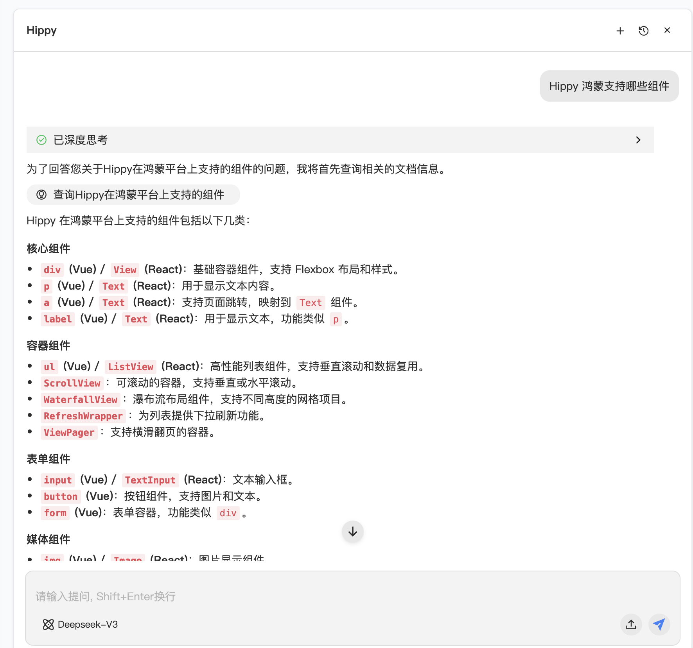

# Hippy AI 编程指引

## 前言

Hippy 团队目前能提供给 AI 的是 iwiki 文档、Hippy源码、Hippy源码生成的知识库。

1.  **团队文档**:
    *   团队早期写了比较多的文档，也把历史 Oncall 单都转化成 iwiki 文档，但是效果一般：
        *   文档很难覆盖全面，框架逻辑细节、平台差异性、兼容性等涉及范围太广。
        *   有些问题类型文档是无法解答的，比如分析代码问题原因。

2.  **源码 RAG 方案**:
    *   后面调研了源码 RAG 方案，比如 deepwiki、工蜂 wiki 等。

    [deepwiki评测](https://doc.weixin.qq.com/sheet/e3_ANsAsgZ1ACcCNxwVgy2g4Q3qHbB7S?scode=AJEAIQdfAAoNwvFu2gANsAsgZ1ACc&newPad=1&newPadType=clone&tab=zkgs2j)

    [deepwiki的Hippy项目](https://deepwiki.com/Tencent/Hippy)

3.  **组合方案**:
    *   在提供了 deepwiki 基础上，文档知识库也能在确定答案情况下快速返回结果，需要组合两个内容。
    *   基于 Knot 平台的方案（示例）：
    

## 总结

deepwiki + 文档知识库的组合方案，比纯文档知识库要好不少，但比 Cursor codebase 效果差点。目前还是建议大家写代码时，直接把 Hippy 源码引入到 IDE 的 workspace。

下面分几个场景介绍 Hippy AI 使用指引：

---

## 一、Cursor

1.  **建议源码引入 Hippy codebase**
    *   在业务项目中添加 workspace。 Hippy 团队通过实际测试发现，引入 Hippy codebase，让 Cursor 去建立源码的索引，能比较好的对很多 Hippy 的问题解答，也能极大的提交日常开发的效率。

    

2.  **添加 deepwiki mcp**
    ```json
    "mcpServers": {
        "deepwiki-sse": {
             "url": "https://mcp.deepwiki.com/sse"
        },
        "deepwiki-mcp": {
             "url": "https://mcp.deepwiki.com/mcp"
        }
      }
    ```
    *   强烈建议添加 deepwiki mcp，deepwiki 是把代码信息转换为知识库的方案。Hippy 作为一个开源框架，大量的信息都在代码中。

3.  **Hippy MCP**
    *   会集成 Hippy 的知识库信息, 后续提供一些生成代码的能力等。
    ```json
       "hippy-mcp": {
          "url": "https://hippy.woa.com/mcp",
          "headers": {
            "X-Rtx-Username": "<自己的企业微信名>"
          }
        }
    ```

4.  **Prompt 技巧**
    *   问题尽量描述清晰，推荐可以带上问题代码，让 Cursor 协助排查。
    *   问题尽量区分用的 React DSL 还是 Vue2/Vue3 DSL。
    *   涉及代码原理的问题，可以带上 “请使用 deepwiki 的 ask_question”，强制触发 deepwiki。
    *   编写代码的问题，可以设置参考 xxx 代码，会提高成功率。

---

## 二、CodeBuddy

CodeBuddy 内网版可以单独添加 官方 Hippy 知识库：

1.  **询问问题时，通过 @ 可以添加「官方 Hippy 知识库」**
    *   CodeBuddy 已经内置集成 Knot 的知识库，大家在询问问题时，可以添加 Hippy 知识库。

    

2. **Hippy MCP**
    ```json
       "hippy-mcp": {
            "timeout": 60,
            "type": "streamableHttp",
            "url": "https://hippy.woa.com/mcp",
            "headers": {
                "X-Rtx-Username": "<自己的企业微信名>"
            }
        }
    ```
---

## 三、网页/企微入口


1.  **Knot 智能体**

    

    [Knot 智能体](https://knot.woa.com/chat?web_key=8292b4273a9549d8bbefa5ddb699cdca)

    **使用提示**
    *   大家提问后，记得点赞👍/👎，方便后续优化。
    *   Hippy AI 助手的知识包含：iwiki 文档、Hippy 源码及开发文档、deepwiki。
    *   Hippy AI 助手弹窗可以放大，方便查看。

   **Prompt技巧：**
    *   问题尽量描述清晰，明确想了解的平台、组件、属性，也可以带上问题代码，。
    *   问题尽量区分用的 React DSL 还是 Vue2/Vue3 DSL。


2.  **企微机器人**
    *   建设中

---

## 四、单独知识库集成

   知识库集成了 Hippy 团队积累的文档，和历史 Oncall 数据，大家可以通过 Hippy 文档、Knot 智能体直接使用，或者集成到自己的系统中。

1.  **Knot 知识库**
    *   [Knot 知识库](https://knot.woa.com/knowledge/detail/7dd3b112147846c298b88ee102132de0)

2.  **iWiki 知识库**
    * [Hippy官方知识库](https://iwiki.woa.com/p/4013486752)
    * [Hippy历史Oncall数据](https://iwiki.woa.com/p/4015817597)

## 五、其他好用的工具

### (一) Figma MCP

[Figma MCP接入指引](ai/figma-mcp.md)

## 六、后续规划

Hippy 团队后续会补充更多 AI 编程实践的案例和工具, 欢迎大家提交建议或者贡献。


