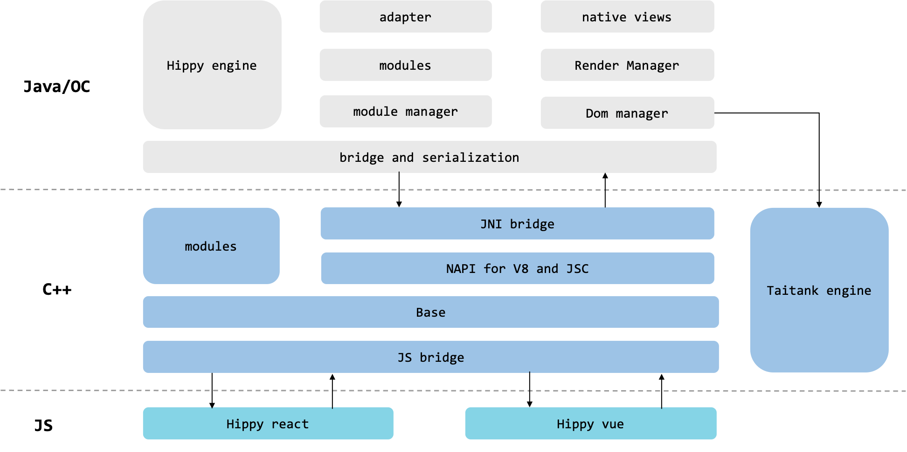

# Hippy 整体架构

---

# Hippy 3.x 架构

Hippy 正在进行 3.x 架构的升级，在 3.x 中业务与渲染层中的具体实现可根据用户实际场景进行切换：业务层上不再局限于 JS 驱动，也支持切换其它任意 DSL 语言进行驱动；DOM Manager 从 Java/OC 下沉到 C++，作为中间枢纽，除了接收处理来自上层的消息进行 DOM Tree 的创建和维护外，还负责与不同渲染引擎，排版引擎和调试工具的对接通信；在渲染层中，渲染引擎除了支持现有原生（Native）渲染之外，还可以选择其他渲染 Renderer，如 Flutter(Voltron) 渲染。Hippy 3.x 能够弥补当前 Hippy 2.x 在性能，双端一致性以及组件支持方面的一些短板，敬请期待！

 

## 驱动层

驱动层为业务封装了对接DOM层的渲染指令和底层接口, 用户可以使用 Hippy 框架提供的 React/Vue 驱动层来开发业务，也支持切换其它任意DSL 语言进行驱动。详见 [Hippy-React](api/hippy-react/introduction)、[Hippy-Vue](api/hippy-vue/introduction)。

## DOM层

DOM Manager 从 Java/OC 抽离到 C++，作为中间枢纽，除了接收处理来自上层的消息，进行 DOM Tree 的创建和维护外，还负责与不同渲染引擎，排版引擎和调试工具的对接通信。

## 渲染层

* Native Renderer：使用 Android/iOS 原生组件进行渲染, 详见 [Android](architecture/render/android/native-render)、[iOS](architecture/render/ios/native-render)。
* Voltron Renderer：使用 Flutter 渲染, 详见 [Voltron](architecture/render/voltron/voltron-render)。
* Web Renderer：使用 WebView 渲染（Web 同构）, 详见 [Web](architecture/render/web/web-render)。

 
 
 

# Hippy 2.x 架构

Hippy 2.x 架构主要分成三层，UI(JS) 层 `Hippy-React` 和 `Hippy-Vue` 负责驱动 UI 指令生成；中间层 [C++ HippyCore](architecture/core.md) 负责抹平平台差异性和提供高性能模块；渲染层 `Android` 和 `iOS` 负责提供终端底层模块、组件，并与布局引擎通信

 

