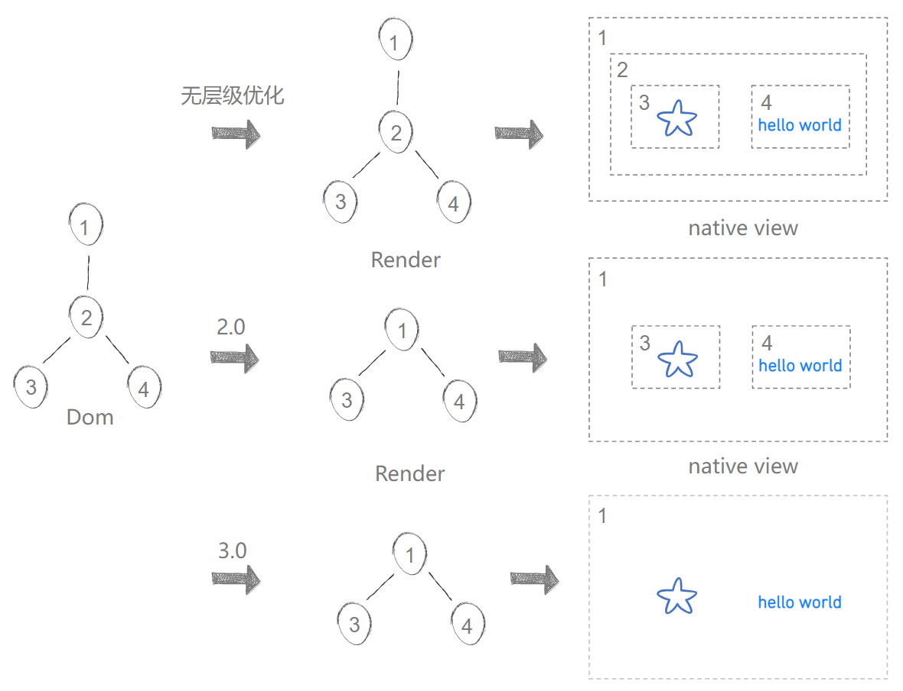
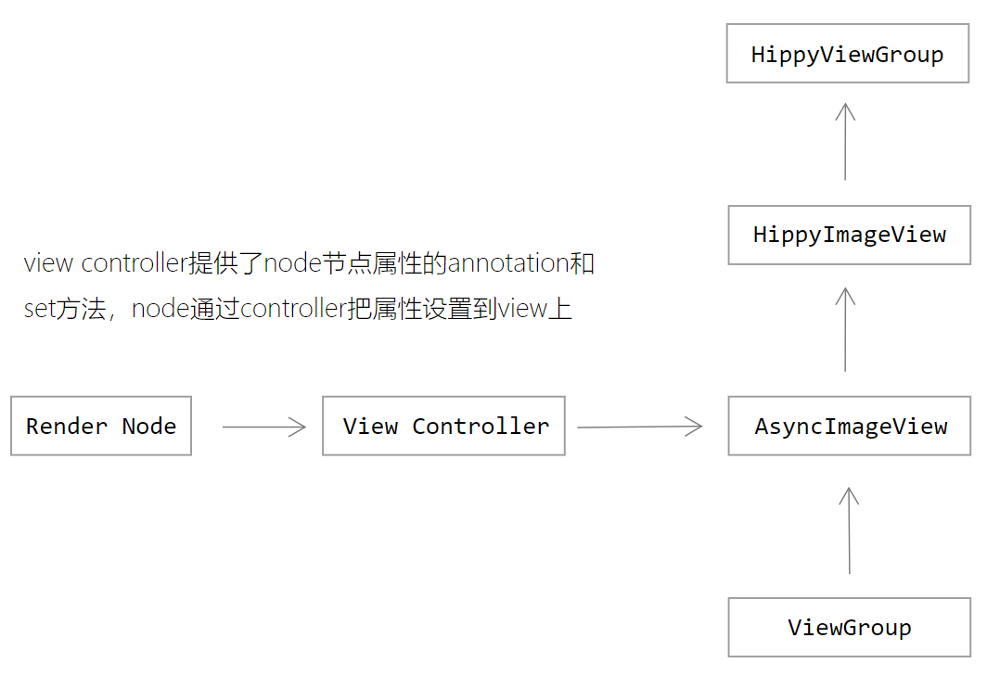
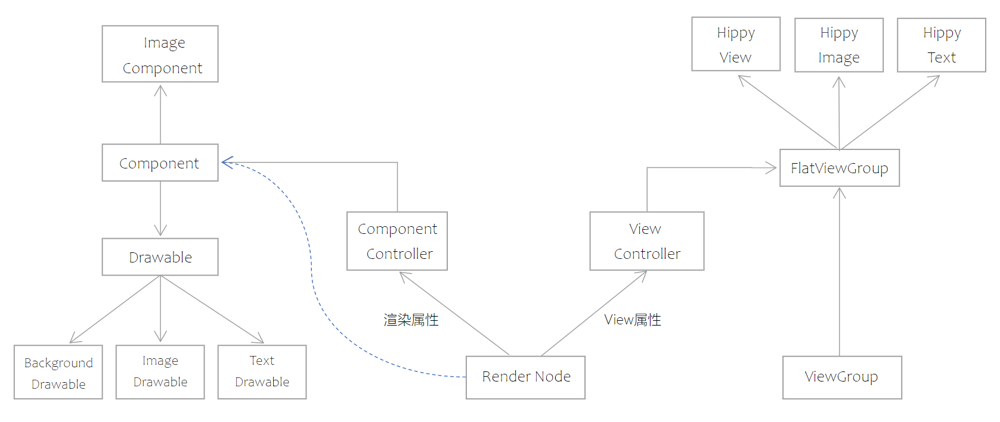
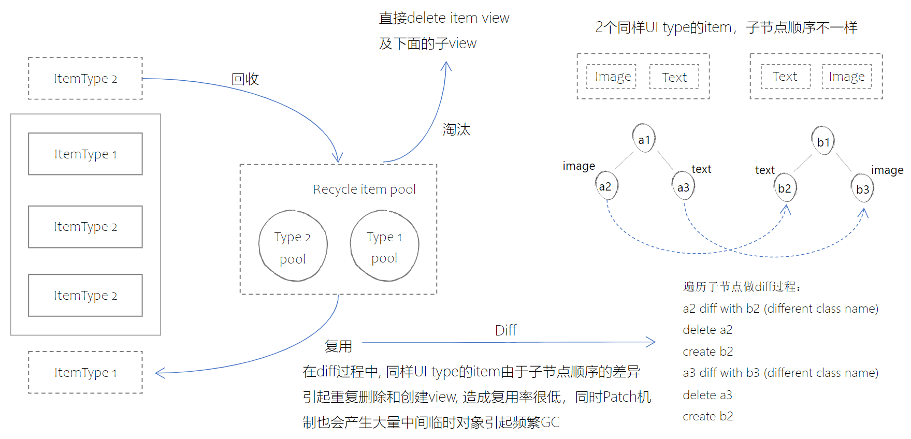
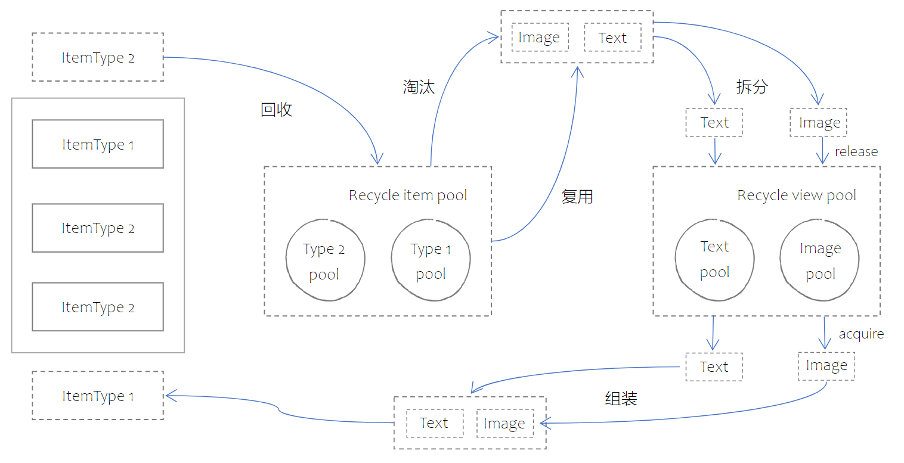
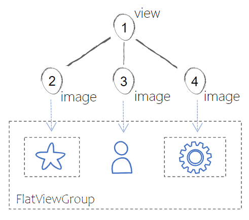

# Android Native Renderer

---

## Flatten UI

  Flatten UI是一种终端视图层级优化的方法，在Hippy 2.0的基础上实现这种优化方案，并不是简单的改造渲染逻辑就可以实现的，这里还依赖整体UI结构调整，缓存池改造，以及细粒度复用等重构完成后才能支持Flatten UI最终优化的实现，所以Flatten UI在3.0可以理解为一整套解决方案的升级，而不是单一的局部优化。

### 层级优化对比

  在2.0中通过针对只参与排版的节点不创建实体view的方法来减少终端UI层级，在此基础上，3.0 Flatten UI采用子元素直接在父view上完成渲染的方法将UI层级进一步打平，通过下面这个demo我们可以看到不同阶段优化效果对比：

```js
      <View onClick={...}>
         <View style={{margin: 10}}> 
               <Image {...} />
               <Text {...}>hello world</Text>
         </View>
      </View>
```

  

- 无层级优化情况下dom  -> render -> view 一一对应
- 2.0将只参与排版的节点在render中被优化，render节点和view一一对应
- 3.0在2.0的基础上进一步优化view层级，部分子节点直接渲染在父节点的view上

### UI 主体结构的改造

### 2.0 UI主体结构

  

- HippyViewGroup是我们页面中最常见的元素，但绝大部分view是不需要展示图片与处理图片属性的，从imageview派生出来让view组件变得异常臃肿;
- AsyncImageView是HippyViewGroup的基类，也是属于Support-ui里面的一个基础组件，这个基类里面包括图片拉取管理，drawable的管理与渲染诸多逻辑，让组件渲染与view强耦合在一起，除了设计不合理以外代码实现质量也较差。
- Support-ui目录下的所有组件逻辑未来会全部废弃。

### 3.0 UI主体结构

  

- 废弃 suppor-ui AsyncImageView，使用轻量化FlatViewGroup替代，FlatViewGroup只负责子节点渲染顺序的管理;
- 通过新增Component体系实现view属性与渲染属性处理逻辑的分离；
- Component由Render Node持有，负责Drawable的管理，可以在不依赖view的情况下完成独立渲染；
- Image Component extends Component，主要包括image相关属性处理以及image loader对接逻辑。

### 缓存池改造

在2.0中只针对预创建view，base64与本地图片的数据做了缓存，既没有抽象出统一的缓存访问接口，也无法做很好的扩展来支持其它流程的缓存优化，所以在3.0定义了一套标准的缓存访问接口，重构了所有缓存相关的代码实现结构，并扩展了基于view的复用池与常用object的复用池。

- PreCreateViewPool

   预创建view缓存池，当在dom线程接收到create node指令时，会创建对应的create  render node task并放入队列中，等batch的时候把队列中的task放到UI线程批量执行，在此之前还需要执行排版相关的逻辑，为了让UI线程能提前处理一部分任务，当接收到create node指令时，就直接在UI线程创建对应的view并放到缓存池，等到UI 线程执行batch的时候就可以直接从缓存池取出使用，这样可以最大化UI线程和dom线程task的并行执行，减少整个流程的耗时该缓存池对于开发者来说是透明的，每次batch执行结束后就会清空，内部使用SparseArray<View>的数据结构进行存储，直接使用view id做key

- RecycleViewPool

   基于view type的view缓存池，主要使用在Recycler view滚动时候，recycler view item子view的回收，具体回收机制可以参考下一节细粒度复用的介绍该缓存池内部使用Map<String, SimplePool<View>>进行存储，view的class name作为key值，每个类型的view pool default pool size为8

- ImageDataPool

   Image data缓存池，该缓存池内部使用LruCache<Integer,ImageDataSupplier>进行存储，key值由image uri后32位做hashcode计算得出，当前设置的default pool size为24

- RecycleObjectPool

   常用频繁创建对象的缓存池，类似于系统Message的使用，使用完成后做recycle，获取的时候直接obtain from pool，避免临时对象的频繁创建和销毁带来GC问题，该缓存池内部使用Map<CustomObjectType, SimplePool<Object>>进行存储，当前设置的default pool size为12，缓存池定义为static对象，也就是所有Hippyengine和页面都共享同一个缓存池，目前VFS ResourceDataHolder与ImageDataHolder对象的使用已经接入，后续其它常用对象的创建接入会继续扩展

### 细粒度复用

#### 2.0复用机制

   在2.0中主要通过recycler view自身item pool对ViewHolder进行缓存，这里的缓冲池分类主要依赖item type，也就是每个item的UI样式，由前端开发者自行分类定义，由于很多开发者对item type分类不精准甚至根本就没有去设置item type，再加上本身SDK的diff机制不够最优，导致这种强依赖item type的缓存复用机制效率很低，有概率会引起列表滚动的掉帧不流畅。

   

#### 3.0复用机制

   3.0增加以view为单位的缓存池，在list view滚动过程中不论是item被淘汰还是被复用，都会先拆解item，将子view放到复用池彻底解决同样type item内部由于子节点结构差异造成的复用率低的问题，取消Patch机制，整个复用diff过程不产生任何多余的临时对象。

   

   增加基于view type缓存池的细粒度复用机制以后，已经最大程度上减弱的对item type分类的依赖，也就是说即使前端item type不设置，也可以获得较好的复用性能。细粒度复用可以很好优化列表滚动性能，同时也是保证Flatten UI的体系的一个必要能力，因为在滚动的候，下一个即将展示的节点有可能是一个偏平化的节点，不需要创建view，如果没有view的缓存池，那么上一个从item pool取出的item会把子view全部delete掉，造成很大的性能损耗。

#### View复用属性Diff与重置

   当view被复用时，view被设置的属性还是之前关联node所带的属性，需要把新关联node属性重新设置到view上，才能保证组件显示和行为的正确性。

2.0 属性Diff与重置主要步骤：

1. 全量递归对比所有子节点，如果节点类型不匹配的，生成create或者delete patch;
2. 如果节点类型匹配的，全量递归遍历所有属性，逐一进行value的对比，得到update props patch;
3. 把所有patch执行应用到view上。

---

3.0 属性Diff与重置主要步骤：

1. 直接遍历新关联node的非渲染属性并设置到view上；
2. 对比获取old node中存在但new node中不存在的属性;
3. 把上一步获取到的diff属性在view上做reset。

---

对比3.0和2.0的属性Diff与重置实现，3.0具有以下优势：

- 由于渲染属性与view已经解耦，所以在属性遍历与设置的时候可以直接跳过渲染相关的属性；
- 不再需要进行节点类型的对比；
- 获取diff属性的时候不需要做value的对比，只需要做containsKey的判断找出新节点不包含的属性；
- 不需要生成任何patch临时对象。

#### FlatViewGroup子节点渲染管理

FlatViewGroup直接派生于系统ViewGroup，作为 text view，imge view与普通view组件的基类，相对于原来suppor-ui AsyncImageView要轻量化很多，只包含子节点渲染顺序相关的处理逻辑，所以基于FlatViewGroup派生的组件不论在创建耗时上还是代码可维护方面比2.0都有明显提升。
子节点遍历与渲染最关键要支持扁平化元素与常规view混合的组合，例如：



#### 触发扁平化渲染的条件

- 必须是View，Image，Text三种元素之一
  
使用SDK内置以上三种基础组件可以支持扁平化渲染，其它组件或者宿主自定义组件暂时还不支持

- 必须是叶子节点
  
只有作为叶子节点的元素才会被扁平化渲染，text节点一定是叶子节点，虽然text可以嵌套，但text子节点在终端做了合并，不会生成实际的Render node节点，只会有VirtualNode与其对应

- 父节点必须是View或者派生于View的组件

这里主要针对宿主自定义View，SDK核心组件List view item，View pager item以及Scroll view的第一个子节点都是从view组件派生出来，它们下面的子节点是都可以满足这个条件的

- 该节点没有设置View属性
  
View属性主要包括click，touch事件监听，focus相关事件以及transform属性
