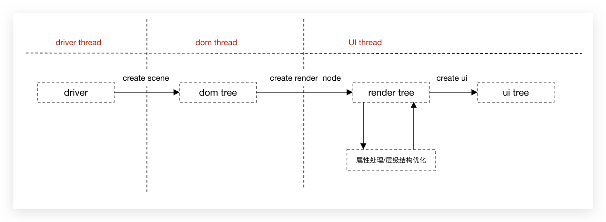
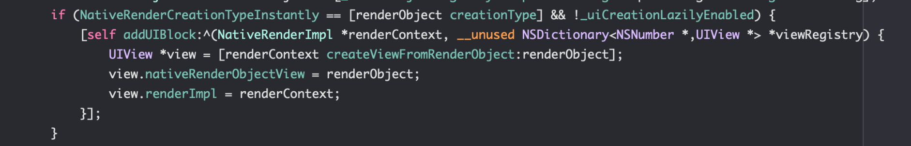
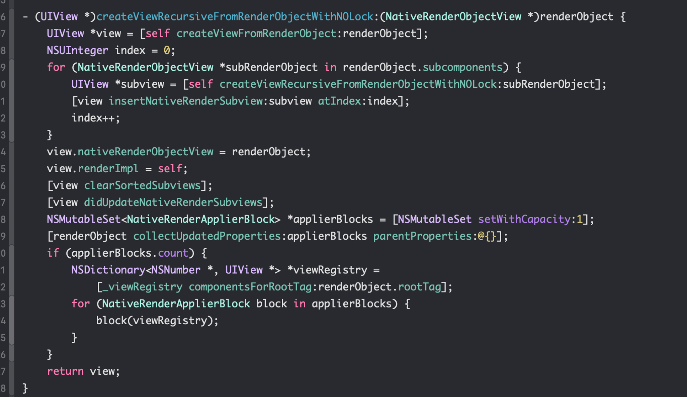
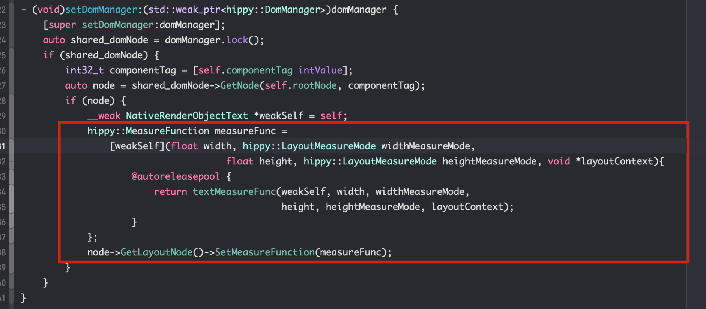
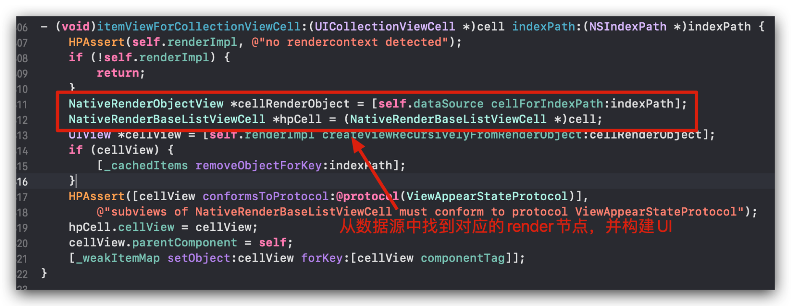
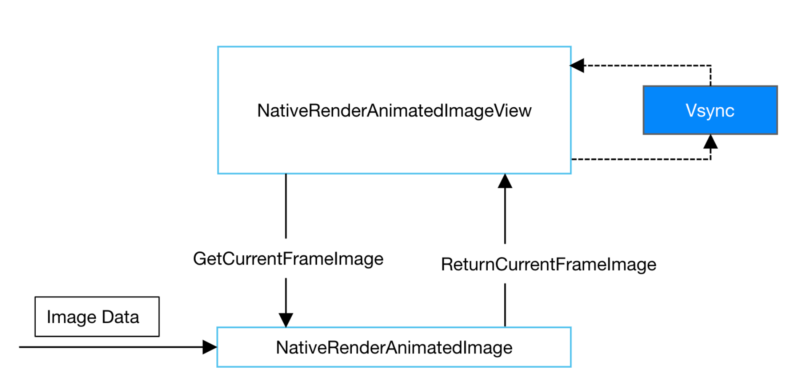

# iOS Native Renderer

在Hippy中，RenderManager负责将Dom层节点构建的Dom树转换为对应的Render节点与Render树，并负责驱动最终的UI展示。

Hippy抽象了RenderManager的接口，允许接入方自行实现RenderManager接口，并实现上屏操作。其中Native Renderer由Hippy默认实现，通过Native组件构建出整个Hippy界面。

NativeRenderManager负责实现Hippy::RenderManager的抽象接口，并将Render树的构建与UI上屏的行为交由HippyUIManager处理。

HippyUIManager负责处理以下行为：

- Render节点的创建与管理
- RooView与RootNode绑定与管理（不持有）
- UI节点的实时创建、懒加载创建与管理
- UI事件的绑定与回调
- 管理UI组件的依赖的功能（vfs， image decoder, ...）
- Vsync信号回调

## UI构建

### 概览

在Hippy3.0的体系中，存在三颗与UI相关的树结构：

- Dom树

  Dom树是有driver层驱动dom manager构建的第一棵树结构，运行于dom线程，记录了每棵节点的原始信息与节点的父子关系。当前节点的名称以dom属性的形式记录，dom节点并没有类型区分，所有dom节点行为一致。

- Render树

  Dom树并不能直接用于构建UI，其中原因有3:

  - Dom树所有行为都在dom线程中进行，无法与UI线程交互。
  - Dom节点只包含有原始属性，未进行任何处理。
  - ○在某些场景下，Dom结构并不与最终的UI结构一致。

  因此，需要构建另外一个树，起到承上启下的作用。

  Render树的特点有：
  - Render节点由dom节点构建，并负责处理dom节点的原始信息，可供UI直接调用。并不保证与Dom树完全一致。
  - Render节点类型与UI类型对应，即不同的UI组件可能对应不同的Render节点类型。
  - Render所有行为都运行于主线程，可直接与UI交互。

- UI树

  NativeRender的最终上屏方案，由Render驱动构建，并能与Render直接交互。

### UI创建流程

- driver层驱动创建dom节点，并将所有创建的dom节点一次性打包发送给render_manager
- render_manager根据dom节点信息构建出对应的render节点与树结构，并做一些预处理以满足UI构建需求
- 之后render_manager将根据render数选择性构建UI树结构并上屏



### UI懒加载

在UI构建过程中，并不是每一个UI组件都是实时构建。部分长列表组件及其子组件，基于性能考虑，只有在需要显示时才构建。

为此，需要设定render节点的懒加载属性，以保证UI的懒创建。

在iOS中，此能力由`[HippyShadowView creationType:NativeRenderCreationType]`属性控制。

对于懒加载组件，需要手动调用创建方法才会创建。


### Text组件构建

Text组件算是一个比较特殊的组件，相对于其他组件，其有两个特色：`测量`与`合并`。

- <font color=#DEBB85>测量</font>：一个普通的组件，其布局结果完全有layout系统计算，无需与render系统交互。但是对于text组件，需要由render系统设置测量函数，由render系统计算出其长宽。


- <font color=#DEBB85>合并</font>：富文本结构，在dom树中，是一个text节点持有一个或者多个text类型子节点。但是在render系统中，render_manager会将其合并为一个text节点，与UI结构保持一致。之后便是正常的上屏流程。

### 长列表组件

目前hippy中包含的长列表组件为ListView和WaterfallView，其子组件遵循懒加载策略，必要时才会创建。

为此，长列表组件会将其子render node节点作为数据源，在创建UI时，会先根据数据源节点信息找到对应的render节点，然后实时创建UI。



### 长列表组件内存策略

基本策略：长列表在停止滑动后，将屏幕外一定数量的，距离屏幕当前可见范围内最远的Item组件删除，避免内存占用过大。

```objectivec

//计算出某个indexPath值距离屏幕可见范围内的visibleIndexPaths的最近距离
- (NSInteger)differenceFromIndexPath:(NSIndexPath *)indexPath 
            againstVisibleIndexPaths:(NSArray<NSIndexPath *> *)visibleIndexPaths {
    NSIndexPath *firstIndexPath = [visibleIndexPaths firstObject];
    NSIndexPath *lastIndexPath = [visibleIndexPaths lastObject];
    NSUInteger diffFirst = [self differenceFromIndexPath:indexPath                againstAnother:firstIndexPath];
    NSUInteger diffLast = [self differenceFromIndexPath:indexPath againstAnother:lastIndexPath];
    return MIN(diffFirst, diffLast);
}

- (NSArray<NSIndexPath *> *)findFurthestIndexPathsFromScreen {
    NSUInteger visibleItemsCount = [[self.collectionView visibleCells] count];
    NSUInteger maxCachedItemCount = [self maxCachedItemCount] == NSUIntegerMax ? visibleItemsCount * 3 : [self maxCachedItemCount];
    NSUInteger cachedCount = [_cachedItems count];
    NSInteger cachedCountToRemove = cachedCount > maxCachedItemCount ? cachedCount - maxCachedItemCount : 0;
    if (0 != cachedCountToRemove) {
        NSArray<NSIndexPath *> *visibleIndexPaths = [_collectionView indexPathsForVisibleItems];
        NSArray<NSIndexPath *> *sortedCachedItemKey = [[_cachedItems allKeys] sortedArrayUsingComparator:^NSComparisonResult(id  _Nonnull obj1, id  _Nonnull obj2) {
            NSIndexPath *ip1 = obj1;
            NSIndexPath *ip2 = obj2;
            NSUInteger ip1Diff = [self differenceFromIndexPath:ip1 againstVisibleIndexPaths:visibleIndexPaths];
            NSUInteger ip2Diff = [self differenceFromIndexPath:ip2 againstVisibleIndexPaths:visibleIndexPaths];
            //按照当前indexPath与屏幕可见范围内的indexPath距离由近到远排序
            if (ip1Diff > ip2Diff) {
                return NSOrderedAscending;
            }
            else if (ip1Diff < ip2Diff) {
                return NSOrderedDescending;
            }
            else {
                return NSOrderedSame;
            }
        }];
        NSArray<NSIndexPath *> *result = [sortedCachedItemKey subarrayWithRange:NSMakeRange(0, cachedCountToRemove)];
        return result;
    }
    return nil;
}

- (void)purgeFurthestIndexPathsFromScreen {
    NSArray<NSIndexPath *> *furthestIndexPaths = [self findFurthestIndexPathsFromScreen];
    //purge view
    //找到距离最远的indexPathes，删除
    NSArray<NSNumber *> *objects = [_cachedItems objectsForKeys:furthestIndexPaths notFoundMarker:@(-1)];
    [self.renderImpl purgeViewsFromComponentTags:objects onRootTag:self.rootTag];
    //purge cache
    [_cachedItems removeObjectsForKeys:furthestIndexPaths];
}

```

### Image Decoder

各业务会选择不同的图片格式就计入，而iOS api默认支持的图片格式有限。这种情况下，需要提供接口，处理默认不支持的图片格式解码。

为此我们声明了一份协议HippyImageProviderProtocol，专门处理各类型Image的解码工作。

接入方如果有自定义格式，需要实现一份protocol。

#### HippyImageProviderProtocol

`HippyImageProviderProtocol`包含有两类方法：必须实现的和可选实现的。

必须实现的方法负责处理图片解码的基本操作，而可选实现的用于处理动图。
接入方可同时添加多个解码器，HippySDK 在需要时，会按照解码器添加反序询问各解码器能否处理当前数据。如果不能，则会询问下个解码器，直至获取了对应的解码器，或者使用默认解码器。

如果没有解码器能处理对应的数据，则直接返回空图片对象。

| 方法名 | 说明 |
|--------|------|
| <font color=RED>必须实现</font> |
| +(BOOL)canHandleData:(NSData *)data | 询问当前解码器是否能处理数据 |
| +(BOOL)isAnimatedData:(NSData *)data | 询问当前解码器数据是否是动图 |
| -(void)setImageData:(NSData *)data | 设置图片原始数据 |
| -(UIImage *)image | 返回图片对象 |
| <font color=GREEN>可选实现</font> |
| -(NSUInteger)imageCount | 返回图片帧数（仅限于动图）|
| -(UIImage *)imageAtFrame:(NSUInteger)frame | 返回指定帧图片 |
| -(NSUIneger)loopCount | 返回动图循环次数 |
| -(double)delayTimeAtFrame:(NSUInteger)frame | 返回指定帧延迟时长 |

#### HippyDefaultImageProvider

Hippy3.0默认实现了一套decoder作为默认decoder，实现对系统支持的格式进行解码操作。任何没有decoder处理的数据，最终都会由HippyDefaultImageProvider调用系统API CGImageSource进行处理。

>默认支持PNG, JPG, GIF等常见格式

#### 动图实现逻辑

- Hipp3.0SDK的动图逻辑由NativeRenderAnimatedImage和NativeRenderAnimatedImageView负责。
- 这是一个生产者-消费者模型。NativeRenderAnimatedImage负责生产，NativeRenderAnimatedImageView负责消费。
- NativeRenderAnimatedImageView实现一个vsync回调，每次回调向NativeRenderAnimatedImage询问当前帧对应的Image
- NativeRenderAnimatedImage持有HippyImageProviderProtocol实例，负责解析动图，并返回对应帧的Image


