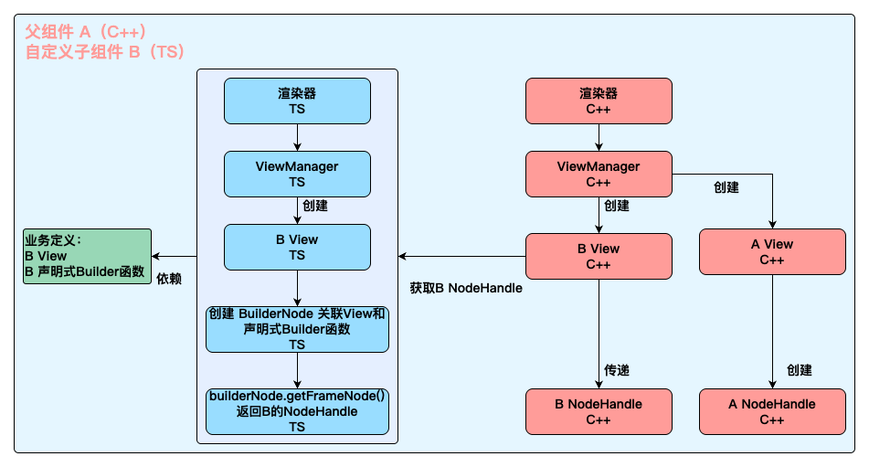

# Ohos Native Renderer

---

Hippy 渲染器对接了 Ohos 的 ArkUI。ArkUI 提供了声明式 [TS API](https://developer.huawei.com/consumer/cn/doc/harmonyos-references-V13/arkui-api-V13) 和过程式 [C API](https://gitee.com/openharmony/docs/blob/master/zh-cn/application-dev/reference/apis-arkui/_ark_u_i___native_module.md)，TS API 开发方便，但性能不如 C API。
Hippy 内部使用 C API 实现 UI 组件的绘制，同时支持业务通过 TS API 来实现自定义组件，也支持通过 C API 来实现自定义组件。

Hippy Ohos 整体架构：

其中渲染系统，分两部分：

- C++渲染器：负责几乎所有组件渲染和流程管理。
- TS渲染器：负责业务接入根组件、自定义组件、Web组件。（Web组件没有C接口）

## 自定义组件

支持两种语言实现自定义组件，TS和C，TS自定义组件开发方便，C自定义组件性能更好。一般页面内少量组件自定义，建议使用TS自定义组件，性能够用，对于极端性能场景，比如自定义Image、Text等基础组件，使用C自定义组件可以获得更好的性能。

TS 语言实现自定义组件原理图：

C 语言实现自定义组件原理图：

## TS 语言和 C 组件

迁移老业务页面时，有的业务会在native侧直接操作hippy的组件来实现一些联动。
设计一套通用的跨语言操作接口给业务调用。接口对齐前端，从而减少业务理解成本。

正常前端操作、业务Native侵入操作、鸿蒙兼容方法对比图：

