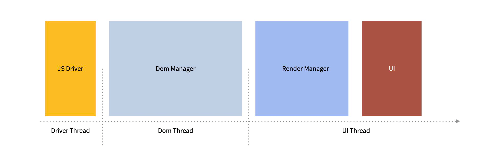
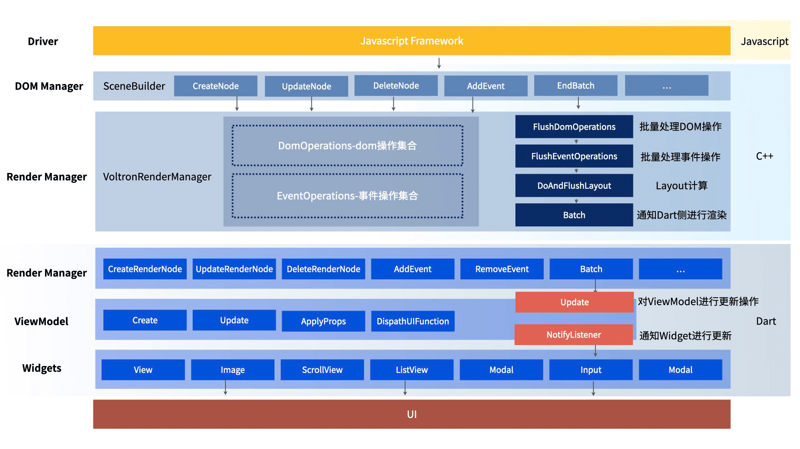
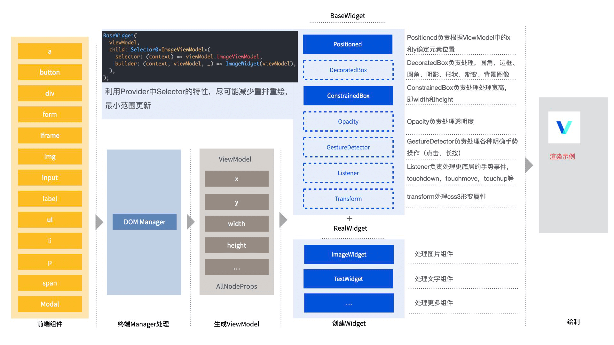

# Voltron Renderer

在Hippy3.0中，我们增加了全新的Flutter渲染引擎丰富Hippy的使用生态，我们致力于将Flutter生态与Hippy进行深度的结合，接下来，我们将会对Voltron进行一些原理性的介绍。

## Voltron 渲染原理

### Hippy3.0 UI创建流程

从Hippy整体架构中我们可以发现，Hippy3.0中所有的渲染器都基于相同的整体流程

Driver层（这里目前支持Javascript作为驱动）驱动DomManager进行Dom操作（包括创建，更新，移动，删除），Dom操作完成后经过Layout将布局信息汇总，并将所有创建的节点一次性打包发送给RenderManage，最后由不同渲染器的RenderManager进行渲染。

### UI 创建流程

1. UI创建的起始点在`Driver`层，这里我们拿`Javascript Framework`作为例子，目前我们主要支持`Vue2`，`Vue3`，`React`三大框架，不管是你采用哪个上层框架，最终我们都会将DOM操作汇集到`SceneBuilder`（`SceneBuilder`是在`C++`侧注册进V8的处理DOM操作的类）上，其中`CreateNode`，`UpdateNode`，`MoveNode`，`DeleteNode`负责对`DOM`进行创建，更新，移动及删除，`AddEventListener`，`RemoveEventListener`负责处理事件的绑定和解绑，`Build`则负责通知一次操作的结束
2. 通过`Driver`的驱动，`C++`侧的`DOM Manager`就可以获得完整的`DOM`信息，在接收到`Build`信号后，执行`SyncWithRenderManager`，通知`RenderManager`进行批量处理，首先是`FlushDomOperations`，更新元素的`DOM Tree`，然后`FlushEventOperations`，对`DOM`进行事件绑定解绑，最终`DoAndFlushLayout`，进行完整的布局计算，将`Layout`信息赋值给每一个`DOM`元素，最后，调用`EndBatch`通知`RenderManager`结束此次操作，需要注意的是，上述每一步操作都会通过`ffi`调用到`Dart`侧，接下来就是`Dart`侧的相关操作。
3. 刚才我们提到，上述的所有操作都会调用到`Dart`侧，所以`Dart`侧也会有一个`RenderManager`负责下一步操作，在`FlushDomOperations`结束后，`Dart`侧会生成一颗`RenderNode Tree`，`FlushEventOperations`，`DoAndFlushLayout`都完成后，`RenderNode`就具备了足够的渲染条件，此时接收到`Build`信号，`RenderNode`就会开始对`ViewModel`（`ViewModel`本身是继承自`ChangeNotifier`，`Voltron`采用了`Provider`框架进行状态管理）进行操作，操作结束后，`ViewModel`调用自身的`Update`方法，通知元素进行更新，后续完全交给`Flutter`。

### UI 属性样式事件等实现

1. 通过前面的UI 创建流程，我们可以得知，前端的组件通过一系列`DOM`操作在`Dart`侧会生成对应的`ViewModel`,而`ViewModel`上存放了所有需要渲染的信息，那么对`ViewModel`的操作如何触发页面的渲染呢。
2. `Flutter`是一个声明式的UI框架，遵循`UI=F(State)`的模式，所以这里我们使用Provider状态管理来对组件进行封装，结合`Selector`的模式，以及重写`ViewModel`的相等操作符，这样在`ViewModel`触发`Update`操作后，元素自身就会检测变更情况，决定是否要进行`Build`操作，接下来，我们来看一下针对不同的样式，我们如何来进行处理。
3. `Voltron`的整个`Widget`设计是基于层叠结构来做的，首先是最外层的`Layout`信息，我们交给`Positioned`组件来进行绝对定位（部分组件不需要绝对定位则可以不包裹这一层），`DecoratedBox`负责处理圆角，边框，阴影，形状，渐变，背景图像等，`ConstrainedBox`负责处理宽高，`Opacity`负责透明度，事件和手势操作我们使用`GestureDetector`和`Listener`，形变采用`Transform`，通过一系列的操作，公共属性都能够得到很好的支持，那么最内部的则是核心Widget，比如图片我们使用`ImageWidget`,文字我们使用`TextWidget`，iframe可以使用`WebViewWidget`等等

## Voltron Render 特点及答疑

1. 接入Voltron后，前端需要改动吗？
  答：上层前端框架完全兼容，Hippy-React和Hippy-Vue均可直接在Voltron中运行，Native侧的自定义模块和事件等经过封装后也可直接在Voltron中调用。

2. 接入Voltron后，Flutter组件可以使用吗？
  答：完全可以，可以参考[Voltron 自定义组件](development/native-component?id=voltron)对Flutter生态中的组件进行自定义的扩展。

3. 其他特性介绍
   - 完整的保留了 Hippy Native的优势，包括热更，跨平台等。
   - 具备天然的双端一致性保证。
   - 更高效的组件扩展，双端开发工作量合而为一，复用庞大的Flutter生态。
   - 更多优势等你探索。
