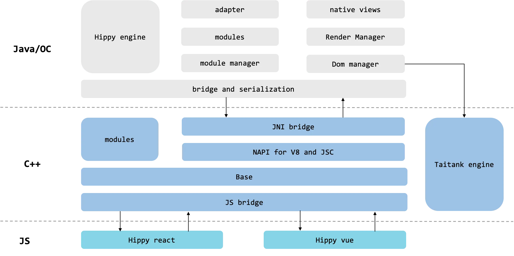
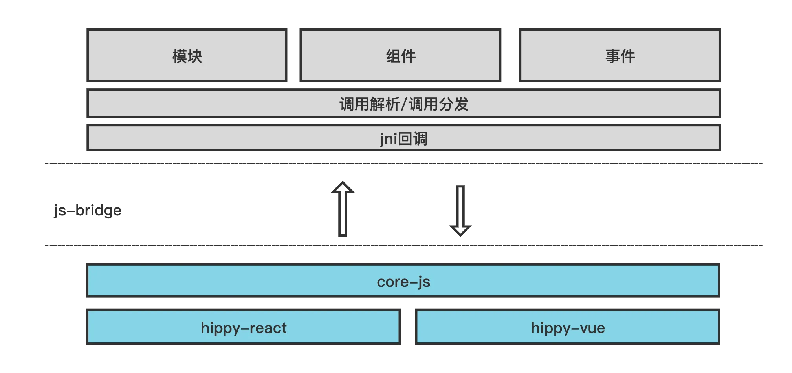
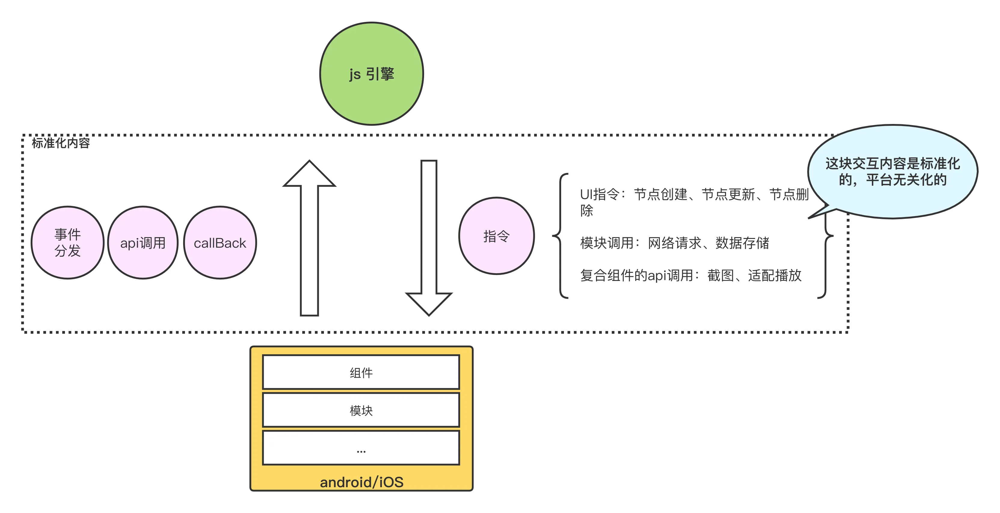
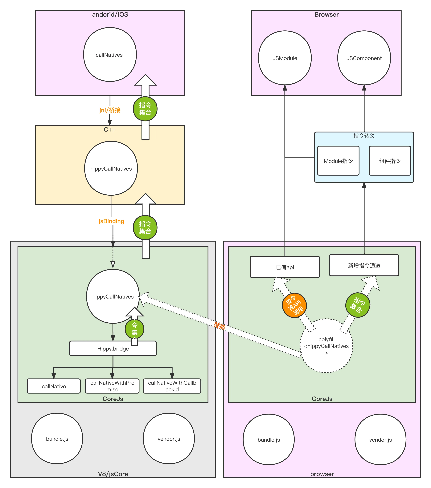

# Web Renderer

`Web Renderer`方案从实现的方案、机制和各种处理事件响应的逻辑与顺序都与终端保持高度一致性。使得`Web-Renderer`能够直接使用Hippy基于`Native方案`构建的`jsbundle.js`产物，在高度保持与终端侧渲染效果一致的情况下，使得复用JS层代码变的可能和简单。
___

## 原理解析

### Hippy2.0方案





上面第一章图是当前hippy的架构图，里面比较细节的展示了js、c++、native的各自组成内容。然后第二张图是在前端的角度，做了一些简化和抽象后的架构图。

### JS运行环境

当前`hippy2.0`的方案下，JS相关的代码一般由两部分组成，一部分是业务也就是平时大家写的，还有一部分是`hippy-react`和`hippy-vue`，这里面是对hippy终端提供的基础功能、协议的封装。而除开这两部分内容还有一部分内容是js逻辑是在c++里面的，在js引擎创建的时候会注入进去。这块代码主要是用来进行js运行环境的提供，如一些环境变量、全局的api（settimeout）等以支持UI框架的运行。

### 桥的实现

这里的`js-bridge`用以将js产生的数据和调用序列化后传递给终端。

### 调用解析/调用分发

终端在接受到js侧传递过来的数据时，需要进行解析然后分发给对应的处理对象进行处理。

### 组件/模块/事件的实现

是调用分发的承接者，如：调用解析到要创建一个组件，则就会将这个调用分发到组件这里然后创建出一个组件出来。

### 基于中间层的实现


在前面的内容，我们提到了hippy2.0方案中的几个关键的内容，其中在“桥的实现”和“调用解析分发”那里平凡提到了js侧产生的数据，接下来将详细讲述一些这些数据是什么、能干些什么。

上图是hippy终端方案交互层的抽象，现在的`hippy2.0`的方案中`js引擎`运转后会输出一些列的数据，其中包了ui指令（用来创建组件、更新组件、删除组件）、模块的功能调用、组件的api调用等。终端在接收和处理各种指令后，也会向js引擎派发事件、js侧的api调用、callback。

我们在这里将这块用来交互的内容称为**中间层**，这块中间层的内容是由hippy方案这么多年演进并且稳定下来的。是**标准化的、平台无关的**。这块中间层的内容，终端有一套完整的解析和处理逻辑，也正是因为这套逻辑才能构建出ui并且产生正确的交互。理论上来说只要能够完成对中间层内容的正确解析和实现，就能够实现与终端一直的渲染效果。

接下来看两个交互数据的例子：

```json
createNode
{
    "id": 64,
    "pId": 20,
    "index": 0,
    "name": "View",
    "props": {
        "onLayout": true,
        "style": {
            "flex": 1
        },
    },
    "tagName": "View"
}
```

这是一个创建组件的指令，

- `creatNode`指明是要进行`ui创建`
- `id`代表终端和Web用来对这个`ui`的唯一标识
- `pId`代表这个节点创建后将要被插入到哪个父节点下
- `index`代表了插入到父节点下的第几个位置
- `name`代表了创建的是一个什么类型的组件
- `props`是对这个组件的哪些属性进行设置已经参数是什么

``` json
receiveUIComponentEvent
[
    287,
    "onPageSelected",
    {
        "position": 0
    }
]
```

这是一个终端对前端的ui事件指令，在数组中

- 第一个数字代表了这个`ui事件`要分发给`id`为287的这个组件，
- 第二个参数`onPageSelected`标识这次分发的事件的名称，
- 第三个参数代表这个事件携带的参数。

通过上面的内容可以看出正式通过js和终端不断的交互,然后解析这些交互内容并且分发到实现对象上，来构造ui，响应用户的操作。所以Web场景下，也需要完成对这些内容的解析和实现，这样才能从机制、流程和功能甚至是异常情况都达到与终端的一致性。从而实现比较平滑的进行渲染层切换，开发者在不同渲染层的成本也会更低更低。而Web-Renderer正是在浏览器上完成了这一系列的标准内容解析和功能提供，让Web-Renderer可以使用相同的构建产物，并且表现上高度一致

### 基于中间层实现，Native VS Web 流程对比



在基于中间层这个技术关键点完成Web-Renderer方案后，可以看到与Native方案的对比，Web-Renderer使用与其相同的构建产物，一致的渲染流程。而不同的是最后落地到的UI和功能上，一个是落地到浏览器提供的上面，一个是落地到 Android/iOS提供的上面。
