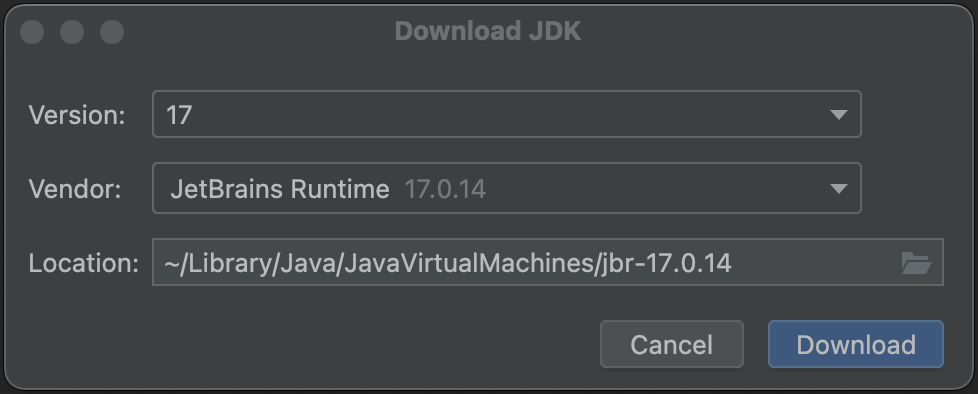

# Hippy Android 3.x SDK集成指引

这篇教程，讲述了如何将 Hippy 3.x SDK 集成到一个现有的 Android 工程。

> 注：以下文档都是假设您已经具备一定的 Android 开发经验。

---

## Android Studio环境配置

1. NDK、 CMake、 Gradle及AGP版本已经在工程配置文件中指定，其中NDK会在第一次Sync project的时候自动安装，CMake需要开发者在Settings > Android SDK中手动下载并设置

   - NDK_VERSION = 25.0.8775105
   - CMAKE_VERSION = 3.22.1
   - GRADLE_VERSION = 7.4
   - AGP_VERSION = 7.2.2

   !> 由于暂未对8.x AGP及Gradle版本作适配，请忽略Android Studio中弹出的AGP升级提示。

2. Settings > Build, Execution, Deployment > Build Tools > Gradle中下载并设置Version 17的JDK版本

   

3. 执行Sync project完成gradle构建

## Demo 体验

若想快速体验，可以直接基于我们的 [Android Demo](https://github.com/Tencent/Hippy/tree/v3.0-dev/framework/examples/android-demo) 来开发

## 快速接入

1. 创建一个 Android 工程 （SDK工程支持的minSdkVersion=21, 宿主工程支持的minSdkVersion不能低于该版本）

2. Maven 集成

   - 查询 [Maven Central Hippy 版本](https://search.maven.org/search?q=com.tencent.hippy)

   - 配置 build.gradle

     下面引用Hippy最新版本号可在上述链接中查询

   ```java
    implementation 'com.tencent.hippy:release:3.3.3'
    implementation 'androidx.legacy:legacy-support-v4:1.0.0'
    implementation 'androidx.recyclerview:recyclerview:1.1.0'
    implementation 'androidx.viewpager:viewpager:1.0.0'
   ```

3. 本地集成（可选）

   - [hippy-framework](https://github.com/Tencent/Hippy/tree/v3.0-dev/framework/android) 工程运行 Gradle Task `other => assembleRelease` 或者 `other => assembleDebug` 后会在 `framework/android/build/outputs/aar` 目录下生成 `release` 或者 `debug` 模式的`android-sdk.aar`，将 `android-sdk.aar` 拷贝到你项目的 `libs` 目录下。

     !> 通过 `assembleRelease` task 生成的 AAR 默认不携带 `inspector` 模块，不能在前端通过 Devtools 对代码进行调试，若需要集成 `inspector`，请执行 `assembleDebug` task

   - 配置 build.gradle

   ```java
    api (name:'android-sdk', ext:'aar')
    implementation 'androidx.legacy:legacy-support-v4:1.0.0'
    implementation 'androidx.recyclerview:recyclerview:1.1.0'
    implementation 'androidx.viewpager:viewpager:1.0.0'
   ```

4. 在宿主 APP 工程中增加引擎初始化与 `hippyRootView` 挂载逻辑，具体可以参考 [Demo](https://github.com/Tencent/Hippy/tree/v3.0-dev/framework/examples/android-demo) 工程中 `HippyEngineWrapper` 实现
