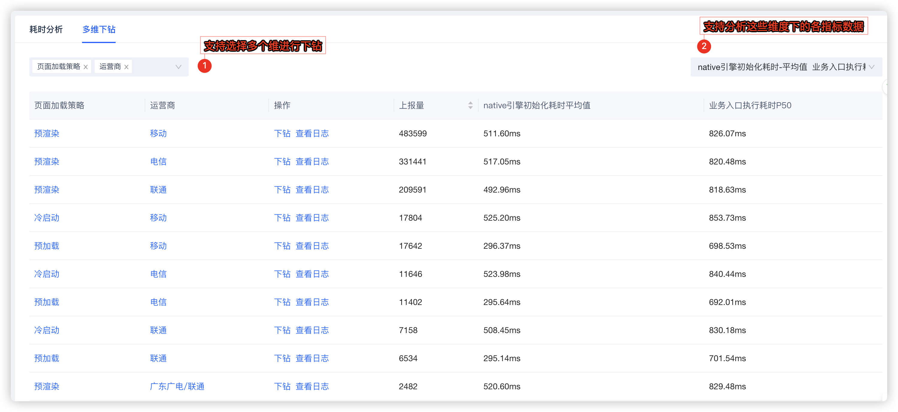

# Bugly Hippy 监控接入使用指引

## 功能简介

Bugly Hippy 监控是专为基于 Hippy 开发框架构建的跨平台应用提供的全链路质量监控解决方案。Bugly Hippy 监控，深度整合 Hippy 框架特性，为开发者提供专业的性能和错误监控能力。

### 核心监控能力

- JS 错误监控
  - 全面捕获 JavaScript 执行时的异常和错误
  - 支持异步错误和 Promise rejection 监控
  - 提供完整的错误堆栈信息和上下文数据

- CGI监控
  - 监控网络请求的成功率、响应时间和错误率
  - 支持 HTTP/HTTPS 请求的详细性能分析

- 静态资源监控​
  - 监控图片、样式表等静态资源的加载性能
  - 统计资源加载成功率和加载时长
  - 识别资源加载失败和超时问题

- 页面性能监控​
  - 精确测量页面加载时间、渲染性能
  - 监控首屏渲染时间和交互响应时间
  - 提供页面级别的性能瓶颈分析

- 页面访问监控​
  - 统计页面 PV/UV 等访问指标
  - 分析用户行为流和转化路径

- 自定义监控功能​
  - 自定义事件​：支持业务特定场景的埋点监控
  - ​自定义测速​：针对关键业务操作进行性能测量

### 功能特色

- ​深度框架集成​
  - 专为 Hippy 框架定制，完美匹配 Hippy 架构特性
  - 支持 React 和 Vue 两种上层框架的监控需求

- ​全链路监控​
  - 从前端到终端的完整监控覆盖
  - 跨 iOS、Android、Ohos 三端的统一监控方案

- ​高性能低开销​
  - 监控 SDK 轻量级设计，对应用性能影响极小
  - 优化的数据上报机制，避免影响用户体验

- ​精准问题定位​
  - 提供丰富的上下文信息，快速定位问题根因
  - 智能错误聚合和根因分析能力

- ​实时数据分析​
  - 分钟级监控数据更新，实时掌握应用状态
  - 多维度的数据分析和趋势展示

- ​开发体验友好​
  - 简单的集成步骤，快速接入监控能力
  - 与现有开发流程无缝衔接，降低使用门槛

## SDK 接入指引

ShiplyCS-HippyAegis 是 Shiply、Bugly、Hippy 团队共建，基于 Aegis-Core 底层，专门针对 Hippy 监控场景进行优化的 SDK。

- 支持 Hippy 团队制定的页面性能官方标准。

- 支持区分 Hippy 网络耗时和 Bridge 耗时。

详细请参考 [《Bugly Hippy 监控 SDK 接入指引》](https://docs.bugly.woa.com/hippy/quick/shiplycs-aegis)。

如果在接入过程中遇到疑问，请联系 [腾讯Bugly客服](https://work.weixin.qq.com/kfid/kfcf4d7385fd3f32b17)。

> 重要提醒：Bugly专业版，Hippy监控还在灰度发布阶段。如需申请试用，请联系 [腾讯Bugly客服](https://work.weixin.qq.com/kfid/kfcf4d7385fd3f32b17)。

## 控制台使用指引

Bugly Hippy 监控功能预览如下图所示：

Bugly Hippy 监控为应用提供了从JS错误、CGI接口、静态资源到页面性能、访问流量的全景式监控能力，并支持自定义事件与测速以满足个性化需求。所有监控维度均遵循一体化数据分析体验。下文将聚焦于 **“页面性能”** 这一维度，详细阐述其使用方法。

### 1. 配置采样率

为满足应用不同生命周期的管理需求，监控配置支持“部署前置”与“线上调控”相结合。部署阶段预设监控范围，上线后则可通过管理台实时调整采样率，从而实现成本与效果的精准平衡。

### 2. 分析指标变化

Bugly Hippy 监控致力于帮助开发者快速定位性能瓶颈。不仅提供灵活的搜索分析，更对关键操作进行全链路打点。以页面打开速度为例，您不仅能看到FP、FCP结果，还能清晰分析从Native引擎初始化、JS加载、业务执行到DOM创建、首帧绘制的每一个关键阶段耗时。这让“页面打开慢”的问题变得可分解、可追溯，结合指标的实时概览与历史趋势，让优化工作有的放矢。

### 3. 关注重要阶段耗时

耗时分析模块通过瀑布图，将页面加载过程中各核心阶段的执行顺序、依赖关系与耗时长短直观呈现。这不仅让总耗时一目了然，更能让开发者快速识别出是哪个阶段发生了阻塞，从而精准定位性能瓶颈的根源。

### 4. 多维下钻指标

多维下钻功能支持您从不同视角切分与对比业务数据。例如，您可以轻松分析“不同页面加载策略”在“不同网络运营商”条件下的表现，从而精准评估策略有效性及网络环境对核心指标（如业务入口执行耗时、Native引擎初始化耗时）的影响。

### 5. 分析上报日志

我们提供了从聚合分析到明细数据的闭环排查能力。所有监控项的原始上报数据均在日志模块中完整保存。当多维分析提示异常时，只需点击 ​​「查看日志」​​ 即可直达相关日志，通过原始信息快速定位问题根因。

### 6. 配置异常告警

Bugly Hippy 监控提供了实时监控和告警能力，允许开发者灵活配置告警条件，及时发现业务异常。

