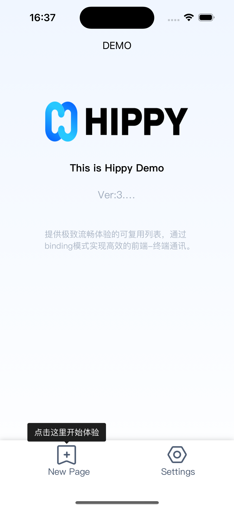
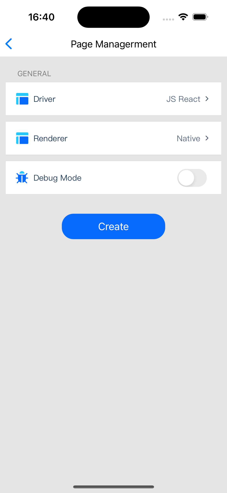
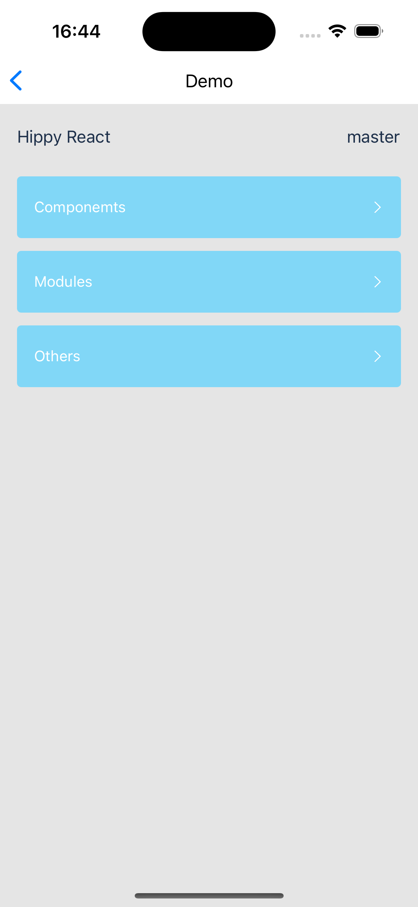
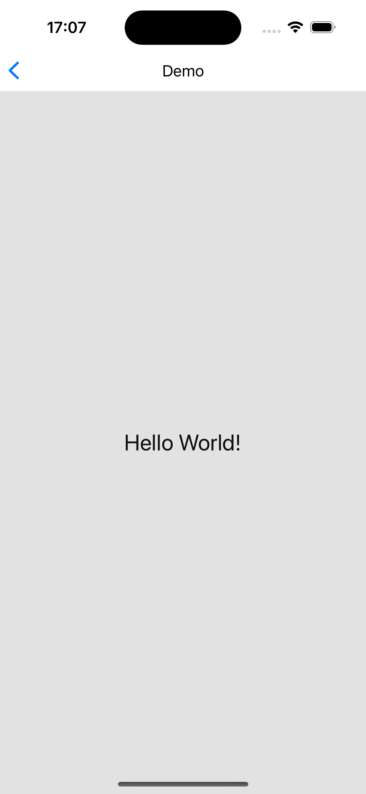

# Demo体验

Hippy 采用 `monorepo` 进行代码管理，多仓库 SDK 统一版本，前端可以直接引入对应的 NPM 包，终端可通过发布分支源码接入或通过对应的包管理仓库引入。

Demo的Native工程代码位于framework/examples目录，前端工程代码位于driver/js/examples目录，如果你对阅读代码更感兴趣，可直接进入github查看

- [Demo Native 工程代码](https://github.com/Tencent/Hippy/tree/main/framework/examples)
- [Demo 前端工程代码](https://github.com/Tencent/Hippy/tree/main/driver/js/examples)

如果已经已经了解Hippy，可跳过Demo体验，参考[Native工程集成章节](development/native-integration?)把Hippy集成到工程。

---

# 快速体验

## 环境准备

### macOS开发环境

可以在macOS上开发iOS，Android应用，请求根据需要进行环境配置。

首先，通过Homebrew包管理工具安装git, git-lfs, node(v16) and npm(v7)

```shell
brew install git git-lfs node@16 cmake
```

#### 编译iOS Demo环境准备

1. Xcode

    通过Apple App Store安装[Xcode](https://apps.apple.com/cn/app/xcode/id497799835?l=en-GB&mt=12)

2. 通过gem命令安装Cocoapods

    `sudo gem install cocoapods`


#### 编译Android Demo环境准备

1. Android Studio

    通过android开发者平台下载安装[Android Studio](https://developer.android.com/studio)
    
2. Android NDK

    通过android开发者平台下载安装[NDK](https://developer.android.com/ndk?hl=en)

### Windows开发环境

可以Windows上开发Android应用，请安装以下依赖。

1. Android Studio

    通过android开发者平台下载安装[Android Studio](https://developer.android.com/studio)
    
2. Android NDK

    通过android开发者平台下载安装[NDK](https://developer.android.com/ndk?hl=en)

3. Git for Windows

    通过(https://gitforwindows.org)下载安装Git for Windows

4. Node和NPM

    通过指引安装[nodejs和npm](https://docs.npmjs.com/downloading-and-installing-node-js-and-npm)，建议使用Node v16，NPM v7版本


## 代码拉取

```shell
git clone  https://github.com/Tencent/Hippy.git
```

## 编译运行Demo

以下基于macOS平台，分别说明如何编译Android和iOS Demo。

### 编译运行iOS Demo

```shell
# 进入Hippy源码目录
cd ./framework/examples/ios-demo
# 使用 Cocoapods 生成工程
pod install
# 打开 workspace，编译运行即可
open HippyDemo.xcworkspace
```

### 编译运行Android Demo

1. 使用 Android Studio 打开根目录 `Android Project` 项目。
2. 使用 USB 线连接 Android 设备，并确保设备 USB 调试模式已经开启（电脑 Terminal 执行 `adb devices` 检查手机连接状态）。
3. Android Studio 执行项目构建，并安装 APK运行。

### 效果预览

Demo运行起来后，可见Demo首页类似



点击"New Page"，进入页面管理


点击"+"号创建新的Hippy页面



点击Create按钮后，显示出了Hippy渲染的页面




## 动手尝试

如果你不满足于简单把Demo跑起来，还可以动手尝试修改前端代码，可以按照以下指引进行。

### 了解Demo项目代码

Demo项目Native代码位于framework/examples/，前端代码位于driver/js/examples目录

```shell
steven@STEVEN-MC Hippy % ls  driver/js/examples 
total 0
drwxr-xr-x   8 steven  staff  256 Oct 30 14:53 hippy-react-demo
drwxr-xr-x   9 steven  staff  288 Oct 30 14:53 hippy-vue-demo
drwxr-xr-x  11 steven  staff  352 Oct 30 14:53 hippy-vue-next-demo

```

其中前端hippy-react-demo、hippy-vue-demo、hippy-vue-next-demo这3者为前端项目Demo，分别演示基于hippy-react、hippy-vue、hippy-vue-next开发项目。

### 修改前端工程

以hippy-react-demo为例，打开hippy-react-demo/src/app.jsx，将内容替换为以下代码片段

```jsx
import React, { Component } from 'react';
import {
  View,
  Text
} from '@hippy/react';

export default class App extends Component {
  render() {
    return (
        <View style={{backgroundColor: '#f0f0f0f0', flex: 1, justifyContent: 'center', alignItems: 'center'}}>
          <Text style={{fontSize: 24, color: '#0f0f0f'}}>Hello World!</Text>
        </View>
    );
  }
}
```

### 编译修改后的前端工程

先在Hippy**根目录**执行命令

```shell
npm install
```

以hippy-react-demo为例说明编译流程

```shell
cd driver/js/
npm run init

# 该命令由 `npm install && npx lerna bootstrap && npm run build` 组成，你也可以分别执行这几个命令。
#
# npm install: 安装项目所需的脚本依赖。
#
# `npx lerna bootstrap`: 安装每一个 JS 包的依赖。（Hippy 使用 [Lerna](https://lerna.js.org/) 管理多个 js 包）
#
# `npm run build`: 构建每一个 JS SDK 包。

# 编译hippy-react-demo
npm run buildexample hippy-react-demo

# 如果上一条命令有异常，可以执行以下命令
cd examples/hippy-react-demo
npm install --legacy-peer-deps
cd ../..
npm run buildexample hippy-react-demo
```

执行完后，构建产物将会被打包放到examples/hippy-react-demo/dist目录中，目录内容类似

```shell
driver/js/examples/hippy-react-demo/dist
├── android
│   ├── assets
│   │   ├── defaultSource.jpg
│   │   └── hippyLogoWhite.png
│   ├── asyncComponentFromHttp.android.js
│   ├── asyncComponentFromLocal.android.js
│   ├── index.android.js
│   ├── vendor-manifest.json
│   └── vendor.android.js
└── ios
    ├── assets
    │   ├── defaultSource.jpg
    │   └── hippyLogoWhite.png
    ├── asyncComponentFromHttp.ios.js
    ├── asyncComponentFromLocal.ios.js
    ├── index.ios.js
    ├── vendor-manifest.json
    └── vendor.ios.js

5 directories, 14 files
```

### 运行前端编译产物

正常构建后产物会被拷贝到Android和iOS的res目录，如果发现未拷贝，可以手动执行。
把examples/hippy-react-demo/dist/ios目录内容整体拷贝到ios demo的res/react目录，当用Android来跑时，注意拷贝到Android对应的目录。

```shell
cp -R driver/js/examples/hippy-react-demo/dist/ios/*   framework/examples/ios-demo/res/react
cp -R driver/js/examples/hippy-react-demo/dist/android/*  framework/examples/android-demo/res/react/
```

接下来，按照[编译运行Demo](#编译运行demo)一节运行Demo。
效果如图所示




恭喜你完成了Hippy的初步体验，下一步参考[Native工程集成章节](development/native-integration)将Hippy接入到你现有的工程吧。
