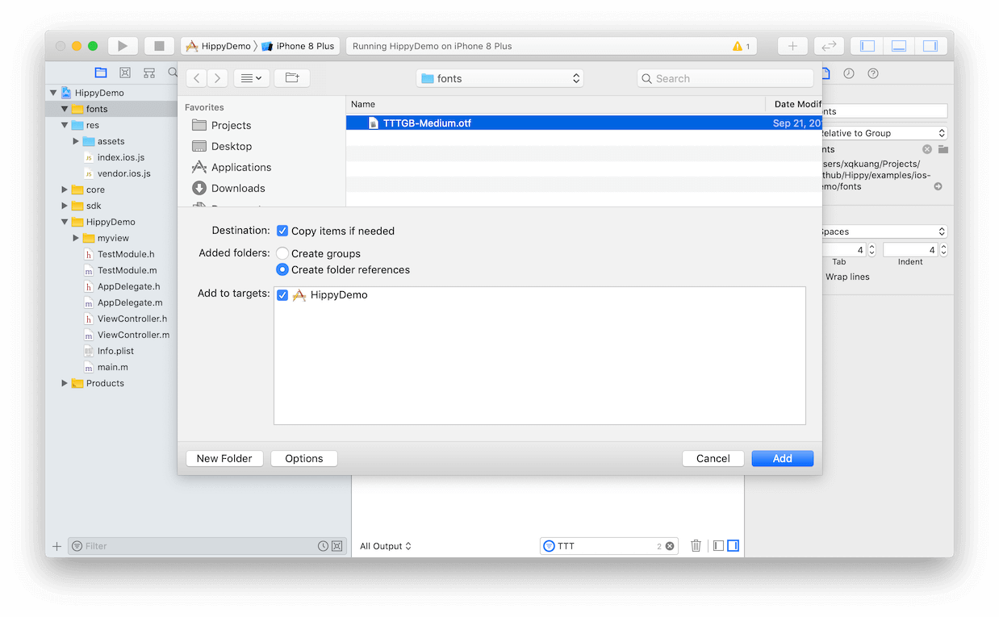
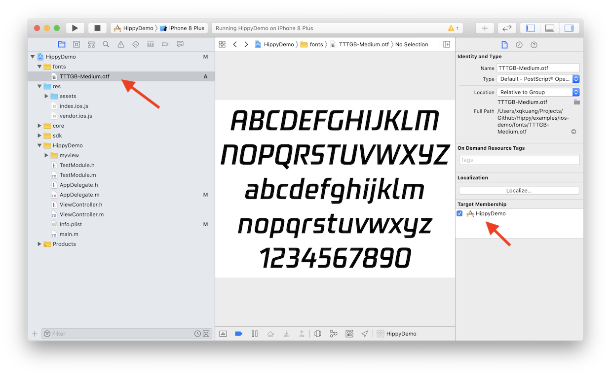
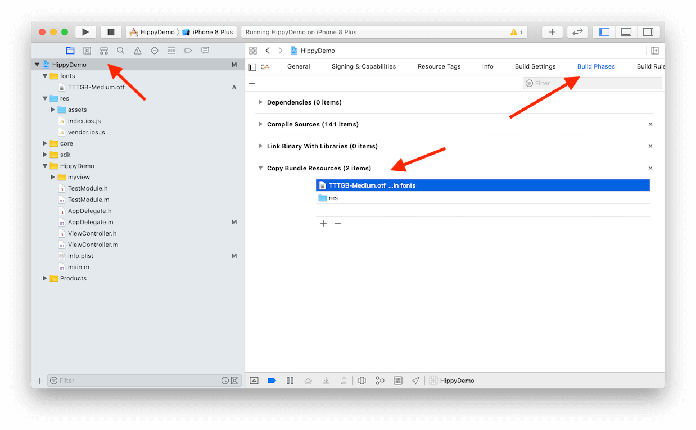
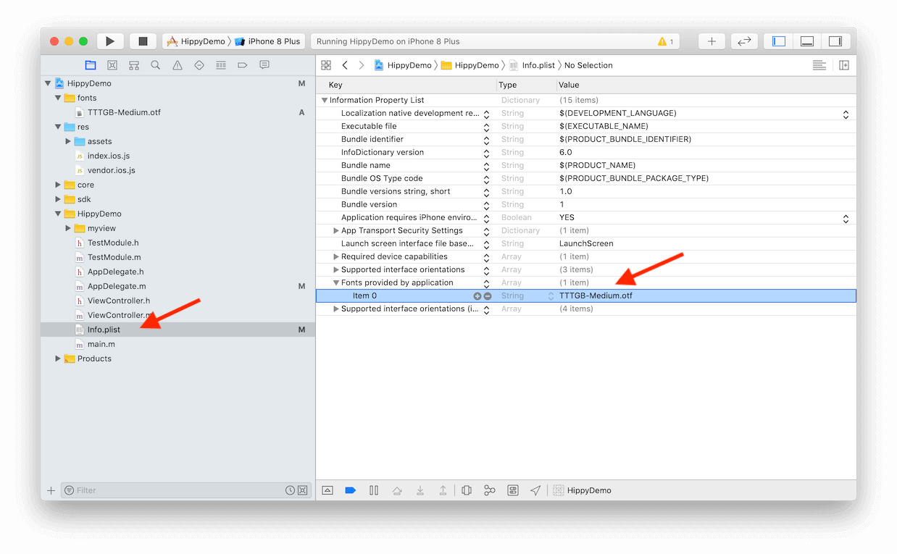
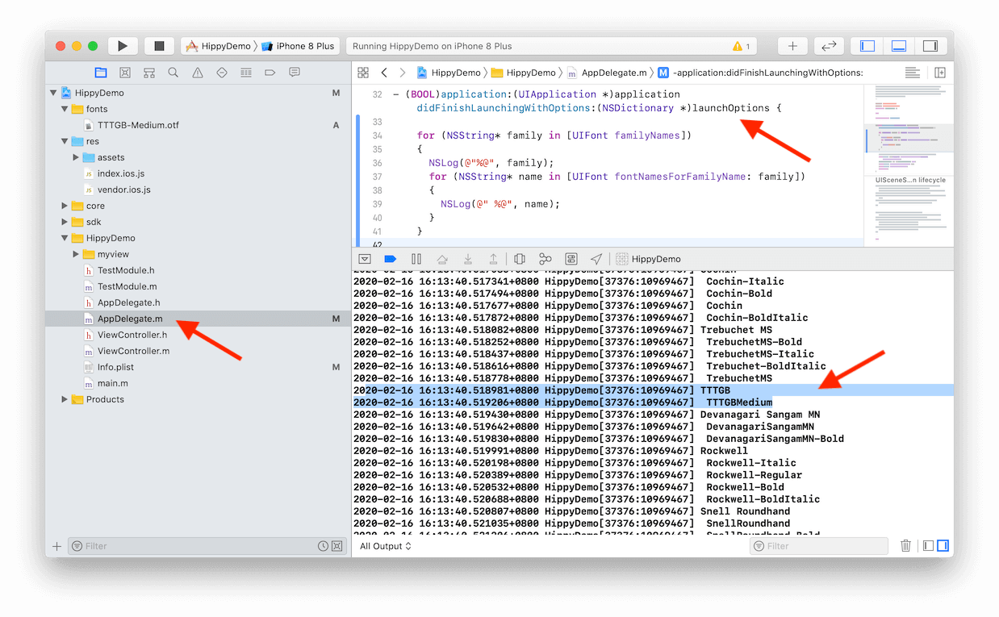

<!-- markdownlint-disable no-duplicate-header -->

# Custom Font

---

# Front-end

It's easy to use custom fonts on the front-end, just like browsers, by using the [font-family](https://www.w3schools.com/cssref/pr_font_font-family.asp) style.

There are two examples: [hippy-react-demo](https://github.com/Tencent/Hippy/blob/master/examples/hippy-react-demo/src/components/Text/index.jsx#L49), [hippy-vue-demo](https://github.com/Tencent/Hippy/blob/master/examples/hippy-vue-demo/src/components/demos/demo-p.vue#L41)

However, if you want to use fonts other than those that come with the operating system, you need to integrate them separately and continue to read the following.

# iOS

## Integrate font file

Open the iOS project, create a `fonts` new directory, and drag the font file to that directory. Follow the screenshot and create a font reference to ensure that the Target is correct.



Then click on the font file in the project and verify that the Target is correct again.



## Check project configuration

Make sure that the font file of the project's settings is `Build Phases` properly integrated.



## Add fonts to Info.plist

To add the exact font file name to `Info.plist` the `Fonts provided by application` field, if there is no such line, you need `Add row` to add a line manually.



## Verify font correctness

If everything is correct, the front-end should be able to display the custom font normally, but sometimes it can not be displayed. The most common one is that the Font Family parameter value is incorrect because of the **font file name!== Font Family**。

There is a simple way to verify. List all Font families for checking.

Add the following code `AppDelegate.m` to the `application didFinishLaunchingWithOptions` method of, and open it in the `Debug` menu `Debug Area``Active Console` (press Command + Shift +C to quickly open it) to print all Font families.

```objectivec
for (NSString* family in [UIFont familyNames])
{
  NSLog(@"%@", family);
  for (NSString* name in [UIFont fontNamesForFamilyName: family])
  {
    NSLog(@" %@", name);
  }
}
```



# Android

## Integrate font file

Android only needs to establish the `fonts` directory in the static resource `assets` directory, and then copy the font file into it.

It's important to note that the font file name needs to be the same as the FontFamily, because Android can also do font file name mapping, but the font and file name consistency is undoubtedly the easiest way.

If `fontFamily` and attributes like `bold(fontWeight: 'bold')` or `italic(fontStyle: 'italic')` are used together，the Hippy SDK will give priority to finding font file in the `fonts` directory stored in the form of <strong>font name + suffix</strong>. For example:

- style={ { fontFamily: 'TTTGB' } } -> TTTGB.ttf or TTTGB.otf
- style={ { fontFamily: 'TTTGB', fontWeight: 'bold' } } -> TTTGB_bold.ttf or TTTGB_bold.otf
- style={ { fontFamily: 'TTTGB', fontStyle: 'italic' } } -> TTTGB_italic.ttf or TTTGB_italic.otf
- style={ { fontFamily: 'TTTGB', fontWeight: 'bold', fontStyle: 'italic' } } -> TTTGB_bold_italic.ttf or TTTGB_bold_italic.otf

<strong>After version `2.16.0`，if font file with corresponding suffix is not found，the Hippy SDK will try finding font file without suffix and display in corresponding style using Android's [Typeface](https://developer.android.com/reference/android/graphics/Typeface).</strong>

>The official demo font is placed in the [res/fonts](https://github.com/Tencent/Hippy/tree/master/examples/android-demo/res) directory because the compilation script [directly copies the files in the `res` directory to the `assets` directory](https://github.com/Tencent/Hippy/blob/master/examples/android-demo/build.gradle#L35), so`res/assets`  becomes the `assets/assets` directory. In order to correctly copy the font directory into the `assets` static resource directory, it can only be placed in`res` the directory.
