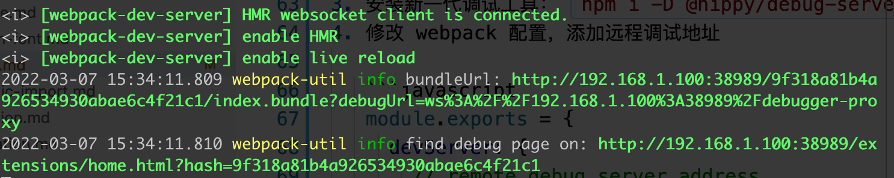
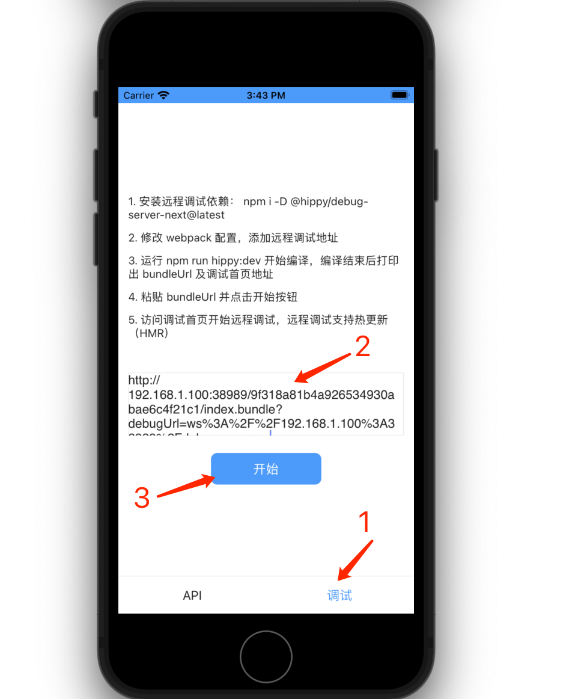
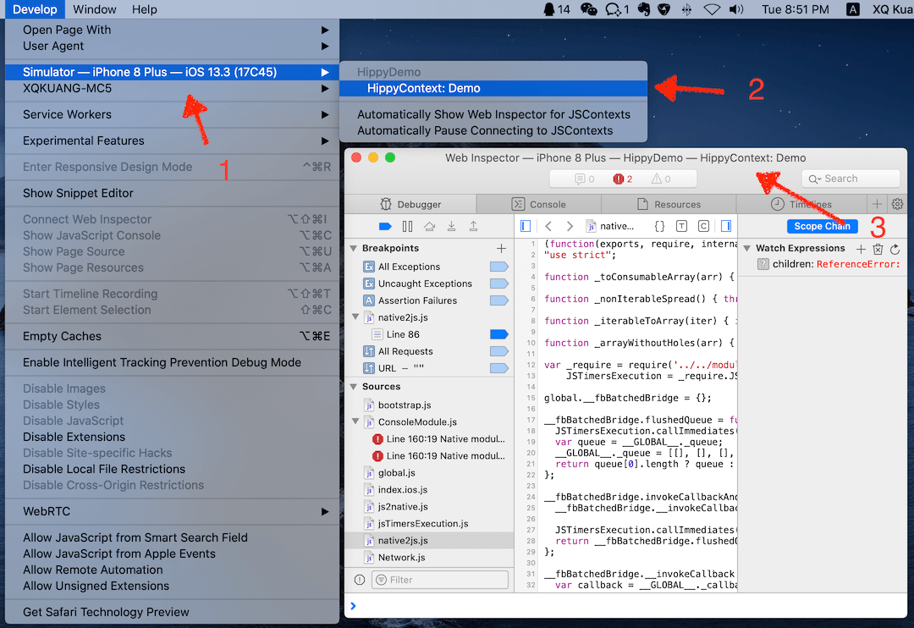
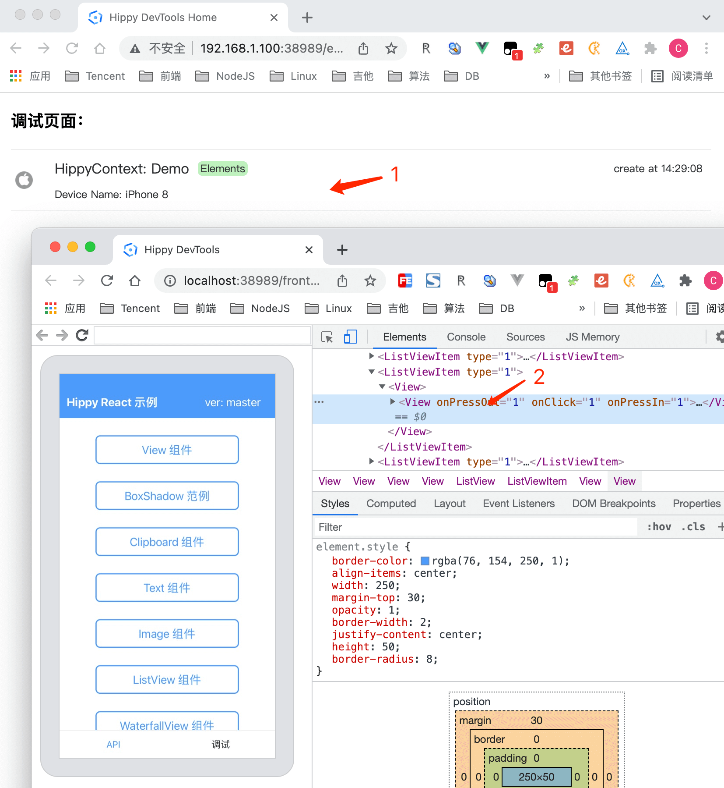
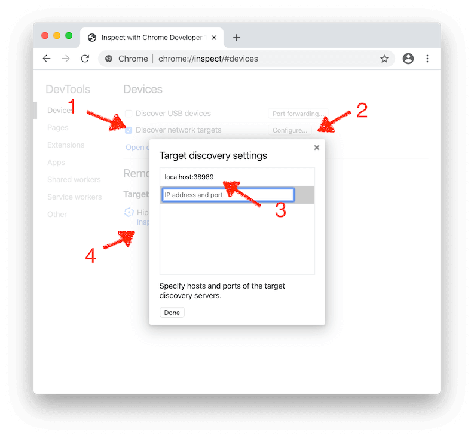
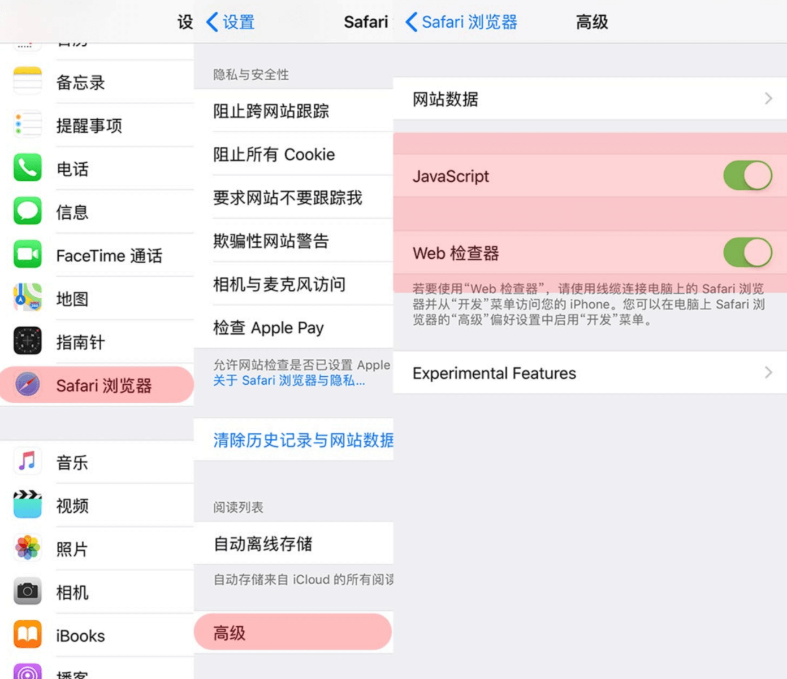
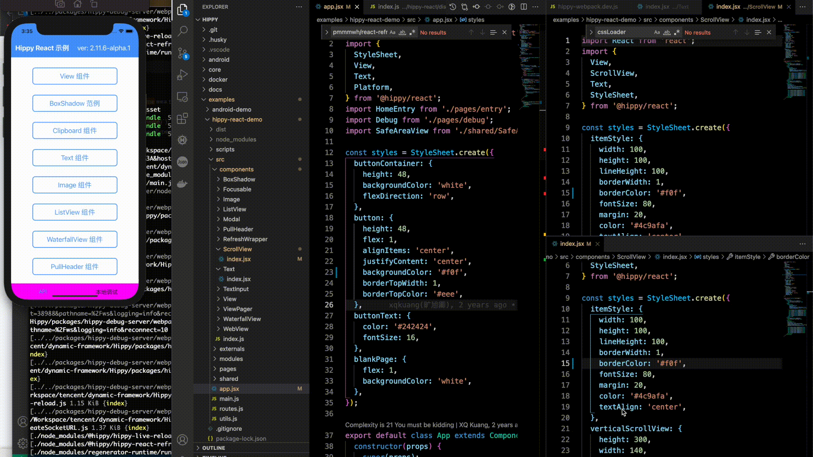
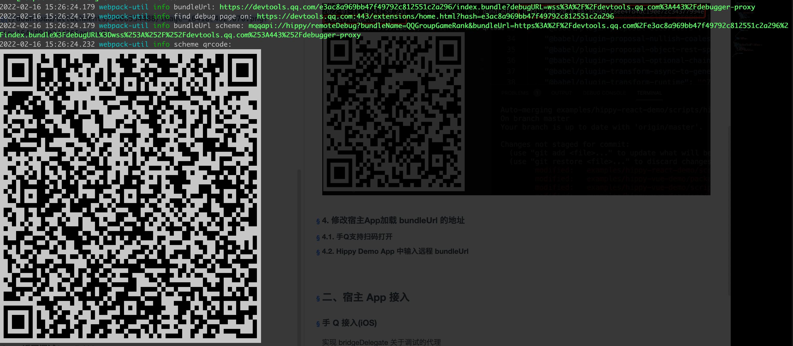
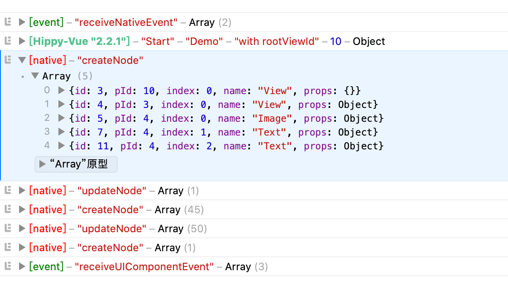

# Debug

---

# Hippy Debugging Principles

Hippy runs directly in real device's JS engine, using WebSocket on Android to communicate with Chrome on the computer via [Chrome DevTools Protocol](//chromedevtools.github.io/devtools-protocol/) debugging, while iOS uses the built-in [JavaScriptCore](//developer.apple.com/documentation/javascriptcore) to connect with [Safari](//www.apple.com.cn/cn/safari/) for debugging, and in the newer Hippy versions of iOS, it can also be debugged using Chrome DevTools.

The JS code running in Hippy can originate from a local file, or from a remote server.

The [@hippy/debug-server-next](//www.npmjs.com/package/@hippy/debug-server-next) is aimed to solve the problem of getting the JS file for debugging in native debug mode, and send the [Chrome DevTools Protocol](//chromedevtools.github.io/devtools-protocol/) back to the debugger.

# Project Initialization

1. run `git clone https://github.com/Tencent/Hippy.git`

   ! > Hippy repository uses [git-lfs](https://git-lfs.github.com/) to manage so, gz, otf, png, jpg files, please make sure you have [git-lfs](https://git-lfs.github.com/) installed.

2. Run the command `npm install` at project root to install front-end dependencies.
3. Run the command `npx lerna bootstrap` at project root to install each package dependency of the front-end. (Hippy uses [Lerna](https://lerna.js.org/) to manage multiple JS repositories, if `lerna command is not found`, first execute `npm install lerna -g`)
4. Run the command `npm run build` at project root to compile the front-end SDK package.
5. Select a front-end sample project to compile, run `npm run buildexample -- [hippy-react-demo|hippy-vue-demo]` in project root.

# Native Environment Preparation

We recommend leaving a backdoor in the native code to enter debug mode after being triggered by certain conditions, the specific code can be found in [iOS](//github.com/Tencent/Hippy/blob/master/examples/ios-demo/HippyDemo/TestModule.m#L60) and  [Android](//github.com/Tencent/Hippy/blob/master/examples/android-demo/example/src/main/java/com/tencent/mtt/hippy/example/module/TestModule.java#L31), where a `TestModule` is implemented and the front-end enters debug mode when its `debug` or `remoteDebug` methods are called. The native can be accessed by other means. The native opens the Hippy Debug page with the following code.

1. **Android**.

   ```java
        // Initialize the hippy engine
        HippyEngine.EngineInitParams initParams = new HippyEngine.EngineInitParams();
        // optional: whether to set to debug mode, default DebugMode.None. set DebugMode.Dev for debug mode, all jsbundle are downloaded from the debug server
        initParams.debugMode = HippyEngine.DebugMode.Dev; // debugMode still uses boolean type below 2.16.0 versions  => initParams.debugMode = true;
        initParams.debugServerHost = "localhost:38989";
        initParams.debugBundleName = "index.bundle";
   ```

2. **iOS**.

   ```objective-c
   - (void)viewDidLoad {
       // Enable debugging
       NSDictionary *launchOptions = @{@"DebugMode": @(YES)};
       // Use the default http://localhost:38989/index.bundle
       NSString *bundleStr = [HippyBundleURLProvider sharedInstance].bundleURLString;
       NSURL *bundleUrl = [NSURL URLWithString:bundleStr];
       HippyBridge *bridge = [[HippyBridge alloc] initWithDelegate:self
                                                         bundleURL:bundleUrl
                                                    moduleProvider:nil
                                                     launchOptions:launchOptions
                                                       executorKey:@"Demo"];
   }
   
   
   - (BOOL)shouldStartInspector:(HippyBridge *)bridge {
       return bridge.debugMode;
   }
   
   - (NSURL *)inspectorSourceURLForBridge:(HippyBridge *)bridge {
       return bridge.bundleURL;
   }
   ```

# Front-end Environment Preparation

1. install the next generation of debugging tools: `npm i -D @hippy/debug-server-next@latest`
2. Modify the Webpack configuration to add the debug service address, the default is ``http://localhost:38989``

   ```javascript
   module.exports = {
     devServer: {
       // debug service address
       remote: {
         protocol: 'http',
         // Local LAN IP for real iOS device debugging
         // localhost for iOS emulator and real Android device debugging
         // configured as remote server IP or domain name for remote debugging
         host: '192.168.1.100',
         // debug service port
         port: 38989,
       },
       // default false, set to true debugging service supports multiple projects debugging at the same time without interfering with each other
       multiple: false,
       // default false, hippy vue projects can be manually enabled
       vueDevtools: false,
       // default hot/liveReload both true, if you only want to use live-reload function, please set hot to false and liveReload to true
       hot: true,
       liveReload: true,
       client: {
         overlay: false,
       },
     },
     // ... other config
   }
   ```

3. Modify the start build command in `package.json`. If the business is started with a custom cli, refer to [package build API](#debug-server-api) for configuration

   ```json
   {
     "scripts": {
        // -c or --config provides the webpack config path
        "hippy:dev": "node ./scripts/env-polyfill.js hippy-dev -c ./scripts/hippy-webpack.dev.js"
     }  
   } 
   ```

4. Run `npm run hippy:dev` to start building and turn on the Dev Server for `HMR` and `Live-Reload` as needed, and print out the bundleUrl and debug home address when the build is finished

   

5. <span id="config-bundle">paste bundleUrl and click start button</span>

    

6. Start debugging with the debugger

   - Safari DevTools: Open Safari's development menu on a Mac (`Preferences` -> `Advanced` -> `Show Development Menu`) and follow the instructions below to start debugging. The Safari debugger supports iOS devices and supports `HMR & Live-Reload, Log, Sources, Memory` and other capabilities.

     

   - Chrome DevTools: Visit the debug home address printed in step 4 to start debugging. Chrome debugger supports Android & iOS devices with `HMR & Live-Reload, Elements, Log, Sources, Memory` capabilities.

     

    If you don't use our debug homepage, you can also actively open DevTools at `chrome://inspect` by first making sure that the `Discover USB devices` checkbox is `unchecked`, then making sure that `Discover network targets` is checked, and that the `Configure` button popup contains the `localhost:38989` debug service address, and the words `Hippy debug tools for V8` should appear in the `Remote Target` below, click the `inspect` link below to open the Chrome debugger.

    

> `@hippy/debug-server-next` contains all the capabilities of `@hippy/debug-server`, a debugging tool for Hippy 3.0 that is fully backward compatible.

# Debugging Javascript

Although Hippy is a front-end framework, it still runs in the native. If the native provides a backdoor to directly link to the debugging service, you can directly use the native backdoor to connect to the native for debugging.

Here, take the official example to describe how to debug.

!> Note that the official example makes `@hippy/react` and `@hippy/vue` an [alias to the packages directory](https://github.com/Tencent/Hippy/blob/master/examples/hippy-react-demo/scripts/hippy-webpack.dev.js#L76). In order to debug the official example, you need to first use ```npm run build``` in the Hippy project root to compile the front-end SDK; or remove the alias to packages in example's ```scripts``` directory.

## iOS

iOS debugging supports both emulator and real iOS device. Since JSBundle and debugging protocols depend on network transfer, you need to make sure your device is on the same LAN as the development machine when debugging on real device. Therefore, we recommend using the emulator.

### Emulator Debugging

1. Click [Xcode on Mac AppStore](//apps.apple.com/cn/app/xcode/id497799835?l=en&mt=12) to download and install Xcode.
2. use Xcode to open `HippyDemo.xcodeproj` project file in [Hippy iOS example project](//github.com/Tencent/Hippy/tree/master/examples/ios-demo), and click run. Under normal circumstances, you should be able to start simulator and run the built-in Hippy front-end code,
3. open project [hippy-react-demo](//github.com/Tencent/Hippy/tree/master/examples/hippy-react-demo) or [hippy-vue-demo](//github.com/Tencent/Hippy/tree/master/examples/hippy-vue-demo) under`examples`. after installing the dependencies via `npm i`, use `npm run hippy:dev` to start building and debugging,
4. Go back to the simulator, [paste bundleUrl](guide/debug.md#config-bundle) and start debugging
5. If HMR or Live-Reload is enabled when the JS source file is changed, it will be refreshed automatically after compilation; otherwise, you need to press `Command + R` or `Command + D` to bring up the Reload panel to refresh it.

> If `Command + D` cannot bring up the panel, you can click `Device` -> `Shake` to force open the Reload panel

### Real iOS device debugging

1. **Real iOS device debugging only supports XCode compiled apps, and the JavaScript debugging and web inspector options need to be enabled on iOS devices**

   

2. Make sure the iOS device and debug service are on the same LAN
3. Compile App，[paste bundleUrl](guide/debug.md#config-bundle) and start debugging

!> Note: You must ensure that the development machine and the device are on the same LAN when debugging on the real device, otherwise the JSBundle will fail to load. Neither of the following is satisfied: <br/>
&nbsp;&nbsp;(a) The development machine and the real iOS device are connected to different network environments.<br/>
&nbsp;&nbsp;(b) The development machine is connected to the network cable and the mobile device is connected to WiFi.

## Android

Android uses the [adb](//developer.android.com/studio/command-line/adb) port mapping feature to solve the communication problem between the real Android device and the development machine, but because of the efficiency of the ARM simulator, it is more recommended to use the real device for debugging.

Specific procedure:

1. Download and install [Android Studio](//developer.android.com/studio)
2. Using Android Studio to open `Hippy Repo` root directory, which will load [Hippy Android example project](//github.com/Tencent/Hippy/tree/master/examples/android-demo).
3. Plug in your real Android device via the data cable and click Run in Android Studio. Normally, the device should already be running the `Hippy Demo` app.
4. Go back to your device and make sure that `USB debug mode` is turned on - you can enter `Developer mode`' by clicking `Build` in succession on the About page, and then turn on `USB debug mode` after you enter the `Developer mode` screen.
5. Run `adb reverse --remove-all && adb reverse tcp:38989 tcp:38989` to make sure port 38389 is not occupied.
6. Open the front-end example project [hippy-react-demo](//github.com/Tencent/Hippy/tree/master/examples/hippy-react-demo) or [hippy-vue-demo](//github.com/Tencent/Hippy/tree/master/examples/hippy-vue-demo), use npm run hippy:dev to start building and debugging service.
7. Back to your device, [paste bundleUrl](guide/debug.md#config-bundle) and start debugging
8. If HMR or Live-Reload is enabled when the JS source file is changed, it will be refreshed automatically after compilation; otherwise, you need to press `Command + R` or `Command + D` to bring up the Reload panel.

# Elements Visualization Inspection

> Android SDK min support version 2.9.0
> iOS SDK min support version 2.11.5

Hippy implements node and property mapping from front-end to native, allowing visual inspection of Elements on Chrome DevTools.

<video width="80%" controls preload="none">
  <source src="../assets/img/elements-inspect.webm" type="video/webm">
  Elements Visualization Inspection example
</video>
<br />
<br />

# Operate Mobile Phone Interface

> Android SDK min supported version 2.16.0

Hippy implements the `Input` interface of the `Chrome DevTools Protocol` . You can directly operate the mobile phone interface on Chrome DevTools without switching back and forth during debugging.

<video width="60%" controls preload="none">
  <source src="../assets/img/device-ctrl.webm" type="video/webm">
  operate mobile phone interface example
</video>

# HMR & Live-Reload

> min support version 2.12.0

[hippy-react-demo config script](//github.com/Tencent/Hippy/blob/master/examples/hippy-react-demo/scripts/hippy-webpack.dev.js)

[hippy-vue-demo config script](//github.com/Tencent/Hippy/blob/master/examples/hippy-vue-demo/scripts/hippy-webpack.dev.js)


<br />
<br />

!> Please don't import HMR-related configuration in production environment.

After the developer has modified the front-end code, we can refresh the component view by `Hot Module Replacement (HMR)` retaining state, or reload the business instance by `live-reload`, as follows.

## Hippy-Vue

1. Install live-reload dependencies

   ```bash
   npm i @hippy/vue@^2.12.0
   npm i -D @hippy/debug-server-next@latest @hippy/vue-loader @hippy/vue-css-loader
   ```

2. Webpack config demo

   ```javascript
   const VueLoaderPlugin = require('@hippy/vue-loader/lib/plugin');
   const vueLoader = '@hippy/vue-loader';
 
   module.exports = {
    devServer: {
      // default hot/liveReload set to true. If you only want to use live-reload, set hot to false and liveReload to true
      hot: true,
      liveReload: true,
      client: {
        // Error masks are not supported at the moment
        overlay: false,
      },
    },
    plugins: [
      new VueLoaderPlugin(),
      // add other plugin ...
    ],
    module: {
      rules: [
        {
          test: /\.vue$/,
          use: [
            vueLoader,
          ],
        },
      ],
      // add other loaders ...
    }
   }
   ```

3. package.json configuration.

   ```json
   {
     "scripts": {
         // -c or --config provides webpack config path
        "hippy:dev": "node ./scripts/env-polyfill.js hippy-dev -c ./scripts/hippy-webpack.dev.js"     }  
   } 
   ```

4. start development: `npm run hippy:dev`

5. **If the Android device is disconnected, you need to manually forward the port with adb:** `adb reverse tcp:38989 tcp:38989`.

6. iOS hot update: iOS devices need to be proxied to the development machine or on the same network segment to use the HMR capability. Webpack configuration is modified as shown below, for the emulator, which is on the same network segment as the development machine, the IP is accessible by setting to `localhost`.

    ```javascript
    module.exports = {
      devServer: {
        host: '<your_ip_or_localhost_with_proxy>',
      },
    }
    ```

## Hippy-React

1. install HMR

   ```bash
   npm i @hippy/react@^2.12.0
   npm i -D @hippy/debug-server-next@latest @hippy/hippy-react-refresh-webpack-plugin react-refresh
   ```

2. Webpack configuration example

   ```javascript
   const ReactRefreshWebpackPlugin = require('@hippy/hippy-react-refresh-webpack-plugin');
 
   module.exports = {
     devServer: {
       // default hot, liveReload are true, if you only want to use live-reload function, please set hot to false and liveReload to true
       hot: true,
       liveReload: true,
       client: {
         // Error masks are not supported at the moment
         overlay: false,
       },
     },
     plugins: [
       new ReactRefreshWebpackPlugin({
         // Error masks are not supported at this time
         overlay: false,
       }),
     ],
     module: {
       rules: [
         {
           test: /\.(jsx?)$/,
           use: [
             {
               loader: 'babel-loader',
               options: {
                 sourceType: 'unambiguous',
                 presets: [
                  '@babel/preset-react',
                  [
                    '@babel/preset-env',
                    {
                      targets: {
                        chrome: 57,
                        ios: 9,
                      },
                    },
                  ],
                 ],
                 plugins: [
                   ['@babel/plugin-proposal-class-properties'],
                   ['@babel/plugin-proposal-decorators', { legacy: true }],
                   ['@babel/plugin-transform-runtime', { regenerator: true }],
                   // add react-refresh babel plugin
                   require.resolve('react-refresh/babel'),
                 ],
               },
             },
           ],
         },
       // other loader ...
       ],
     },
   };
   ```

3. package.json configuration.

   ```json
   {
      "scripts": {
        // -c or --config provide Webpack config path
        "hippy:dev": "node ./scripts/env-polyfill.js hippy-dev -c ./scripts/hippy-webpack.dev.js"
      }
   }
   ```

4. Run the `npm run hippy:dev` commands.

5. **If the Android device is disconnected, you need to manually forward the port with adb:** `adb reverse tcp:38989 tcp:38989`.

6. iOS hot update: iOS devices need to be proxied to the development machine or on the same network segment to use the HMR capability. Webpack configuration is modified as shown below, for the emulator, which is on the same network segment as the development machine, the IP is accessible by writing ``localhost``.

    ```javascript
    module.exports = {
      devServer: {
        host: '<your_ip_or_localhost_with_proxy>',
      },
    }
    ```

# Vue Devtools

> Minimum supported version 2.13.7

Support for debugging Vue component trees, component state, routes, store, and event performance

<video width="80%" controls preload="none">
  <source src="../assets/img/hippy-vue-devtools.webm" type="video/webm">
  Vue Devtools example
</video>

1. install vue-devtools dependencies.

   ```bash
   npm i @hippy/vue@^2.13.7 @hippy/vue-router@^2.13.7
   npm i @hippy/debug-server-next@latest -D
   ```

2. open vue devtools

   ```js
   module.exports = {
    devServer: {
       remote: {
         protocol: 'https',
         host: 'devtools.qq.com',
         port: 443,
       },
      // default is false, when enabled, vue debugging commands will be distributed via the remote debugging service specified in the remote field
      vueDevtools: true
    },
   ```

! > Vue Devtools configuration will inject debugging code at runtime, which may have some performance impact, please do not introduce it in the production environment.

# React Devtools

> Min support client version 2.13.7<br />
> Min support front-end version 2.14.0

Support for debugging React component tree, component state, route, performance, etc.

<video width="80%" controls preload="none">
  <source src="../assets/img/hippy-react-devtools.webm" type="video/webm">
  React Devtools Demo
</video>

Configuration

1. Install react devtools dependencies:

   ```bash
   npm i @hippy/react@^2.14.0
   npm i @hippy/debug-server-next@latest -D
   ```

2. Open react devtools

   ```js
   module.exports = {
    devServer: {
       remote: {
         protocol: 'https',
         host: 'devtools.qq.com',
         port: 443,
       },
      // default false, which will distribute react debugging commands through the remote debugging service specified by the `remote` field.
      reactDevtools: true
    },
    module: {
      rules: [
        {
          test: /\. (jsx?)$/,
          // must add the following line. to make babel ignore react-devtools plugin
          exclude: /@hippy\/hippy-react-devtools-plugin/,
          use: [
            {
              loader: 'babel-loader',
              options: {
                sourceType: 'unambiguous',
                presets: [
                  '@babel/preset-react',
                  [
                    '@babel/preset-env',
                    {
                      targets: {
                        chrome: 57,
                        ios: 9,
                      },
                    },
                  ],
                ],
                plugins: [
                  ['@babel/plugin-proposal-class-properties'],
                  ['@babel/plugin-proposal-decorators', { legacy: true }],
                  ['@babel/plugin-transform-runtime', { regenerator: true }],
                  require.resolve('react-refresh/babel'),
                ],
              },
            },
          ],
        },
      ],
    },
   }
   ```

!> React Devtools configuration injects debugging code at runtime, which may have some performance impact, please do not introduce it in production environment.

Translated with www.DeepL.com/Translator (free version)

# Build & Compile API

`@hippy/debug-server-next` provides command `hippy-debug` and `hippy-dev` to debug and compile. In addition, it provides <span id="debug-server-api"> interface for custom CLI tools to call.</span>:

```javascript
const { webpack } = require('@hippy/debug-server-next');

// start webpack compiling, supports HMR and other ability
webpack(webpackConfig, (err, stats) => {
  // handle webpack callbacks
});
```

# Remote Debugging

Remote Debugging currently supports two modes, including Development Remote Debugging and Production Remote Debugging mode

- Development Remote Debugging mode needs to load bundle from remote server for debug
- Production Remote Debugging mode uses local cached bundle instead of remote, which is more suitable for production environment. If no such requirement, you can also use the above Development Remote Debugging mode

## Development Remote Debugging

Local debugging has two pain points.

1. unable to cover all models and difficult in locating problems from user feedback.
2. unable to get rid of the data cable.

Then we can consider using remote debugging for these scenarios, with the following preview.

<video width="80%" controls preload="none">
  <source src="../assets/img/remote-debug-demo.webm" type="video/webm">
  Remote debug example
</video>

### Front-end Usage Configuration

1. Install the next generation debugging tool: `npm i -D @hippy/debug-server-next@latest`.

2. Modify the Webpack configuration and add `remote` field to configure the compilation product upload address and debug service address (default <http://127.0.0.1:38989>). For security reasons, the official remote debugging service is not available on the public network, you need to deploy it [privately](https://github.com/hippy-contrib/debug-server-next/blob/main/doc/deploy.md) by yourself.

   ```js
   module.exports = {
     devServer: {
       // The remote debug address, configured as the address of your private debug service
       remote: {
         protocol: 'https',
         host: 'devtools.qq.com',
         port: 443,
         // Configure the scheme for the host app to scan and load, if you don't need to scan, you may not configure it
         qrcode: (bundleUrl) => {
           // must specify business bundleName
           const bundleName = 'QQGroupGameRank';
           return `mqqapi://hippy/remoteDebug?bundleName=${bundleName}&bundleUrl=${encodeURIComponent(bundleUrl)}`;
         }
       },
       client: {
         overlay: false,
       },
     },
     // other config ...
   }
   ```

   !> Configure that the compilation product will be uploaded to the remote end when debugging remotely and deleted after debugging is finished. As a precaution, make sure that the code does not contain sensitive information (e.g. keys, etc.).

   !> When debugging remotely, `publicPath` will be set to `{protocol}://${host}:${port}/<hash>/` to distinguish between different business.

   !> [when business loads remote js sub-bundles](guide/dynamic-import.md#remote-bundle), if `customChunkPath` is not configured, the address of `publicPath` will be used by default, please make sure the remote subpackage is also uploaded to the debug server at the same time.

3. Start the build: `npm run hippy:dev`, and the debug message will be printed when the build is finished:

   

   where the three printed fields are:

   - bundleUrl: the address of the JSBundle for remote debugging, filled in the `remoteServerUrl` field of the host App
   - debug page: the debugging home page of the PC side
   - bundleUrl scheme: scheme of the host App's code scanning

### Host App Configuration

Set Host App debugMode to true and pass in the bundleUrl generated by front-end Webpack for remote wireless debugging, we recommend the host to use input box or scan QR code to pass in.

1. **Android**

   ```java
    // initialize hippy engine
    HippyEngine.EngineInitParams initParams = new HippyEngine.EngineInitParams();
    initParams.debugMode = HippyEngine.DebugMode.Dev; // debugMode still uses boolean type below 2.16.0 versions  => initParams.debugMode = true;
    initParams.remoteServerUrl = ""; // remote debug bundleUrl
   ```

2. **iOS**

   ```objective-c
   - (void)viewDidLoad {
       // Enable debugging
       NSDictionary *launchOptions = @{@"DebugMode": @(YES)};
       NSString *bundleStr = ""; // remote debug bundleUrl
       NSURL *bundleUrl = [NSURL URLWithString:bundleStr];
       HippyBridge *bridge = [[HippyBridge alloc] initWithDelegate:self
                                                         bundleURL:bundleUrl
                                                    moduleProvider:nil
                                                     launchOptions:launchOptions
                                                       executorKey:@"Demo"];
   }
   
   - (BOOL)shouldStartInspector:(HippyBridge *)bridge {
       return bridge.debugMode;
   }
   
   - (NSURL *)inspectorSourceURLForBridge:(HippyBridge *)bridge {
       return bridge.bundleURL;
   }
   ```

## Production Remote Debugging

In the production environment, developers can directly debug the local bundle, restore the scene of online users, and improve the efficiency for fixing problem

### Front-end Usage

no need

### Host App

1. **Android**：

  > Minimum supported version 2.16.0

  The type of debugMode is changed from boolean type to enumeration type

  ```java
    public enum DebugMode {
      None, // Production
      Dev, // Development
      UserLocal, // directly use local bundle to debug instead of from remote server
    }
  ```

 **Step One**:

  ```java
  // hippy engine initialized
    HippyEngine.EngineInitParams initParams = new HippyEngine.EngineInitParams();
    initParams.debugMode = HippyEngine.DebugMode.UserLocal; // open debug in production
  ```

  **Step two**：

  Sometimes engine startup and business are separated in many business, so we separate the debugging option startup and debug server connection, which is better for usage.

  ```java
  // connect debug server before or after business startup
  mHippyEngine.getEngineContext().getBridgeManager().connectDebugUrl("ws://${ip}:${port}/debugger-proxy");
  mHippyView = mHippyEngine.loadModule(loadParams, new HippyEngine.ModuleListener() {
      @Override
      public void onLoadCompleted(ModuleLoadStatus statusCode, String msg, HippyRootView hippyRootView) {
        if (statusCode != ModuleLoadStatus.STATUS_OK) {
          LogUtils.e("MyActivity", "loadModule failed code:" + statusCode + ", msg=" + msg);
        }
      }

      @Override
      public boolean onJsException(HippyJsException exception) {
        return true;
      }
  });
  ```

2.**iOS**

(coming soon)

## List of supported capabilities for remote debugging

> min support version 2.13.1

| Platform | HMR & Live-Reload | Elements | Log | Sources | Memory |
|:--------:|:---:|:-------:|:---:|:------:|:------:|
| Android  | ✅ | ✅ | ✅ | ✅ | ✅ |
|   iOS    | ✅ | ✅ | ❌ | ❌ | ❌ |

<br />

# Framework Log

Both hippy-react and hippy-vue will output the information of communicating with native, including the js-native node operations, events sent/received. These logs are actually very helpful for business debugging, allowing developers to understand how the front-end framework translates code into a syntax that the native can understand. When you encounter problems, please first check the framework communication logs, as they can basically locate most of the problems.

If you need to turn off the logs, you can add `silent: true` to hippy-react's `new Hippy` startup parameters, or  turn on `Vue.config.silent = true;` in hippy-vue project entry file, or add `silent: true` to hippy-vue-next's `createApp` init options.


