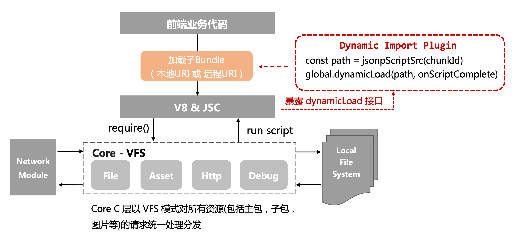

<! -- markdownlint-disable no-duplicate-header -->
<! -- markdownlint-disable no-blacks-blockquote -->

# Dynamic Load

## Introduction

Prior to Hippy 2.2, only a single js bundle file could be loaded. As the business becomes more complex, the increasing size of a single js file size will affect the first screen launch speed. To solve this problem, Hippy v2.2 added dynamic loading capabilities, developers can dynamically introduce sub-js bundle files on demand.

`Hippy minimum version support: 2.2`

## Schematic architecture



## Examples

[[React Paradigm]](//github.com/Tencent/Hippy/blob/master/examples/hippy-react-demo/src/externals/DyanmicImport/index.jsx)

[[Vue paradigm]](//github.com/Tencent/Hippy/blob/master/examples/hippy-vue-demo/src/components/demos/demo-dynamicimport.vue)

## Usage

### Install

`npm install -D @hippy/hippy-dynamic-import-plugin`

### Use

Introduce the plugin in the [webpack package script](https://github.com/Tencent/Hippy/tree/master/examples/hippy-vue-demo/scripts)

```javascript
const HippyDynamicImportPlugin = require('@hippy/hippy-dynamic-import-plugin');

module.exports = {
  entry: {
    index: 'example.js',
  },
  output: {
    filename: 'example.output.js',
    strictModuleExceptionHandling: true,
    path: path.resolve('./dist/'),
    globalObject: '(0, eval)("this")',
  },
  plugins: [
    new HippyDynamicImportPlugin(),
  ],
};
```

### Degradation options

In versions of the native SDK that do not support dynamic import, you can use the following two methods to prevent sub-packaging.

+ Use the `/* webpackMode: "eager" */` magic comment provided by Webpack to stop generating additional chunks. See [webpack magic comment](https://webpack.js.org/api/module-methods/#magic-comments)

```javascript
// Add magic comment in import() example as follows.
AsyncComponent: () => import(/* webpackMode: "eager" */ '. /dynamicImport/async-component.vue'),
```

+ Use the `maxChunks` parameter of the `webpack.optimize.LimitChunkCountPlugin` in the Webpack configuration. See [webpack LimitChunkCountPlugin](https://webpack.docschina.org/plugins/limit-chunk-count-plugin/) for details.

```javascript
// By configuring webpack.optimize.LimitChunkCountPlugin with maxChunks of 1, the dynamic import will be replaced with Promise.resolve
plugins: [
  ...,
  new HippyDynamicImportPlugin(),
  // LimitChunkCountPlugin can control dynamic import ability
  // Using 1 will prevent any additional chunks from being added
  new webpack.optimize.LimitChunkCountPlugin({
      maxChunks: 1,
  }),
],
```

## Support simultaneous configuration of local/network loaded sub-packages

`Network loading hippy sdk: min supported version 2.5.5`

`Network loading @hippy/hippy-dynamic-import-plugin min: supported version 2.0.0`

The following modes are provided

### Only load [local] js bundle

Same as the original dynamic loading capability, the `import()` syntax can be used directly

### Only load [remote] js bundle

+ use webpack script to configure global `publicPath` (optional)

```javascript
 // webpack output config
 output: {
    ...
    publicPath: 'https://xxxx/hippy/hippyVueDemo/',
  },

```

+ <span id="remote-bundle">Configure `webpackChunkName` (required) and `customChunkPath` (optional) for `magic comment` at the entry point of the business code referencing the subpackage; if `customChunkPath` is not configured, it will default to the global `publicPath`.

+ Take Hippy-Vue as an example.

```javascript
 // Hippy-Vue configuration
 AsyncComponentFromHttp: () => import(/* customChunkPath: "https://xxx/hippy/hippyVueDemo/", webpackChunkName: "asyncComponentFromHttp" */'./dynamicImport/async-component-http.vue')
  .then(res => res)
  .catch(err => console.error('import async remote component error', err))
```

### Business loading [local + remote] js bundle at the same time

+ Remove the Webpack global configuration `publicPath` (publicPath will force the configured path to be prepended to all bundles, affecting local bundle loading)

+ load remote bundle, configure `webpackChunkName` (required) and `customChunkPath` (required) of `magic comment` at the entry point of the business code referencing the subpackage. Take Hippy-Vue as an example.

```javascript
 // Hippy-Vue configuration
AsyncComponentFromHttp: () => import(/* customChunkPath: "https://xxx/hippy/hippyVueDemo/", webpackChunkName: "asyncComponentFromHttp" */'./dynamicImport/async-component-http.vue')
  .then(res => res)
  .catch(err => console.error('import async remote component error', err))

```

+ load local bundle, configure `webpackChunkName` of `magic comment` at the entry point of the business code reference sub-package (optional), take Hippy-Vue as an example.

```javascript
// Hippy-Vue configuration
AsyncComponentFromLocal: () => import(/* webpackChunkName: "asyncComponentFromLocal" */'./dynamicImport/async-component-local.vue')
.then(res => res)
.catch(err => console.error('import async local component error', err)),

```
