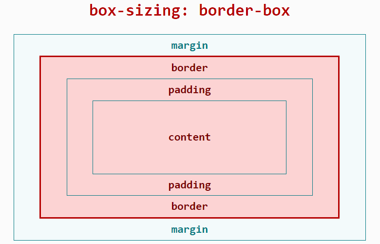

# Box model

In order to facilitate front-end developer to understand, Hippy also uses CSS-Box model to build the style. When Hippy is laying out, the rendering engine will represent all elements as a rectangular box according to the CSS-Box model, and the style configuration determines the size, location, and attributes (color, background, border size ...) of these boxes.

In Hippy, the standard box model is used to describe each of these rectangular boxes. This model describes the content of the space occupied by elements. Each box has four edges: an outer margin edge, a border edge, an inner fill edge, and a content edge.

> PS: Hippy's box model layout corresponds to the 'border-box' type of the 'box-sizing' attribute of CSS. For specific performance and width height margin calculation, please refer to the [MDN Docs: box-sizing](//developer.mozilla.org/en-US/docs/Web/CSS/box-sizing).



* [width](style/layout.md?id=width)
* [height](style/layout.md?id=height)
* [padding](style/layout.md?id=padding)
* [margin](style/layout.md?id=margin)
* [border](style/layout.md?id=borderWidth)

# Layout (Flex)

In Hippy, in order to facilitate the mobile native to write the layout, the most popular 'Flex' layout on the mobile native is supported by default. At the same time, because only 'Flex' layout is supported, it can be used without handwriting 'display: flex'
Flex layouts are similar to Web Flex. They are designed to provide a more effective way to formulate, adjust and distribute the layout of items in a container, even if their size is unknown or dynamic. Flex specifies how the elastic element extends or contracts to accommodate the available space in the Flex container. CSS tutorial documentation can be found in [This article](http://www.w3cplus.com/css3/a-visual-guide-to-css3-flexbox-properties.html)

## flexDirection

The flexDirection attribute specifies how the internal elements are laid out in the Flex container, defining the direction of the main axis (horizontal or vertical).

>Note: Hippy's flexDirection is different from Web's flex-direction, Web defaults to `row`, Hippy defaults to `column`


<br />
<br />

| Type   | Required| Default|
| ------ | -------- |---|
| enum('column', 'row') |No    |'column'|

## alignItems

alignItems define how the flex item can be aligned on the side axis of the current row of the flex container

* flex-start(default): the outer margin of the flex item at the start edge of the side axis is close to the edge of the line at the start of the side axis.
* flex-end: the outer distance of the flex item at the end of the side axis is close to the edge of the line at the end of the side axis.
* center: the outer margin box of the flex item is centered on the side axis of the row.
* baseline: flex items are aligned to their baseline.
* stretch: the flex item stretches to fill the entire flex container. This value causes the size of the item's outer margin box to be as close to the size of the row as possible, subject to the limits of the「min/max-width/height」 attribute.

| Type   | Required| Default|
| ------ | -------- |---|
| enum('flex-start', 'flex-end', 'center', 'baseline', 'stretch') |No     |'flex-start'|

## justifyContent

justifyContent defines the alignment of the flex item along the main axis.

* flex-start(default): the flex items is aligned with the start of a row.
* flex-end: the flex item is aligned to the end of a row.
* center: the flex item is aligned to the middle of a row.
* space-between: the flex items are evenly distributed among the rows. The first flex item is at the beginning of a row, and the last flex item is at the end of a row.
* space-around: the flex items are evenly distributed in rows, leaving half the space at both ends.

| Type   | Required| Default|
| ------ | -------- |---|
| enum('flex-start', 'flex-end', 'center', 'space-between', 'space-around') |No     |'flex-start'|

## flex

The value of the flex attribute, which defines the size of the remaining space in the container that can be occupied by child node items of the flex container. The default value is 0, which does not occupy the remaining space. If a flex number is defined and is positive, then

```text
The remaining space occupied by each element = its own flex value / the sum of the flex numbers of all sub containers at the same level
```

Normal width and height are displayed by default when flex is set to height 1. However, if there is not enough space left, this set`flex: -1` container will shrink to its minWidth and minHeight to display.

| Type   | Required| Default|
| ------ | -------- |---|
| number| No     | 0|

## flexBasis

flexBasis sets the flex basis value, and the remaining space is flexed by a ratio. Negative values are invalid, and can only be 0 or positive.

| Type   | Required| Default |
| ------ | -------- |--------|
| number, string| No     | 'auto'   |

## flexGrow

flexGrow defines the growth of a flex project. It accepts a value without units as a ratio. It is mainly used to determine how much space the remaining space of the flex container should be expanded proportionally.

If flex-row is set to 1 for all flex items, each flex item will be set to an equal amount of remaining space. If you set a flex-row value of 2 for one of the flex items, the remaining space occupied by that flex item is twice as large as the remaining space occupied by the other flex items.

| Type   | Required| Default|
| ------ | -------- |---|
| number| No     | 0|

## flexShrink

flexShrink defines the ability to flex project shrinkage.

>Note: the flexShrink default in Hippy is 0, which is different from the Web standard

| Type   | Required| Default|
| ------ | -------- |---|
| number| No     | 0|

# Unit of length

Hippy now does not support a percentage length value for the time being, only a specific number. Unit is dp, and specific conversion formula is:

```text
the real machine length value = screen scaling * Hippy style length value
```

The screen scaling can be obtained by `PixelRatio.get()` (Hippy-React) or `Vue.Native.PixelRatio` (Hippy-Vue), e.g. 2 for iPhone 8 and 3 for iPhone X. Take iPhone 8 as an example:

* The real screen width is 750px
* The PixelRatio is 2
* So the full screen width of Hippy is `750/2 = 375`
