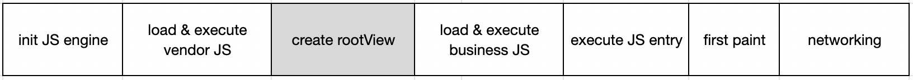

# Performance

## SDK startup performance indicators

> Minimum supported version `2.16.0`

### Introduce

The loading and execution process of `Hippy` Native SDK is shown in the figure below:



Corresponding to the above stages, `Hippy` Native SDK provides the corresponding time-consuming and other performance indicators for developers to obtain, as shown in the following table:

| Category | Description | Key |
| :------- | :--------------- | :--------------------- |
| JS engine | Initialize JS engine (Android only) | hippyInitJsFramework |
| Vendor bundle | Vendor bundle loading | hippyCommonLoadSource |
| Vendor bundle | Vendor bundle execution | hippyCommonExecuteSource |
| Business bundle | Business bundle loading | hippySecondaryLoadSource |
| Business bundle | Business bundle execution | hippySecondaryExecuteSource |
| Overall | Bridge startup | hippyBridgeStartup |
| Overall | JS entry execution | hippyRunApplication |
| Overall | First Paint | hippyFirstPaint |


### Native get performance data

#### Android API Guidelines

##### 1. Inject `HippyEngineMonitorAdapter`

```java
public class MyEngineMonitorAdapter extends DefaultEngineMonitorAdapter {
    @Override
    public void reportEngineLoadResult(int code, int loadTime,
        List<HippyEngineMonitorEvent> loadEvents, Throwable e) {
        // Engine creation completed callback
    }

    @Override
    public void reportModuleLoadComplete(HippyRootView rootView, int loadTime,
        List<HippyEngineMonitorEvent> loadEvents) {
        // Business JS execute and first paint completed callback
    }

    @Override
    public void reportCustomMonitorPoint(HippyRootView rootView, String eventName,
        long timeMillis) {
        // Custom monitor point added callback
    }

}
```

```java
HippyEngine.EngineInitParams initParams = new HippyEngine.EngineInitParams();
initParams.engineMonitor = new MyEngineMonitorAdapter();
...
HippyEngine engine = HippyEngine.create(initParams);
```

##### 2. Get performance data

It is recommended to call after reportModuleLoadComplete to obtain complete performance data.

Use as

```java
TimeMonitor monitor = rootView == null ? null : rootView.getTimeMonitor();
if (monitor != null) {
    Map<String, Long> points = monitor.getAllPoints();
}
```

The constants to each indicator are defined in the `HippyEngineMonitorPoint` class, and the naming rules are: `hippyXxx` corresponds to `XXX_START` and `XXX_END`.

#### iOS API Guidelines

It is recommended to obtain performance indicators after HippyRootView is loaded (that is, after receiving `HippyContentDidAppearNotification` notification).

Use as

```objc
int64_t duration = [bridge.performanceLogger durationForTag:HippyPLxxxTag];
```

'HippyPLxxx' is defined in the 'HippyPerformanceLogger' class and is a 'HippyPLTag' enumeration type.

---

## memory

Provide global `performance` to get performance data. 

`performance.memory` return statistics about the js heap (Only android supported, iOS will return `undefined`）。

> Minimum supported version `2.15.0`

```javascript

global.performance.memory = undefined || {
  // Heap size limit
  jsHeapSizeLimit: 4096,
  // Total heap size
  totalJSHeapSize: 2048,
  // Used heap size
  usedJSHeapSize: 1024,
  // The value of native_context is the number of the top-level contexts currently active.
  // Increase of this number over time indicates a memory leak.
  jsNumberOfNativeContexts: 1,
  // The value of detached_context is the number of contexts that were detached and not yet garbage collected.
  // This number being non-zero indicates a potential memory leak.
  jsNumberOfDetachedContexts: 0,
}

```

