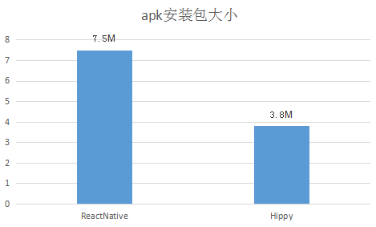
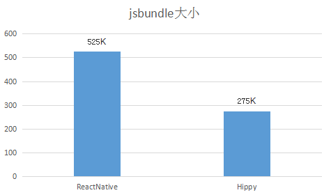
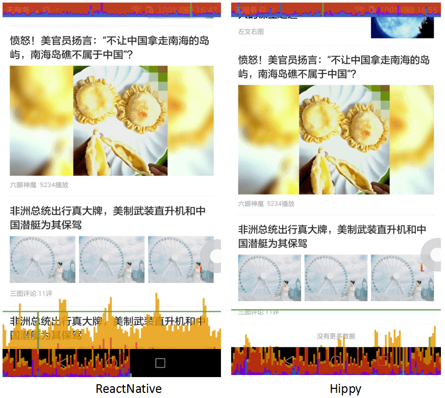
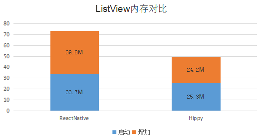

    

    

        <h1 id="hippy">
            <a class="anchor" data-id="hippy" href="#/?id=hippy">
                Hippy
            </a>
        </h1>
        
Cross-Platform Framework for Developers

        
        
        

            <a href="//github.com/Tencent/Hippy" rel="noopener" target="_blank">GitHub</a>
            <a href="#/guide/integration">Get Started</a>
        

    

    

        
<h2>⚡ High Performance</h2>
            
Reusable ListView with ultimate smoothness experience, efficient data communication via binding mode

        
<h2>📱 Cross Platform</h2>
            
Different platforms maintain the same interface, support smooth migration to Web

        
<h2>📚 Easy to Learn</h2>
            
React / Vue driven framework and full Flex Layout supported.

    

# Hippy overview

Hippy is like a simplified browser, which has done a lot of work from the bottom layer, smoothed out the differences between iOS and Android, and provided a development experience close to the Web. At present, the upper layer supports two sets of interface frameworks, React and Vue, through which front-end developers can convert front-end codes into native instructions to develop native apps.

At the same time, Hippy has made a lot of optimization from the bottom layer, providing top performance in startup speed, reusable list components, rendering efficiency, animation speed, network communication, etc.

## Feature Comparison

Hippy implemented a lot of interfaces according to browser, convenient for developers to use, here are a few Hippy unique features.

| Classifications| Properties                     | Description                     | Support|
| ---- | ------------------------ | ------------------------ | -------- |
| Interface|  fetch                    | Http/Https protocol request      | ✅    |
|      | WebSocket                | Instant Messaging Based on Http | ✅   |
| Events|  onClick                  | Click Event                 | ✅    |
|      | onTouchStart/onTouchDown | Triggered when start to touch screen             | ✅   |
|      | onTouchMove              | Triggered when move on screen             | ✅   |
|      | onTouchEnd               | Triggered when end to touch screen             | ✅   |
|      | onTouchCancel            | Triggered when touch screen canceled           | ✅   |
| Style|  zIndex                   | Layer level                 | ✅    |
|      | backgroundImage          | Background image                | ✅   |

## Package Volume

Hippy's package volume is also very competitive in the industry.

The above figure is an empty APK, showing the comparison of package size among different native SDKs.

The above figure shows the comparison of package size of JS bundle with the simplest ListView.

## Rendering Performance

Comparison of ListView performance when sliding, Hippy can always maintain a very smooth state.

## Memory Consumption

In terms of memory consumption, Hippy has a slight advantage when initializing the List, and the difference in memory consumption is getting bigger and bigger after sliding a few screens.

## Web-like development experience

Hippy has also made a lot of optimizations in the development experience, including but not limited to onClick, onTouch series touch screen events like browsers, simpler animation schemes, hippy-vue provides full compatibility with Vue, etc.

## Who Using it

 
  
  
<a target="_blank" style="text-decoration:none;color:#34495e" href="https://mb.qq.com/" title="QQ Brower">QQ Browser</a>

 
 
  
  
<a target="_blank" style="text-decoration:none;color:#34495e" href="https://im.qq.com/mobileqq/" title="Mobile QQ">Mobile QQ</a>

 
 
  
  
<a target="_blank" style="text-decoration:none;color:#34495e" href="https://news.qq.com/mobile/" title="Tencent News">Tencent News</a>

 
 
  
  

  <a target="_blank" style="text-decoration:none;color:#34495e" href="https://kg.qq.com/html/contest/kg-intro.html" title="WeSing">WeSing</a>
  

 
 
  
  

  <a target="_blank" style="text-decoration:none;color:#34495e" href="https://y.qq.com/download/download.html" title="QQ Music">QQ Music</a>
  

 
 
  
  
<a target="_blank" style="text-decoration:none;color:#34495e" href="https://map.qq.com/mobile/index.html" title="Tencent Map">Tencent Map</a>

  
  

  <a target="_blank" style="text-decoration:none;color:#34495e" href="https://sj.qq.com/myapp/detail.htm?apkName=com.tencent.gamehelper.smoba" title="Camps of Kings">Camps of Kings</a>
  

 
 
  
  
<a target="_blank" style="text-decoration:none;color:#34495e" href="https://shanxian.qq.com/" title="shanxian">ShanXian</a>

 
  
  

  <a target="_blank" style="text-decoration:none;color:#34495e" href="https://tv.qq.com/" title="Tencent TV">Tencent TV</a>
  

 
 
  
  

  <a target="_blank" style="text-decoration:none;color:#34495e" href="https://start.qq.com/download.html?terminal=tv" title="Tencent Start(TV)">Tencent Start(TV)</a>
  

 
 
  
  

  <a target="_blank" style="text-decoration:none;color:#34495e" href="https://weishi.qq.com/" title="Weishi">Weishi</a>
  

 
 
  
  

  <a target="_blank" style="text-decoration:none;color:#34495e" href="https://www.myapp.com" title="Tencent App Market">Tencent App Market</a>
  

 
 
  
  

  <a target="_blank" style="text-decoration:none;color:#34495e" href="https://a.app.qq.com/o/simple.jsp?pkgname=com.tencent.fortuneplat" title="Tencent Wealth Management">Tencent WM</a>
  

 
 
  
  

  <a target="_blank" style="text-decoration:none;color:#34495e" href="https://sj.qq.com/myapp/detail.htm?apkName=com.tencent.portfolio" title="Tencent ZXG App">Tencent ZXG App</a>
  

 
 
  
  

  <a target="_blank" style="text-decoration:none;color:#34495e" href="https://now.qq.com/" title="NOW Live">NOW Live</a>
  

 
 
  Tencent Joy Club" />
  

  <a target="_blank" style="text-decoration:none;color:#34495e" href="https://xinyue.qq.com" title=">Tencent Joy Club">Tencent Joy Club</a>
  

 
 
  
   

  <a target="_blank" style="text-decoration:none;color:#34495e" href="https://wifi.qq.com/" title="Wi-Fi Butler">Wi-Fi Butler</a>
  

 
 
  
  

  <a target="_blank" style="text-decoration:none;color:#34495e" href="https://www.dafenghk.com/hk_web/download.shtml" title="DaFeng App">DaFeng App</a>
  

 
 
  
  

  <a target="_blank" style="text-decoration:none;color:#34495e" href="https://android.myapp.com/myapp/detail.htm?apkName=com.tencent.omapp" title="Tencent OM">Tencent OM</a>
  

 
 
  
  

  <a target="_blank" style="text-decoration:none;color:#34495e" href="https://www.voovlive.com/" title="VOOV Live">VOOV Live</a>
  

 
 

## Team Contribution

 
  
  
TME WeSing Team

 
 
  
  
TME QQ Music Team

 
 
  
  
CDG Finance Team

 
 
  
  
QGraphics Team

 
 
  
  
IVWEB Team

 
 
  
  
Tour Yunnan WII team

 
 

## Contributors

 
  
  
<a target="_blank" style="text-decoration:none;color:#34495e" href="https://github.com/medns" title="Super Zheng">Super Zheng</a>

 
 
  
  

  <a target="_blank" style="text-decoration:none;color:#34495e" href="https://github.com/xuqingkuang" title="XQ Kuang">XQ Kuang</a>

 
 
  
  
<a target="_blank" style="text-decoration:none;color:#34495e" href="https://github.com/siguangli2018" title="siguangli2018">siguangli2018</a>

 
 
  
  
<a target="_blank" style="text-decoration:none;color:#34495e" href="https://github.com/ozonelmy/" title="luomy">luomy</a>

 
 
  
  
<a target="_blank" style="text-decoration:none;color:#34495e" href="https://github.com/churchill-zhang" title="churchill-zhang">churchill-zhang</a>

 
 
  
  
<a target="_blank" style="text-decoration:none;color:#34495e" href="https://github.com/xxs665" title="old kidd">old kidd</a>

 
 
  
  
<a target="_blank" style="text-decoration:none;color:#34495e" href="https://github.com/zoomchan-cxj" title="Zoom Chan">Zoom Chan</a>

 
 
  
<a target="_blank" style="text-decoration:none;color:#34495e" href="https://github.com/ilikethese" title="ilikethese">ilikethese</a>

  
 
  
<a target="_blank" style="text-decoration:none;color:#34495e" href="https://github.com/boxizen" title="Box Tsang">Box Tsang</a>

 
 
  
<a target="_blank" style="text-decoration:none;color:#34495e" href="https://github.com/jeromehan" title="jerome han">jerome han</a>

 
 
<a target="_blank" style="text-decoration:none;color:#34495e" href="https://github.com/tsangint" title="tsangint">tsangint</a>

 
 
<a target="_blank" style="text-decoration:none;color:#34495e" href="https://github.com/RonkTsang" title="RonkTsang">RonkTsang</a>

 
 
<a target="_blank" style="text-decoration:none;color:#34495e" href="https://github.com/ElfSundae" title="ElfSundae">Elf Sundae</a>

 
 
<a target="_blank" style="text-decoration:none;color:#34495e" href="https://github.com/zousandian" title="zousandian">Three O 'clock.</a>

 
 
<a target="_blank" style="text-decoration:none;color:#34495e" href="https://github.com/dequan1331" title="zousandian">dequanzhu</a>

 
 
<a target="_blank" style="text-decoration:none;color:#34495e" href="https://github.com/kassadin" title="kassadin">kassadin</a>

 
 
<a target="_blank" style="text-decoration:none;color:#34495e" href="https://github.com/Arylo" title="Arylo Yeung">Arylo Yeung</a>

 
 

## Communication

* [Article Column](https://cloud.tencent.com/developer/column/84006)
* WeCom Group, use WeChat or WeCom scan to join.

 

## Summary

If you're ready, [Getting start to Hippy](guide/integration.md).
