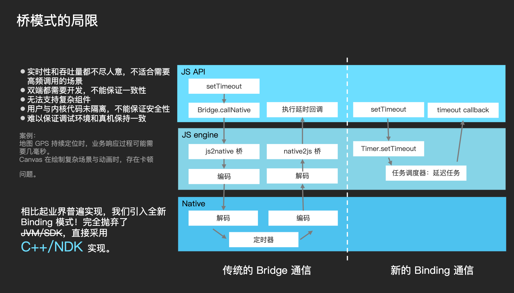

# HippyCore Architecture

During developed Hippy, JS often needs to access some dual-native (Android and iOS) general capabilities. Hippy recommends using `internalBinding` to realize the basic capability extension (we call this capability [Core architecture](//github.com/Tencent/Hippy/tree/master/core)). Like the internalBinding of Node.js, it uses C++ for development, directly shares JS and C++ running environment and data, and provides very high communication performance between JS and native.

Its principle is directly insert functions, classes, etc in JS context. With these functions or methods, JS can directly access the C++ code.

However, if platform dependency is involved, sub-platform bridging is still required.

At present, the [Timer](../guide/timer.md) and [Log](../guide/console.md) module in Hippy are implemented by Hippy Core.



# C++ Module Extension

We'll use TestModule as an example, extending a Module that will show how JS can invoke the native capabilities and return the results to JS.

## Inherit ModuleBase

Create test-module.h under [core/modules/](//github.com/Tencent/Hippy/tree/master/core/modules)

```cpp
#ifndef CORE_MODULES_TEST_MODULE_H_
#define CORE_MODULES_TEST_MODULE_H_

#include "core/modules/module-base.h"
#include "core/napi/callback-info.h"

class TestModule : public ModuleBase {
  public:
    explicit TestModule(hippy::napi::napi_context context){};
    void RetStr(const hippy::napi::CallbackInfo& info);
    void Print(const hippy::napi::CallbackInfo& info);
};

#endif // CORE_MODULES_TEST_MODULE_H_
```

Create test-module.cc under [core/modules/](//github.com/Tencent/Hippy/tree/master/core/modules)

```cpp
#include "core/modules/module-register.h"
#include "core/modules/test-module.h"
#include "core/napi/js-native-api.h"
#include "core/base/logging.h"
REGISTER_MODULE(TestModule, RetStr)
REGISTER_MODULE(TestModule, Print)

void TestModule::RetStr(const hippy::napi::CallbackInfo& info) {
  std::shared_ptr<Environment> env = info.GetEnv();
  hippy::napi::napi_context context = env->getContext();
  HIPPY_CHECK(context);

  info.GetReturnValue()->Set(hippy::napi::napi_create_string(context, "hello world"));
}

void TestModule::Print(const hippy::napi::CallbackInfo& info) {
  std::shared_ptr<Environment> env = info.GetEnv();
  hippy::napi::napi_context context = env->getContext();
  HIPPY_CHECK(context);
  HIPPY_LOG(hippy::Debug, "hello world");

  info.GetReturnValue()->SetUndefined();
}

```

# JS Bridge

Dual-platform general module is generally placed under [core/js/global](//github.com/Tencent/Hippy/tree/master/core/js/global), and we add TestModule.js under global

```js
const TestModule = internalBinding('TestModule');

global.TestModule = TestModule;
```

[core/js/entry/](//github.com/Tencent/Hippy/tree/master/core/js/entry)

```js
require('../../global/TestModule.js');
```

Run `npm run buildcore` in the Hippy directory, which will generate the corresponding dual-platform C source code:

* [native-source-code-android.cc](//github.com/Tencent/Hippy/blob/master/core/napi/v8/native-source-code-android.cc)
* [native-source-code-ios.cc](//github.com/Tencent/Hippy/blob/master/core/napi/jsc/native-source-code-ios.cc)

# Recompile Core

There is no need to make other changes, just recompile the native SDK. The native SDK can link to `core` corresponding C++ code in the core directory. It is necessary to pay attention to the compilation environment of cmake, ndk, etc. For Android.

# Effects

```js
global.TestModule.Print();
global.TestModule.RetStr();
2019-11-08 17:32:57.630 7004-7066/? D/HippyCore: hello world
```

