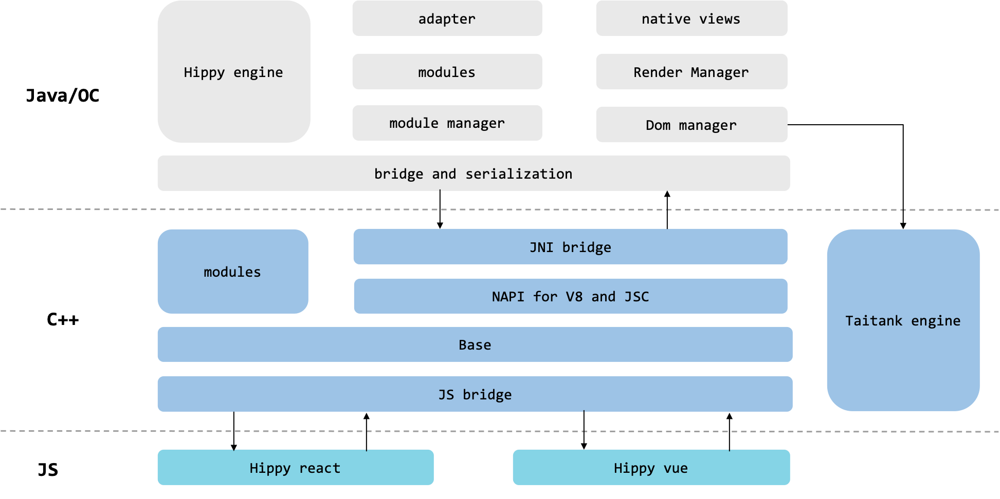

# Introduction

# Hippy 2.x architecture

The Hippy 2.x architecture is mainly divide into three layers: UI(JS) layer `Hippy-React` and`Hippy-Vue` instruction generation responsible for driving UI; The middle layer [C++ HippyCore](structure/core.md) is responsible for smoothing platform differences and providing high-performance modules; Render Layers `Android` and `iOS` are responsible for providing the bottom-modules and components of the terminal and communicating with the layout engine.

 

 
 
 

# Hippy 3.x architecture

Hippy is upgrading the 3.x architecture. In 3.x, the specific implementation in the business and rendering layers can be switched according to the actual user scenario: the driver layer is no longer limited to JS driver, and other languages (such as DSL/Dart/WASM, etc.) can also be selected for driving. DOM Manager sinks from Java/OC to C++, as an intermediate hub, in addition to receiving and processing the messages from the upper layer to create and maintain DOM Tree, it is also responsible for interfacing and communicating with different rendering engines, typesetting engines and debugging tools. In the rendering layer, the rendering engine can also select other rendering renderers, such as Flutter(Voltron) rendering, in addition to supporting the existing Native rendering. Hippy 3.x can make up for some shortcomings of current Hippy 2.x in performance, double-end consistency, and component support, so look forward to it!

 

