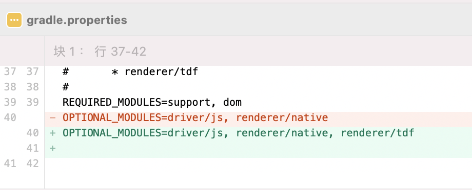
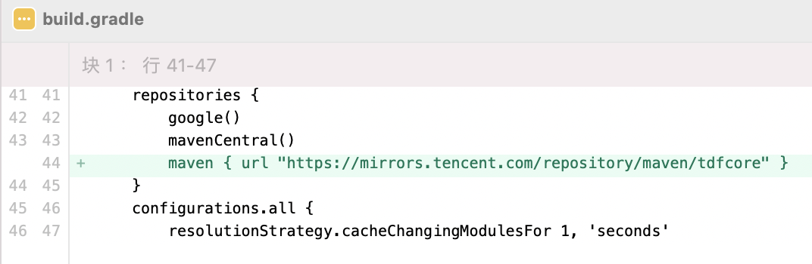
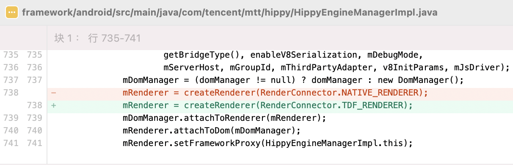

# TDFRender

TDFRender is a cross platform renderer implemented in C++, which unifies component implementation and event processing on the Android/iOS platform.

This tutorial shows how to use TDFRender in Android/iOS project.

---

# Android / iOS Integration

The method of integrating Hippy:

* The Android platform is the same as [Android Integration](../android/integration.md)
* The iOS platform is the same as [iOS Integration](../ios/integration.md)

# TDFRender Usage

## Android Demo Experience

1. Introducing the TDFRender module

	gradle.properties file modification：


2. Introducing temporary Maven source

	```text
	maven { url "https://mirrors.tencent.com/repository/maven/tdfcore" }
	```

	build.gradle file modification：


3. Open TDFRender

	framework/android/src/main/java/com/tencent/mtt/hippy/HippyEngineManagerImpl.java file modification：


4. Demo add dependency

	framework/examples/android-demo/build.gradle file modification：


## iOS Demo Experience

Under planning。
