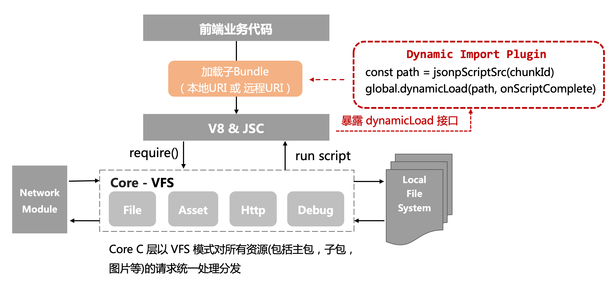

# 动态加载

---

# 介绍

Hippy 2.2 版本之前只支持加载单个 js bundle 文件。随着业务越来越复杂，单个 js 文件体积愈发增加的体积会影响首屏启动速度。为了解决这个问题，Hippy 在 2.2 版本增添了动态加载能力，开发人员可以按需来动态引入子 js bundle 文件。

 `Hippy 最低版本支持 2.2`

# 原理架构



# 范例

[[React 范例]](//github.com/Tencent/Hippy/blob/master/examples/hippy-react-demo/src/externals/DyanmicImport/index.jsx)

[[Vue 范例]](//github.com/Tencent/Hippy/blob/master/examples/hippy-vue-demo/src/components/demos/demo-dynamicimport.vue)

# 使用方法

## 安装

`npm install -D @hippy/hippy-dynamic-import-plugin`

## 使用

在 [Webpack 打包脚本](https://github.com/Tencent/Hippy/tree/master/examples/hippy-vue-demo/scripts) 中引入插件

```javascript
const HippyDynamicImportPlugin = require('@hippy/hippy-dynamic-import-plugin');

module.exports = {
  entry: {
    index: 'example.js',
  },
  output: {
    filename: 'example.output.js',
    strictModuleExceptionHandling: true,
    path: path.resolve('./dist/'),
    globalObject: '(0, eval)("this")',
  },
  plugins: [
    new HippyDynamicImportPlugin(),
  ],
};
```

## 降级方案

在终端 SDK 不支持 dynamic import 的版本，可以使用以下两种方法阻止分包。

+ 利用 Webpack 提供的 `/* webpackMode: "eager" */` magic comment 停止生成额外的chunk。具体原理可以参看 [webpack magic comment](https://webpack.js.org/api/module-methods/#magic-comments)

```javascript
// 在import()中增加magic comment例子如下：
AsyncComponent: () => import(/* webpackMode: "eager" */ './dynamicImport/async-component.vue'),
```

+ 在 Webpack 配置中使用 `webpack.optimize.LimitChunkCountPlugin` 的 `maxChunks` 参数。具体原理可以参看 [webpack LimitChunkCountPlugin](https://webpack.docschina.org/plugins/limit-chunk-count-plugin/)。

```javascript
// 通过配置webpack.optimize.LimitChunkCountPlugin的maxChunks为1，dynamic import 会替换成 Promise.resolve
plugins: [
  ...,
  new HippyDynamicImportPlugin(),
  // LimitChunkCountPlugin can control dynamic import ability
  // Using 1 will prevent any additional chunks from being added
  new webpack.optimize.LimitChunkCountPlugin({
      maxChunks: 1,
  }),
],
```

# 可同时配置本地/网络加载分包

`网络加载 hippy sdk 最低支持版本 2.5.5`

`网络加载 @hippy/hippy-dynamic-import-plugin 最低支持版本 2.0.0`

提供以下几种模式

## 业务只加载 [本地] js bundle

与原有动态加载能力一样，直接使用 `import()` 语法即可

## 业务只加载 [远程] js bundle

+ webpack打包脚本配置全局 `publicPath`(可选)

```javascript
 // webpack output 配置
 output: {
    ...
    publicPath: 'https://xxxx/hippy/hippyVueDemo/',
  },

```

+ <span id="remote-bundle">在业务代码引用分包的入口配置</span> `magic comment`的 `webpackChunkName`（必须） 和 `customChunkPath`（可选），如果没有配置`customChunkPath`，会默认使用全局 `publicPath`；
以 Hippy-Vue 为例：

```javascript
 // Hippy-Vue 配置，
 AsyncComponentFromHttp: () => import(/* customChunkPath: "https://xxx/hippy/hippyVueDemo/", webpackChunkName: "asyncComponentFromHttp" */'./dynamicImport/async-component-http.vue')
  .then(res => res)
  .catch(err => console.error('import async remote component error', err))
```

## 业务同时加载 [本地 + 远程] js bundle

+ 去除 webpack 全局配置的 `publicPath`（publicPath 会强制在所有 bundle 前加上配置的路径，影响本地 bundle 加载）

+ 加载远程 bundle，在业务代码引用分包的入口配置 `magic comment`的`webpackChunkName`（必须） 和 `customChunkPath`（必须），以 Hippy-Vue 为例：

```javascript
 // Hippy-Vue 配置
 AsyncComponentFromHttp: () => import(/* customChunkPath: "https://xxx/hippy/hippyVueDemo/", webpackChunkName: "asyncComponentFromHttp" */'./dynamicImport/async-component-http.vue')
  .then(res => res)
  .catch(err => console.error('import async remote component error', err))

```

+ 加载本地 bundle，在业务代码引用分包的入口配置 `magic comment`的`webpackChunkName` （可选），以 Hippy-Vue 为例：

```javascript
// Hippy-Vue 配置
AsyncComponentFromLocal: () => import(/* webpackChunkName: "asyncComponentFromLocal" */'./dynamicImport/async-component-local.vue')
.then(res => res)
.catch(err => console.error('import async local component error', err)),

```
