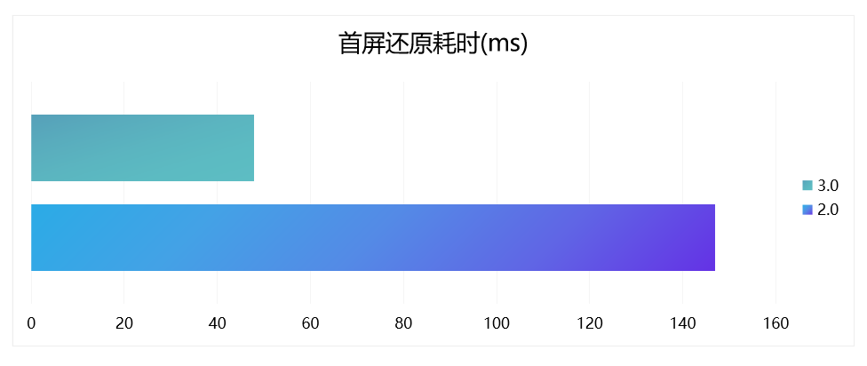

# RenderNode Snapshot

---

## 2.0 dom node缓存存在的问题

2.0上我们支持了dom节点的缓存，但这套方案存在一些性能上的瓶颈，只在少量的业务上应用：

- 全量节点缓存，在一些类似长列表节点较多的复杂页面恢复耗时比较大（首屏恢复耗时=dom节点恢复+render节点恢复+layout+view恢复）；
- 恢复过程存在线程切换，同步恢复dom节点会卡住UI线程，异步恢复dom节点不能在同一个渲染周期去渲染首屏，还是有可能出现短暂白屏；
- 存在一定接入成本，dom tree的遍历与序列化数据需要宿主自己完成。

## 3.0 render node缓存解决方案

3.0上我们支持了render node节点的缓存方案，很好的解决了之前缓存dom node存在的问题：

- 由于不再需要创建dom节点和layout，大大减少了首屏恢复耗时，而且整个还原过程不再需要线程切换；
- 由于render节点本身带有排版后的layout信息，节点遍历的时候增加了节点显示区域的判断逻辑，只保存首屏显示区域内的节点，解决长列表节点多的问题；
- 使用Native renderer新dom value编解码能力，在SDK内部完成了节点数据的序列化与反序列化操作，进一步降低了开发者的接入成本。

## 3.0 render node缓存接口定义

### HippyEngine Public methods

```java
public void recordSnapshot(@NonNull View rootView, @NonNull final Callback<byte[]> callback)
```

   记录指定root view的节点缓存，SDK内部会完成节点遍历，序列化相关的任务，最终通过Callback返回节点序列化后的buffer，节点数据存储，生命周期管理由宿主自行完成

```java
public View replaySnapshot(@NonNull Context context, byte[] buffer)
```

   传入之前record的buffer回放节点数据，这个接口调用将同步返回还原的view

```java
public View replaySnapshot(@NonNull Context context, @NonNull Map<String, Object> snapshotMap)
```

   传入decode后的节点Map数据，同步返回还原的view

```java
public View removeSnapshotView()
```

   从view tree中移除snapshot view及其子view，同时删除所有对应的render node节点，调用该接口的时机需要根据不同的业务场景做调整，保证真正页面完整显示后再移除snapshot view，不会产生页面的跳变视觉体验

### NativeRenderer Public static methods

```java
public static Map<String, Object> decodeSnapshot(@NonNull byte[] buffer)
```

   NativeRenderer静态方法，对节点数据进行decode操作，支持子线程异步调用，返回的Map可以直接用作 replaySnapshot接口的输入参数

   > 注意：replaySnapshot接口调用必须在Hippy engine初始化完成以后，可以在引擎回调的子线程中执行，也可以在UI主线程执行，但必须在replay调用结束后再调用loadModule，否则有可能会有多线程的问题，在子线程执行好处就是不卡UI线程，但需要post到UI线程挂载到父容器，中间还是会有短暂白屏过程，在主线程直接replay并挂载到父容器，虽然会卡UI，但可以保证页面切换无白屏效果

## Performance

在中低端机型华为M10上对比demo首屏还原耗时：3.0 replay耗时47.8ms，2.0 relplay耗时146.9ms，优化后耗时下降67.5%


