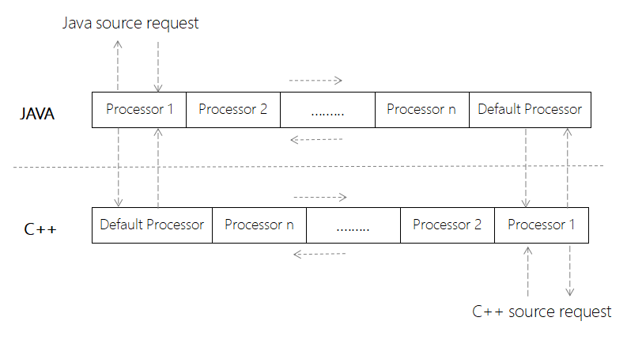
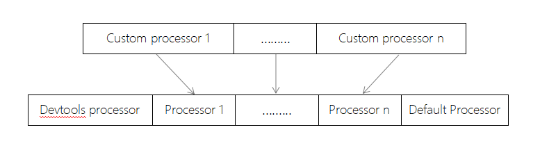

# VFS

---

当前SDK内部发起资源请求的类型主要分为以下几种：

- debug模式下jsbundle请求
- 动态加载资源请求
- Image view url资源请求
- Text中嵌套image url资源请求
- Network module fetch请求
- Image module 图片预拉取请求
- Font-face 字体资源请求

在2.0中对于以上IO资源的请求缺少一套统一管理机制和处理流程，导致很难去全局添加一些监控分析，拦截过滤的处理逻辑，同时由于存在多条资源请求处理分支也会使代码维护成本很高，所以我们在3.0中新增了VFS独立模块，主要模拟类似Virtual file system的机制，对所有IO资源的请求进行统一的管理并提供统一的处理机制，目前3.0所有IO资源的请求已经全部对接到VFS模块。

## VFS链式访问机制

1. 什么是链式访问

   VFS内部实际管理了一个链表，链表中的每个元素是引擎启动时候就注册好的processor，当请求发起者调用VFS接口发起请求后，VFS会遍历这个链表，让processor对request进行处理，request处理完成后，VFS会反向遍历链表，让每个processor对response进行处理，最终返回给请求发起者。

2. 对称链表结构定义

   2.0中所以的资源请求都是从JAVA层发起，但3.0由于接入了自绘内核以及dev tools对接C++ dom以后，资源请求有可能从C++层发起，所以JAVA层和C++层各维护了一条VFS链表，形成对称结构：

   

3. 链表遍历访问规则

- 当请求发起者调用VFS接口以后，默认从链首第一个processor开始访问；
对于request的处理是否需要递交给下一个processor处理，由当前processor决定，也就是说不是所有的processor都会获得request的处理机会；
- 当request处理完成后，会反向遍历链表，把response递交给上一级processor的处理，反方向上的每一级processor都会获得response处理机会，直到最开始的请求发起者；
- SDK内部会在链表尾端插入Default processor，只有当Default processor无法识别的scheme才会传递给Native C++的链表继续处理，识别的scheme无论处理成功或失败都会原路返回，不会再递交给Native C++去处理；
- Native C++链表与JAVA对称，同样遵守以上4条规则；

## Processor介绍

### Processor接口定义

所有custom processor都需要extends base processor，base processor定义位于3.0 VFS子工程中 - com.tencent.vfs.Processor，也可以参照同目录下DefaultProcessor的定义 - com.tencent.vfs.DefaultProcessor。

### Processor Public methods

```java
public void handleRequestAsync(@NonNull ResourceDataHolder holder, @NonNull ProcessorCallback callback)
```

  异步处理request，基类默认什么都不处理调用callback.next传递给下一个processor

```java
public boolean handleRequestSync(@NonNull ResourceDataHolder holder)
```

  同步处理request，返回true表示这个请求处理完成不需要再传递给下一个processor，返回false，表示需要递交给下一个processor继续处理

```java
public void handleResponseAsync(@NonNull ResourceDataHolder holder,@NonNull ProcessorCallback callback)
```

  异步处理response，基类默认不对response做任何处理，直接调用callback.onHandleCompleted()递交给上一个processor

```java
public void handleResponseSync(@NonNull ResourceDataHolder holder)
```

  同步处理response，基类默认不做任何处理

### ProcessorCallback Public methods

```java
public void goNext()
```

  VFS链表正向遍历处理request的时候，当前processor调用该接口表示需要递交给下一个processor继续处理在反向遍历处理response的时候，由于默认会原路返回并传递给请求发起者，所以processor在handleResponse相关接口的重载逻辑中不需要调用该接口，也就是说该接口仅在handleRequest相关接口的重载逻辑中调用才有效

```java
public void onHandleCompleted()
```

  VFS链表正向遍历处理request的时候，当前processor调用该接口表示不在需要递交给下一个processor处理，直接将当前处理结果原路返回给请求发起者。在反向遍历处理response的时候，当前processor调用该接口表示已经完成处理，可以遍历到上一级processor继续处理

### Processor的注册

在HippyEngine的EngineInitParams初始化参数中增加了设置选项

```java
   public List<Processor> processors
```

引擎初始化阶段会将开发者自定义的processor设置到VFS链表中



关于Devtools processor和Default processor是SDK内部默认添加的，其存放位置不可以更改
