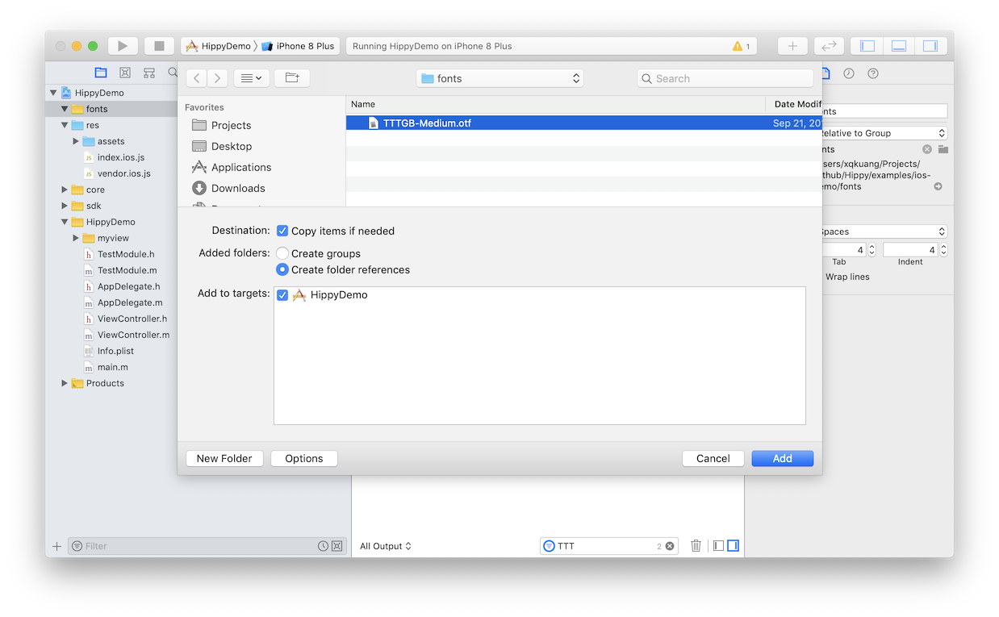
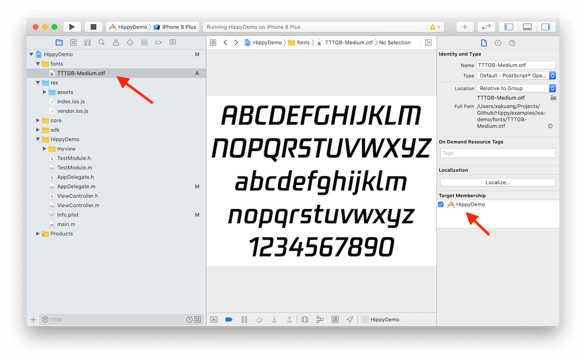
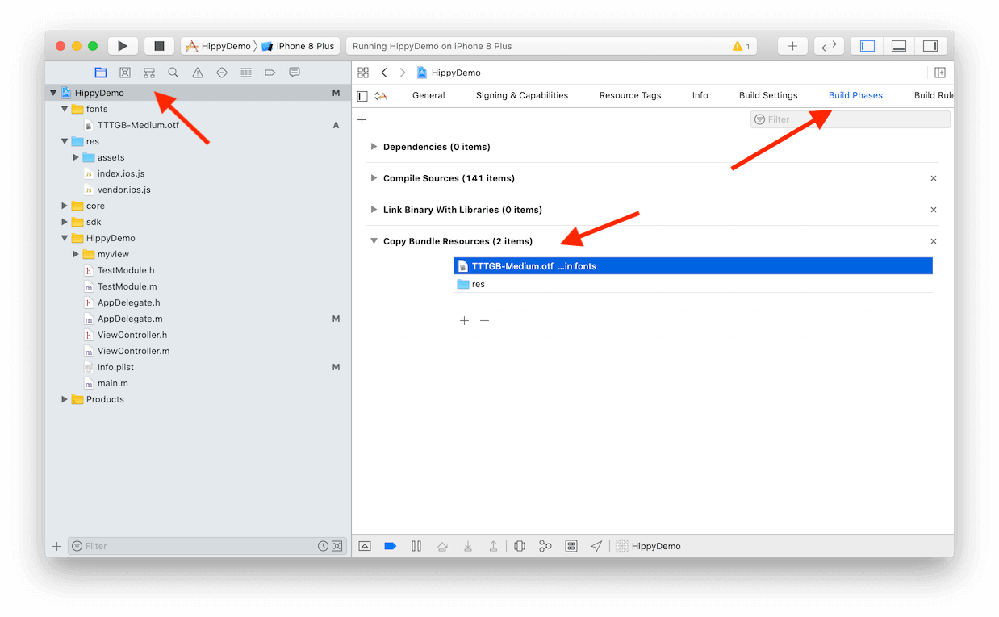
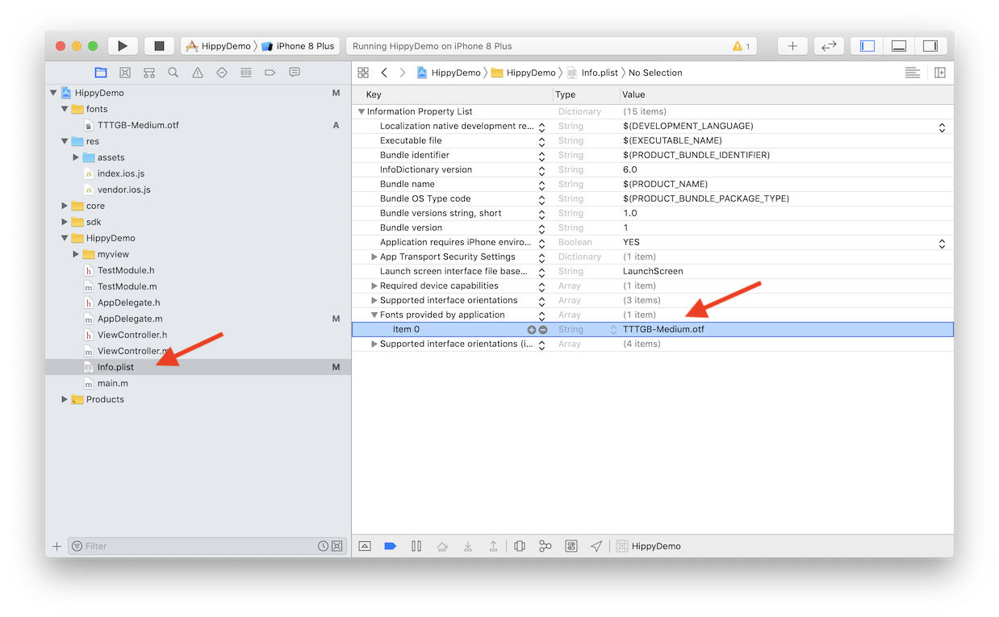
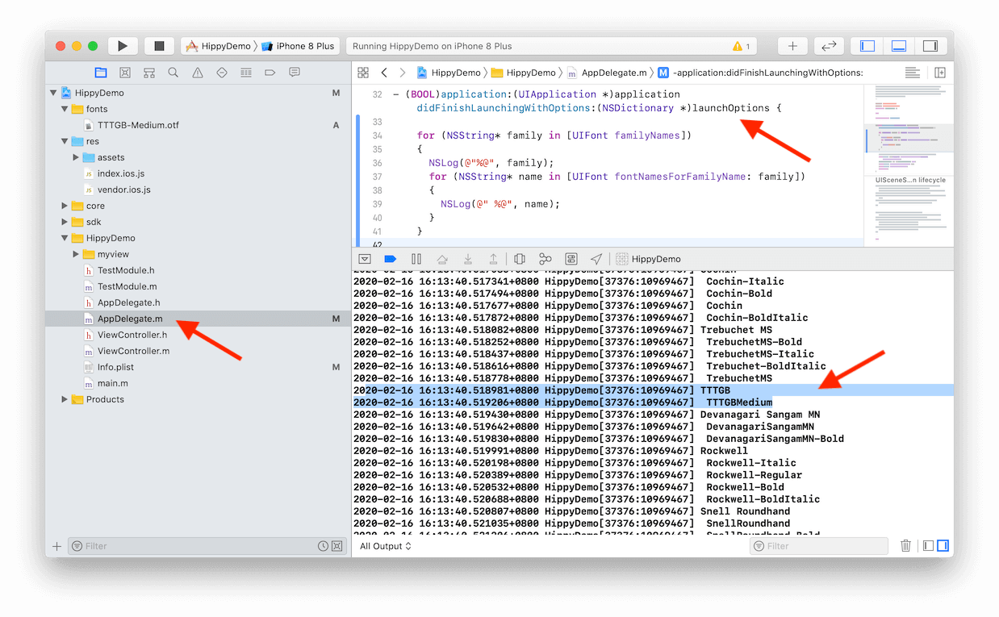

<!-- markdownlint-disable no-duplicate-header -->

# 自定义字体

---

# 前端

前端使用自定义字体非常简单，和浏览器一样，使用 [font-family](https://www.w3schools.com/cssref/pr_font_font-family.asp) 样式即可。

有两个范例：[hippy-react-demo](https://github.com/Tencent/Hippy/blob/master/examples/hippy-react-demo/src/components/Text/index.jsx#L49)、[hippy-vue-demo](https://github.com/Tencent/Hippy/blob/master/examples/hippy-vue-demo/src/components/demos/demo-p.vue#L41)

但是如果要使用操作系统自带以外的字体，需要单独整合一下，继续阅读下面内容。

# iOS

## 整合字体文件

打开 iOS 工程，新建一个 `fonts` 目录，并将字体文件拖动到该目录中。按照截图，建立字体引用即可，确保 Target 正确。



然后点击项目中的字体文件，并再次确认 Target 正确。



## 检查项目配置

确认项目的设置的 `Build Phases` 里字体文件正确整合。



## 将字体添加到 Info.plist

将准确的字体文件名加入 `Info.plist` 的 `Fonts provided by application` 字段，如果没有这行的话，需要手工 `Add row` 添加一行。



## 验证字体正确性

如果一切都正确，前端应该已经能正常显示自定义字体了，不过有的时候还是显示不了，其中最常见的，就是 Font Family 参数值不对，因为**字体文件名 !== Font Family**。

有个简单办法可以进行校验，将 Font Family 全部列出来检查。

在 `AppDelegate.m` 的 `application didFinishLaunchingWithOptions` 方法中加上以下代码，在 `Debug` 菜单中打开 `Debug Area` 下 `Active Console`（按下 Command + Shift +C 可以快速打开）即可打印所有 Font Family。

```objectivec
for (NSString* family in [UIFont familyNames])
{
  NSLog(@"%@", family);
  for (NSString* name in [UIFont fontNamesForFamilyName: family])
  {
    NSLog(@" %@", name);
  }
}
```



# Android

## 整合字体文件

Android 只需要在静态资源 `assets` 目录中建立 `fonts` 目录，然后把字体文件拷贝进去即可。

需要注意的是，字体文件名需要和 FontFamily 一致，因为 Android 虽然也可以做字体文件名映射，但是字体和文件名一致无疑是最简单的办法。

如果有将自定义字体和`粗体 (fontWeight: 'bold')` 或`斜体 (fontStyle: 'italic')` 等属性一同使用的场景，SDK 会优先匹配在 `fonts` 目录下以<strong>字体名+后缀</strong>的形式存放的字体文件。如：

- style={ { fontFamily: 'TTTGB' } } 对应 TTTGB.ttf 或 TTTGB.otf
- style={ { fontFamily: 'TTTGB', fontWeight: 'bold' } } 对应 TTTGB_bold.ttf 或 TTTGB_bold.otf
- style={ { fontFamily: 'TTTGB', fontStyle: 'italic' } } 对应 TTTGB_italic.ttf 或 TTTGB_italic.otf
- style={ { fontFamily: 'TTTGB', fontWeight: 'bold', fontStyle: 'italic' } } 对应 TTTGB_bold_italic.ttf 或 TTTGB_bold_italic.otf

<strong>2.16.0版本后，如果匹配不到对应的带后缀的文件，SDK 会再尝试匹配不带后缀的自定义字体文件，结合 Android 的 [Typeface](https://developer.android.com/reference/android/graphics/Typeface) 的对应风格进行展示。</strong>

> 官方 demo 的字体放在 [res/fonts](https://github.com/Tencent/Hippy/tree/master/examples/android-demo/res) 目录下，是因为编译脚本[将 `res` 目录下的文件直接拷贝到 `assets` 目录](https://github.com/Tencent/Hippy/blob/master/examples/android-demo/build.gradle#L35)下了，所以 `res/assets` 就变成 `assets/assets` 目录，为了让字体目录正确拷贝进 `assets` 静态资源目录，只能让它放在 `res` 下。
