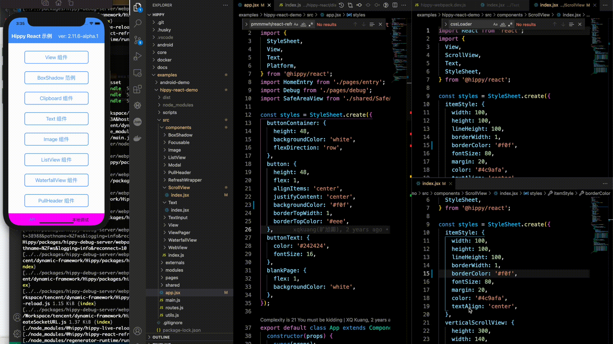

# 调试

---

# Hippy 调试原理

Hippy 是直接运行于手机的 JS 引擎中的，在 Android 上使用 WebSocket 通过 [Chrome DevTools Protocol](//chromedevtools.github.io/devtools-protocol/) 与电脑上的 Chrome 进行通讯调试，而 iOS 上使用内置 的 [JavaScriptCore](//developer.apple.com/documentation/javascriptcore) 与 [Safari](//www.apple.com.cn/cn/safari/) 连接进行调试，在较新的 Hippy 版本 iOS 也可以使用 Chrome DevTools 进行调试。

Hippy 中运行的 JS 代码可以来源于本地文件(local file)，或者远程服务地址(server)。

[@hippy/debug-server-next](//www.npmjs.com/package/@hippy/debug-server-next) 就是为了解决调试模式下终端模式获取调试用 JS 文件，以及将 [Chrome DevTools Protocol](//chromedevtools.github.io/devtools-protocol/) 传输回调试器而诞生。

# 项目初始化

1. 运行 `git clone https://github.com/Tencent/Hippy.git`

   !> Hippy 仓库使用 [git-lfs](https://git-lfs.github.com/) 来管理 so, gz, otf, png, jpg 文件, 请确保你已经安装 [git-lfs](https://git-lfs.github.com/)。

2. 项目根目录运行命令 `npm install` 安装前端依赖。
3. 项目根目录运行命令 `npx lerna bootstrap` 安装前端每一个 package 依赖。（Hippy 采用 [Lerna](https://lerna.js.org/) 管理多JS仓库)
4. 项目根目录运行命令 `npm run build` 编译前端 SDK 包。
5. 选择一个前端范例项目来进行编译，项目根目录运行 `npm run buildexample [hippy-react-demo|hippy-vue-demo]`。

# 终端环境准备

我们推荐在终端代码中留一个后门，通过一定条件触发后进入调试模式，具体代码可以参考 [iOS](//github.com/Tencent/Hippy/blob/master/examples/ios-demo/HippyDemo/TestModule.m#L60) 和 [Android](//github.com/Tencent/Hippy/blob/master/examples/android-demo/example/src/main/java/com/tencent/mtt/hippy/example/module/TestModule.java#L31)，这里实现了一个 `TestModule`，当前端调用它的 `debug` 或 `remoteDebug` 方法时就会进入调试模式，而终端可以通过其它方式进入。终端打开 Hippy Debug 页面代码如下：

1. **Android**：

   ```java
        // 初始化 hippy 引擎
        HippyEngine.EngineInitParams initParams = new HippyEngine.EngineInitParams();
        // 可选：是否设置为 debug 模式，默认为 DebugMode.None。设置 DebugMode.Dev 为调试模式，所有 jsbundle 都将从 debug server 上下载
        initParams.debugMode = HippyEngine.DebugMode.Dev; // 2.16.0 以下版本 debugMode 使用 boolean 类型 => initParams.debugMode = true;
        initParams.debugServerHost = "localhost:38989";
        // 可选参数 Hippy Server 的 jsbundle 名字，默认为 "index.bundle"。debugMode = DebugMode.Dev 时有效
        initParams.debugBundleName = "index.bundle";
   ```

2. **iOS**：

   ```objective-c
   - (void)viewDidLoad {
       // 开启调试
       NSDictionary *launchOptions = @{@"DebugMode": @(YES)};
       // 使用默认 http://localhost:38989/index.bundle
       NSString *bundleStr = [HippyBundleURLProvider sharedInstance].bundleURLString;
       NSURL *bundleUrl = [NSURL URLWithString:bundleStr];
       HippyBridge *bridge = [[HippyBridge alloc] initWithDelegate:self
                                                         bundleURL:bundleUrl
                                                    moduleProvider:nil
                                                     launchOptions:launchOptions
                                                       executorKey:@"Demo"];
   }
   
   
   - (BOOL)shouldStartInspector:(HippyBridge *)bridge {
       return bridge.debugMode;
   }
   
   - (NSURL *)inspectorSourceURLForBridge:(HippyBridge *)bridge {
       return bridge.bundleURL;
   }
   ```

# 前端环境准备

1. 安装新一代调试工具： `npm i -D @hippy/debug-server-next@latest`
2. 修改 Webpack 配置，添加调试服务地址，默认为 `http://localhost:38989`

   ```javascript
   module.exports = {
     devServer: {
       // 调试服务地址
       remote: {
         protocol: 'http',
         // iOS 真机调试时配置为本地局域网 IP
         // iOS 模拟器和安卓真机调试时配置为 localhost
         // 远程调试时配置为远程服务器 IP 或域名
         host: '192.168.1.100',
         // 调试服务端口
         port: 38989,
       },
       // 默认为 false，设为 true 调试服务支持多个工程同时调试，彼此之间不会干扰
       multiple: false,
       // 默认为 false，hippy vue 项目可以手动开启
       vueDevtools: false,
       // 默认 hot, liveReload 都为 true，如果只想使用 live-reload 功能，请将 hot 设为 false，liveReload 设为 true
       hot: true,
       liveReload: true,
       client: {
         overlay: false,
       },
     },
     // ... other config
   }
   ```

3. 修改 `package.json` 中的启动编译命令。如果业务通过自定义 cli 启动，参考 [打包编译 API](#debug-server-api) 进行配置

   ```json
   {
     "scripts": {
        // -c 或 --config 提供 webpack config 配置路径
        "hippy:dev": "node ./scripts/env-polyfill.js hippy-dev -c ./scripts/hippy-webpack.dev.js"
     }  
   } 
   ```

   !> Node 17+ 不再支持 `md4` hash，此处为了兼容 Webpack 的 hash 算法，暂时通过 `env-polyfill.js` 脚本判断环境来解决，若出现错误将 `node ./scripts/env-polyfill.js` 移除即可

4. 运行 `npm run hippy:dev` 启动编译并按需开启用于 `HMR` 和 `Live-Reload` 的 Dev Server，编译结束后打印出 bundleUrl 和调试首页地址

   

5. <span id="config-bundle">粘贴 bundleUrl 并点击开始按钮</span>

    

6. 使用调试器开始调试
   - Safari DevTools：在 Mac 上打开 Safari 的开发菜单（`预置` -> `高级` -> `显示开发菜单`），然后按下图指引开始调试。Safari 调试器支持 iOS 设备，支持 `HMR & Live-Reload, Log, Sources, Memory` 等能力。

      

   - Chrome DevTools：访问第 4 步打印的调试首页地址开始调试。Chrome 调试器支持 Android & iOS 设备，支持 `HMR & Live-Reload, Elements, Log, Sources, Memory` 等能力。

      

      如果不使用我们的调试主页，也可以主动在 `chrome://inspect` 打开 DevTools，首先确保 `Discover USB devices` 的复选框呈`未选中状态`，然后确保 `Discover network targets` 选中，并在右侧 `Configure` 按钮的弹窗中包含了 `localhost:38989` 调试服务地址，下方的 `Remote Target` 中应该会出现 `Hippy debug tools for V8` 字样，点击下方的 `inspect` 链接即可打开 Chrome 调试器。

   

# 调试 Javascript

尽管 Hippy 是前端框架，但依然运行在终端中，如果终端提供了后门可以直接链接调试服务，那可以直接用终端后门连接终端进行调试。

这里仅以官方范例为准，讲述如何进行调试。

!> 需要注意的是：官方范例为应用最新功能，将 `@hippy/react` 和 `@hippy/vue` 做了 [alias 到 packages 目录](https://github.com/Tencent/Hippy/blob/master/examples/hippy-react-demo/scripts/hippy-webpack.dev.js#L76)，如果调试官方范例，需要先在 Hippy 项目根目录下运行 ```npm run build``` 编译前端 SDK；或者删除范例的 `scripts` 目录中对 packages 的 alias。

## iOS

iOS 调试支持模拟器和真机两种方式，由于 JSBundle 和调试协议依赖网络传输，真机调试时需要确保手机与开发机在同一个局域网内，因此我们推荐使用模拟器调试。

### 模拟器调试

1. 点击 [Xcode on Mac AppStore](//apps.apple.com/cn/app/xcode/id497799835?l=en&mt=12) 下载安装 Xcode。
2. 使用 Xcode 打开[Hippy iOS 范例工程](//github.com/Tencent/Hippy/tree/master/examples/ios-demo) 中的 `HippyDemo.xcodeproj` 工程文件，并点击运行，正常情况下应该可以启动模拟器，并运行之前内置的 Hippy 前端代码。
3. 打开 `examples` 下的前端范例工程 [hippy-react-demo](//github.com/Tencent/Hippy/tree/master/examples/hippy-react-demo) 或者 [hippy-vue-demo](//github.com/Tencent/Hippy/tree/master/examples/hippy-vue-demo)，通过 `npm i` 安装完依赖之后，使用 `npm run hippy:dev` 启动编译和调试服务。
4. 回到模拟器，[粘贴 bundleUrl](guide/debug.md#config-bundle) 并启动调试
5. 当 JS 源码文件发生改动时，如已开启 HMR 或 Live-Reload，编译结束后会自动刷新；否则需要按 `Command + R` 或 `Command + D` 键调起 Reload 面板刷新

> 如果 `Command + D` 无法调起面板，可以点击 `Device` -> `Shake` 强制调起 Reload 面板

### 真机调试

1. **iOS 真机调试只支持 XCode 编译的 App，并且 iOS 设备上需要开启 JavaScript 调试和 Web 检查器选项**

   
  
2. 确保 iOS 设备和调试服务处于同一局域网内
3. 编译 App，[粘贴 bundleUrl](guide/debug.md#config-bundle) 并启动调试

!> 注意：真机调试时必须保证开发机和手机处于同一局域网内，否则会加载 JSBundle 失败。以下两种情况都不是同一局域网：<br/>
&nbsp;&nbsp;(a) 开发机和手机分别连接不同的网络环境；<br/>
&nbsp;&nbsp;(b) 开发机连接网线，手机连接 WiFi。

## Android

Android 使用了 [adb](//developer.android.com/studio/command-line/adb) 的端口映射功能，解决了真机到开发机的通讯问题。由于 ARM 模拟器运行效率问题，更加推荐使用真机进行调试。

具体流程：

1. 下载安装 [Android Studio](//developer.android.com/studio)。
2. 通过 Android Studio 直接打开 Hippy 项目根目录，即可加载 [Hippy Android 范例工程](//github.com/Tencent/Hippy/tree/master/examples/android-demo)
3. 通过数据线插上 Android 手机，并在 Android Studio 中点击运行，正常情况下手机应该已经运行起 `Hippy Demo` app。
4. 回到手机上，首先确保手机的 `USB 调试模式` 已经打开 -- 一般在关于手机页面里连续点击 `Build` 可以进入`开发者模式`，再进入`开发者模式`界面后打开 `USB 调试模式`。
5. 执行 `adb reverse --remove-all && adb reverse tcp:38989 tcp:38989` 确保 38389 端口不被占用。
6. 打开前端范例工程 [hippy-react-demo](//github.com/Tencent/Hippy/tree/master/examples/hippy-react-demo) 或者 [hippy-vue-demo](//github.com/Tencent/Hippy/tree/master/examples/hippy-vue-demo)，通过 `npm i` 安装完依赖之后，使用 `npm run hippy:dev` 启动编译和调试服务。
7. 回到手机上，[粘贴 bundleUrl](guide/debug.md#config-bundle) 并启动调试
8. 当 JS 源码文件发生改动时，如已开启 HMR 或 Live-Reload，编译结束后会自动刷新；否则需要按 `Command + R` 或 `Command + D` 键调起 Reload 面板刷新

# Elements 可视化审查

> Android SDK 最低支持版本 2.9.0<br/>
> iOS SDK 最低支持版本 2.11.5

Hippy 实现了节点和属性从前端到终端的映射，可以在 Chrome DevTools 上进行 Elements 的可视化检查。

<video width="80%" controls preload="none">
  <source src="../assets/img/elements-inspect.webm" type="video/webm">
  Elements 可视化审查示例(您的浏览器不支持webm视频格式)
</video>
<br />
<br />

# 操作手机界面能力

> Android SDK 最低支持版本 2.16.0

Hippy 实现了 `Chrome DevTools Protocol` 协议的 `Input` 接口，可以在 Chrome DevTools 上直接操作手机界面，调试时无需来回切换。

<video width="60%" controls preload="none">
  <source src="../assets/img/device-ctrl.webm" type="video/webm">
  操作手机界面能力示例(您的浏览器不支持webm视频格式)
</video>


# HMR & Live-Reload 能力

> 最低支持版本 2.12.0

[hippy-react-demo 配置脚本](//github.com/Tencent/Hippy/blob/master/examples/hippy-react-demo/scripts/hippy-webpack.dev.js)

[hippy-vue-demo 配置脚本](//github.com/Tencent/Hippy/blob/master/examples/hippy-vue-demo/scripts/hippy-webpack.dev.js)


<br />
<br />

!> 请勿在生产环境引入 HMR 相关的配置

当开发者修改了前端代码后，我们可以通过 `Hot Module Replacement (HMR)` 保留状态刷新组件视图，或通过 `live-reload` 重载业务实例，步骤如下：

## Hippy-Vue

1. 安装热更新依赖

   ```bash
   npm i @hippy/vue@^2.12.0
   npm i -D @hippy/debug-server-next@latest @hippy/vue-loader @hippy/vue-css-loader
   ```

2. webpack 配置示例

   ```javascript
   const VueLoaderPlugin = require('@hippy/vue-loader/lib/plugin');
   const vueLoader = '@hippy/vue-loader';
 
   module.exports = {
    devServer: {
      // 默认 hot, liveReload 都为 true，如果只想使用 live-reload 功能，请将 hot 设为 false，liveReload 设为 true
      hot: true,
      liveReload: true,
      client: {
        // 暂不支持错误提示蒙层
        overlay: false,
      },
    },
    plugins: [
      new VueLoaderPlugin(),
      // add other plugin ...
    ],
    module: {
      rules: [
        {
          test: /\.vue$/,
          use: [
            vueLoader,
          ],
        },
      ],
      // add other loaders ...
    }
   }
   ```

3. package.json 配置：

   ```json
   {
     "scripts": {
         // -c 或 --config 提供 webpack config 配置路径
        "hippy:dev": "node ./scripts/env-polyfill.js hippy-dev -c ./scripts/hippy-webpack.dev.js"
     }  
   } 
   ```
  
4. 启动开发：`npm run hippy:dev`

5. **如果安卓设备断连，需要手动用 adb 转发端口：**`adb reverse tcp:38989 tcp:38989`。

6. iOS 的热更新：iOS 设备需要代理到开发机上，或处于同一网段，才能使用 HMR 能力。Webpack 配置修改如下所示，对于模拟器，本就和开发机处于同一网段，IP 写 `localhost` 就能访问到。

    ```javascript
    module.exports = {
      devServer: {
        host: '<your_ip_or_localhost_with_proxy>',
      },
    }
    ```

## Hippy-React

1. 安装热更新依赖

   ```bash
   npm i @hippy/react@^2.12.0
   npm i -D @hippy/debug-server-next@latest @hippy/hippy-react-refresh-webpack-plugin react-refresh
   ```

2. webpack 配置示例

   ```javascript
   const ReactRefreshWebpackPlugin = require('@hippy/hippy-react-refresh-webpack-plugin');
 
   module.exports = {
     devServer: {
       // 默认 hot, liveReload 都为 true，如果只想使用 live-reload 功能，请将 hot 设为 false，liveReload 设为 true
       hot: true,
       liveReload: true,
       client: {
         // 暂不支持错误提示蒙层
         overlay: false,
       },
     },
     plugins: [
       new ReactRefreshWebpackPlugin({
         // 暂不支持错误提示蒙层
         overlay: false,
       }),
     ],
     module: {
       rules: [
         {
           test: /\.(jsx?)$/,
           use: [
             {
               loader: 'babel-loader',
               options: {
                 sourceType: 'unambiguous',
                 presets: [
                  '@babel/preset-react',
                  [
                    '@babel/preset-env',
                    {
                      targets: {
                        chrome: 57,
                        ios: 9,
                      },
                    },
                  ],
                 ],
                 plugins: [
                   ['@babel/plugin-proposal-class-properties'],
                   ['@babel/plugin-proposal-decorators', { legacy: true }],
                   ['@babel/plugin-transform-runtime', { regenerator: true }],
                   // add react-refresh babel plugin
                   require.resolve('react-refresh/babel'),
                 ],
               },
             },
           ],
         },
       // other loader ...
       ],
     },
   };
   ```

3. package.json 配置：

   ```json
   {
      "scripts": {
        // -c 或 --config 提供 webpack config 配置路径
        "hippy:dev": "node ./scripts/env-polyfill.js hippy-dev -c ./scripts/hippy-webpack.dev.js"
      }
   }
   ```

4. 执行 `npm run hippy:dev` 命令。

5. **如果安卓设备断连，需要手动用adb转发端口：** `adb reverse tcp:38989 tcp:38989`。

6. iOS的热更新：iOS 设备需要代理到开发机上，或处于同一网段，才能使用 HMR 能力。Webpack 配置修改如下所示，对于模拟器，本就和开发机处于同一网段，IP 写 `localhost` 就能访问到。

    ```javascript
    module.exports = {
      devServer: {
        host: '<your_ip_or_localhost_with_proxy>',
      },
    }
    ```

# Vue Devtools

> 最低支持版本 2.13.7

支持调试 Vue 组件树、组件状态、路由、store、以及事件性能等

<video width="80%" controls preload="none">
 <source src="../assets/img/hippy-vue-devtools.webm" type="video/webm">
  Vue Devtools示例(您的浏览器不支持webm视频格式)
</video>

使用配置：

1. 安装 vue devtools 依赖：

   ```bash
   npm i @hippy/vue@^2.13.7 @hippy/vue-router@^2.13.7
   npm i @hippy/debug-server-next@latest -D
   ```

2. 开启 vue devtools

   ```js
   module.exports = {
    devServer: {
       remote: {
         protocol: 'https',
         host: 'devtools.qq.com',
         port: 443,
       },
      // 默认为 false，开启后将通过 remote 字段指定的远程调试服务分发 vue 调试指令
      vueDevtools: true
    },
   }
   ```

!> Vue Devtools 的配置会在业务运行时中注入调试代码，可能会有一定的性能影响，请勿在生产环境引入。

# React Devtools

> 客户端最低支持版本 2.13.7<br />
> 前端最低支持版本 2.14.0

支持调试 React 组件树、组件状态、路由以及性能等

<video width="80%" controls preload="none" preload="none">
 <source src="../assets/img/hippy-react-devtools.webm" type="video/webm">
  React Devtools示例(您的浏览器不支持webm视频格式)
</video>

使用配置：

1. 安装 react devtools 依赖：

   ```bash
   npm i @hippy/react@^2.14.0
   npm i @hippy/debug-server-next@latest -D
   ```

2. 开启 react devtools

   ```js
   module.exports = {
    devServer: {
       remote: {
         protocol: 'https',
         host: 'devtools.qq.com',
         port: 443,
       },
      // 默认为 false，开启后将通过 remote 字段指定的远程调试服务分发 react 调试指令
      reactDevtools: true
    },
    module: {
      rules: [
        {
          test: /\.(jsx?)$/,
          // 必须添加下面这一行，让 babel 忽略 react-devtools 插件
          exclude: /@hippy\/hippy-react-devtools-plugin/,
          use: [
            {
              loader: 'babel-loader',
              options: {
                sourceType: 'unambiguous',
                presets: [
                  '@babel/preset-react',
                  [
                    '@babel/preset-env',
                    {
                      targets: {
                        chrome: 57,
                        ios: 9,
                      },
                    },
                  ],
                ],
                plugins: [
                  ['@babel/plugin-proposal-class-properties'],
                  ['@babel/plugin-proposal-decorators', { legacy: true }],
                  ['@babel/plugin-transform-runtime', { regenerator: true }],
                  require.resolve('react-refresh/babel'),
                ],
              },
            },
          ],
        },
      ],
    },
   }
   ```

!> React Devtools 的配置会在业务运行时中注入调试代码，可能会有一定的性能影响，请勿在生产环境引入。

# 打包编译 API

`@hippy/debug-server-next` 除了提供 bin 命令 `hippy-debug` 和 `hippy-dev` 进行调试构建，还提供了<span id="debug-server-api">接口供自定义的 CLI 工具封装时调用</span>，使用方法如下：

```javascript
const { webpack } = require('@hippy/debug-server-next');

// 开始 webpack 编译，支持 HMR 等能力
webpack(webpackConfig, (err, stats) => {
  // 处理 webpack 打包回调信息
});
```

# 远程调试

远程调试目前已支持两种模式，【开发环境远程调试】模式和【生产环境远程调试】模式

- 【开发环境远程调试】模式需要加载远程 bundle 包进行调试，适用于开发场景
- 【生产环境远程调试】模式使用本地缓存 bundle 包替代远程 bundle 包，更适用于线上环境，无此需求的也可使用上述【开发环境远程调试】模式

## 开发环境远程调试

本地调试存在两个痛点：

   1. 无法覆盖所有机型，测试反馈的问题难以定位；
   2. 无法摆脱数据线的束缚。

那么这些场景我们可以考虑使用远程调试，效果预览：

<video width="80%" controls preload="none">
  <source src="../assets/img/remote-debug-demo.webm" type="video/webm">
  远程调试实例(您的浏览器不支持webm视频格式)
</video>

### 前端接入配置

1. 安装新一代调试工具： `npm i -D @hippy/debug-server-next@latest`

2. 修改 Webpack 配置，添加 `remote` 字段来配置编译产物上传地址和调试服务地址（默认为 <http://127.0.0.1:38989> ）。考虑到安全因素，官方不提供公网的远程调试服务，你需要自己[私有化部署](https://github.com/hippy-contrib/debug-server-next/blob/main/doc/deploy.md)。

   ```js
   module.exports = {
     devServer: {
       // 远程调试地址，需要配置为你的私有化调试服务地址
       remote: {
         protocol: 'https',
         host: 'devtools.qq.com',
         port: 443,
         // 配置宿主 App 扫码加载的 scheme，如无需扫码，可不配置
         qrcode: (bundleUrl) => {
           // 必须指定业务 bundleName
           const bundleName = 'QQGroupGameRank';
           return `mqqapi://hippy/remoteDebug?bundleName=${bundleName}&bundleUrl=${encodeURIComponent(bundleUrl)}`;
         }
       },
       client: {
         overlay: false,
       },
     },
     // other config ...
   }
   ```

   !> 配置远程调试时编译产物将上传远端，并在调试结束后删除。为以防万一，请确保代码中不含敏感信息（如密钥等）。

   !> 远程调试时，`publicPath` 将被设为 `${protocol}://${host}:${port}/<hash>/`，以区分不同的业务。

   !> [业务加载远程 js bundle 分包时](guide/dynamic-import.md#remote-bundle)，如未配置 `customChunkPath`，将默认使用 `publicPath` 的地址，请确保远程分包也同时上传到调试服务器。

3. 启动编译：`npm run hippy:dev`，编译结束后将打印调试信息：

   

   其中打印三个字段表示：

   - bundleUrl：远程调试的 JSBundle 地址，填入宿主 App 接入的 `remoteServerUrl` 字段中
   - debug page：PC 端调试首页
   - bundleUrl scheme：宿主 App 扫码的 scheme

### 宿主 App 接入配置

宿主 App 设置 debugMode 为 DebugMode.Dev，并把前端 webpack 生成远程无线调试的 bundleUrl 传入，推荐宿主使用输入框或扫描二维码的方式传入。

1. **Android**：

   ```java
    // 初始化 hippy 引擎
    HippyEngine.EngineInitParams initParams = new HippyEngine.EngineInitParams();
    initParams.debugMode = HippyEngine.DebugMode.Dev; // 2.16.0 以下版本 debugMode 使用 boolean 类型 => initParams.debugMode = true;
    initParams.remoteServerUrl = "";  // 远程调试 bundleUrl
   ```

2. **iOS**：

   ```objective-c
   - (void)viewDidLoad {
       // 开启调试
       NSDictionary *launchOptions = @{@"DebugMode": @(YES)};
       NSString *bundleStr = "";  // 远程调试 bundleUrl
       NSURL *bundleUrl = [NSURL URLWithString:bundleStr];
       HippyBridge *bridge = [[HippyBridge alloc] initWithDelegate:self
                                                         bundleURL:bundleUrl
                                                    moduleProvider:nil
                                                     launchOptions:launchOptions
                                                       executorKey:@"Demo"];
   }
   
   - (BOOL)shouldStartInspector:(HippyBridge *)bridge {
       return bridge.debugMode;
   }
   
   - (NSURL *)inspectorSourceURLForBridge:(HippyBridge *)bridge {
       return bridge.bundleURL;
   }
   ```

## 生产环境远程调试

生产环境下开发者可直接对本地 bundle 进行调试，还原线上用户真实运行的环境，提高问题定位的效率

### 前端接入

无相关调整

### 宿主 App 接入

1. **Android**：

> 最低支持版本 2.16.0

安卓对于 debugMode 进行了改造，原本的 boolean 类型改为了枚举类型

```java
  public enum DebugMode {
    None, // 生产环境
    Dev, // 开发环境
    UserLocal, // 生产环境下开启远程调试，直接使用本地包发起调试
  }
```

- **第一步**：

  ```java
  // 初始化 hippy 引擎
    HippyEngine.EngineInitParams initParams = new HippyEngine.EngineInitParams();
    initParams.debugMode = HippyEngine.DebugMode.UserLocal; // 外网调试选项开启
  ```

- **第二步**：
  由于不少业务场景下引擎启动与业务分离，因此我们将调试选项开启和 debug server 连接两个时机分开，使用上更加灵活，局限性小

  ```java
  // 在业务启动前后发起 debug server 连接
  mHippyEngine.getEngineContext().getBridgeManager().connectDebugUrl("ws://${ip}:${port}/debugger-proxy");
  mHippyView = mHippyEngine.loadModule(loadParams, new HippyEngine.ModuleListener() {
      @Override
      public void onLoadCompleted(ModuleLoadStatus statusCode, String msg, HippyRootView hippyRootView) {
        if (statusCode != ModuleLoadStatus.STATUS_OK) {
          LogUtils.e("MyActivity", "loadModule failed code:" + statusCode + ", msg=" + msg);
        }
      }
  
      @Override
      public boolean onJsException(HippyJsException exception) {
        return true;
      }
  });
  ```

1. **iOS**

（待支持）

## 远程调试支持能力列表

> 最低支持版本 2.13.1

|  平台   | HMR & Live-Reload | React Devtools | Vue Devtools | Elements |  Log  | Sources | Memory |
| :-----: | :---------------: | :------------: | :----------: | :------: | :---: | :-----: | :----: |
| Android |         ✅         |       ✅        |      ✅       |    ✅     |   ✅   |    ✅    |   ✅    |
|   iOS   |         ✅         |       ✅        |      ✅       |    ✅     |   ❌   |    ❌    |   ❌    |

<br />
<br />

# 框架日志输出

无论是 hippy-react 还是 hippy-vue 都将和终端通讯的信息进行输出，包含了前终端的节点操作、事件收发。这些日志对于业务调试其实很有帮助，可以让开发了解到前端框架是如何将代码转译成终端可以理解的语法。当遇到问题时应先检查框架通信日志，基本可以定位到大部分问题。

如果需要关闭日志，可以在 hippy-react 的 `new Hippy` 启动参数中增加 `silent: true`，或者 hippy-vue 项目的入口文件中，开启 `Vue.config.silent = true;`，或者在 hippy-vue-next 项目的 `createApp` 初始化参数中增加 `silent: true`。


