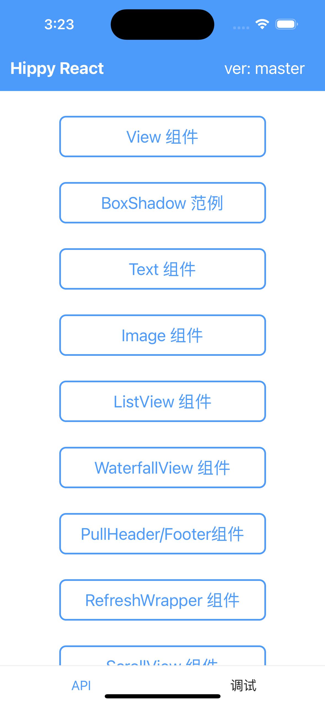

# 开始接入

Hippy 采用 `monorepo` 进行代码管理，多仓库 SDK 统一版本，前端可以直接引入对应的 NPM 包，终端可通过发布分支源码接入或通过对应的包管理仓库引入。

Demo代码位于examples目录，如果你对阅读代码更感兴趣，可直接[进入github查看](https//github.com/Tencent/Hippy/tree/master/examples)

---

# 快速体验

## 环境准备

### macOS开发环境

可以在macOS上开发iOS，Android应用，请求根据需要进行环境配置。

首先，通过Homebrew包管理工具安装git, git-lfs, node(v16) and npm(v7)

```shell
brew install git git-lfs node@16
```

#### 编译iOS Demo环境准备

1. Xcode

    通过Apple App Store安装[Xcode](https://apps.apple.com/cn/app/xcode/id497799835?l=en-GB&mt=12)

2. 通过gem命令安装Cocoapods

    `sudo gem install cocoapods`


#### 编译Android Demo环境准备

1. Android Studio

    通过android开发者平台下载安装[Android Studio](https://developer.android.com/studio)
    
2. Android NDK

    通过android开发者平台下载安装[NDK](https://developer.android.com/ndk?hl=en)

### Windows开发环境

可以Windows上开发Android应用，请安装以下依赖。

1. Android Studio

    通过android开发者平台下载安装[Android Studio](https://developer.android.com/studio)
    
2. Android NDK

    通过android开发者平台下载安装[NDK](https://developer.android.com/ndk?hl=en)

3. Git for Windows

    通过(https://gitforwindows.org)下载安装Git for Windows

4. Node和NPM

    通过指引安装[nodejs和npm](https://docs.npmjs.com/downloading-and-installing-node-js-and-npm)，建议使用Node v16，NPM v7版本


## 代码拉取

```shell
git clone --branch master https://github.com/Tencent/Hippy.git
```

!> Hippy 2.0主干代码位于master分支，Hippy 3.0主干代码位于main分支，本文适用于2.0，因此分支指定为master

## 编译运行Demo

以下基于macOS平台，分别说明如何编译Android和iOS Demo。

### 编译运行iOS Demo

```shell
# 进入Hippy源码目录
cd ./Hippy/examples/ios-demo
# 通过Cocoapods生成workspace
pod install
# 打开workspace，编译运行即可
open HippyDemo.xcworkspace
```

### 编译运行Android Demo

1. 使用 Android Studio 打开根目录 `Android Project` 项目。
2. 使用 USB 线连接 Android 设备，并确保设备 USB 调试模式已经开启（电脑 Terminal 执行 `adb devices` 检查手机连接状态）。
3. Android Studio 执行项目构建，并安装 APK运行。

Demo运行起来后，可见效果类似



## 动手尝试

如果你不满足于简单把Demo跑起来，还可以动手尝试修改前端代码，可以按照以下指引进行。

### 了解Demo项目代码

Demo项目位于examples目录

```shell
steven@STEVEN-MC Hippy % ls  examples 
total 0
drwxr-xr-x   8 steven  staff  256 Oct 30 14:53 android-demo
drwxr-xr-x   8 steven  staff  256 Oct 30 14:53 hippy-react-demo
drwxr-xr-x   9 steven  staff  288 Oct 30 14:53 hippy-vue-demo
drwxr-xr-x  11 steven  staff  352 Oct 30 14:53 hippy-vue-next-demo
drwxr-xr-x  12 steven  staff  384 Dec  6 20:24 ios-demo

```

其中前端hippy-react-demo、hippy-vue-demo、hippy-vue-next-demo这3者为前端项目Demo，分别演示基于hippy-react、hippy-vue、hippy-vue-next开发项目。
android-demo为Android Native工程代码，ios-demo为iOS Native工程代码，这两个是运行demo前端项目的容器。

### 修改前端工程

以hippy-react-demo为例，打开hippy-react-demo/src/app.jsx，编辑render()函数

```jsx
render() {
  return (
      <SafeAreaView statusBarColor="#4c9afa">
        <View style={{backgroundColor: '#f0f0f0f0', flex: 1, justifyContent: 'center', alignItems: 'center'}}>
          <Text style={{fontSize: 24, color: '#0f0f0f'}}>Hello World!</Text>
        </View>
      </SafeAreaView>
  );
}
```

### 编译修改后的前端工程

以编译hippy-react-demo为例，在Hippy**根目录**执行命令

```shell
npm run init

# 该命令由 `npm install && npx lerna bootstrap && npm run build` 组成，你也可以分别执行这几个命令。
#
# npm install: 安装项目所需的脚本依赖。
#
# `npx lerna bootstrap`: 安装每一个 JS 包的依赖。（Hippy 使用 [Lerna](https://lerna.js.org/) 管理多个 js 包）
#
# `npm run build`: 构建每一个 JS SDK 包。

# 编译hippy-react-demo
npm run buildexample hippy-react-demo

# 如果上一条命令有异常，可以执行以下命令
cd examples/hippy-react-demo
npm install --legacy-peer-deps
cd ../..
npm run buildexample hippy-react-demo
```

执行完后，构建产物将会被打包放到examples/hippy-react-demo/dist目录中，目录内容类似

```shell
examples/hippy-react-demo/dist
├── android
│   ├── assets
│   │   ├── defaultSource.jpg
│   │   └── hippyLogoWhite.png
│   ├── asyncComponentFromHttp.android.js
│   ├── asyncComponentFromLocal.android.js
│   ├── index.android.js
│   ├── vendor-manifest.json
│   └── vendor.android.js
└── ios
    ├── assets
    │   ├── defaultSource.jpg
    │   └── hippyLogoWhite.png
    ├── asyncComponentFromHttp.ios.js
    ├── asyncComponentFromLocal.ios.js
    ├── index.ios.js
    ├── vendor-manifest.json
    └── vendor.ios.js

5 directories, 14 files
```

### 运行前端编译产物

把examples/hippy-react-demo/dist/ios目录内容整体拷贝到ios demo的res目录，当用Android来跑时拷贝到Android对应的目录。

```shell
cp -R examples/hippy-react-demo/dist/ios/*  examples/ios-demo/res/
cp -R examples/hippy-react-demo/dist/android/*  examples/android-demo/res/
```

接下来，按照[编译运行Demo](#编译运行demo)一节运行Demo。
效果如图所示


恭喜你完成了Hippy的初步体验，下一步将Hippy接入到你现有的工程吧。

# 终端接入

如果要接入 Hippy 到现有终端项目，请参考 [Android 集成](android/integration.md) 和 [iOS 集成](ios/integration.md) 教程。

# 前端接入

Hippy 同时支持 React 和 Vue 两种 UI 框架，通过 [@hippy/react](//www.npmjs.com/package/@hippy/react) 和 [@hippy/vue](//www.npmjs.com/package/@hippy/vue) 两个包提供实现。

## hippy-react

[[hippy-react 介绍]](hippy-react/introduction.md) [[范例工程]](//github.com/Tencent/Hippy/tree/master/examples/hippy-react-demo)

hippy-react 工程暂时只能通过手工配置初始化，建议直接 clone 范例工程并基于它进行修改。

当然，也可以从头开始进行配置。

### 准备 hippy-react 运行时依赖

请使用 `npm i` 安装以下 npm 包。

| 包名                | 说明                       |
| ------------------- | -------------------------- |
| @hippy/react        | hippy-react 运行时和渲染层 |
| react               | react 本体                 |
| regenerator-runtime | async/await 转换运行时     |

### 准备 hippy-react 编译时依赖

以官方提供的 [范例工程](//github.com/Tencent/Hippy/tree/master/examples/hippy-react-demo) 范例工程为例，需要使用 `npm i -D` 准备好以下依赖，当然开发者可以根据需要自行选择：

必须的：

| 包名                                    | 说明                                           |
| --------------------------------------- | ---------------------------------------------- |
| @babel/plugin-proposal-class-properties | Babel 插件 - 支持仍在草案的 Class Properties   |
| @babel/preset-env                       | Babel 插件 - 根据所设置的环境选择 polyfill     |
| @babel/preset-react                     | Babel 插件 - 转译 JSX 到 JS                    |
| @hippy/debug-server                     | Hippy 前终端调试服务                           |
| @babel/core                             | Babel - 高版本 ES 转换为 ES6 和 ES5 的转译程序 |
| babel-loader                            | Webpack 插件 - 加载 Babel 转译后的代码         |
| webpack                                 | Webpack 打包程序                               |
| webpack-cli                             | Webpack 命令行                                 |

可选的：

| 包名                                | 说明                                       |
| ----------------------------------- | ------------------------------------------ |
| @hippy/hippy-live-reload-polyfill   | live-reload 必备脚本 - 会在调试模式编译时注入代码到工程里 |
| @hippy/hippy-dynamic-import-plugin  | 动态加载插件 - 拆分出子包用于按需加载
| @babel/plugin-x                     | Babel 其余相关插件，如 `@babel/plugin-proposal-nullish-coalescing-operator` 等 |
| case-sensitive-paths-webpack-plugin | Webpack 插件，对 import 文件进行大小写检查 |
| file-loader                         | 静态文件加载                               |
| url-loader                          | 静态文件以 Base64 形式加载                 |

### hippy-react 编译配置

当前 hippy-react 采用 `Webpack 4`构建，配置全部放置于 [scripts](//github.com/Tencent/Hippy/tree/master/examples/hippy-react-demo/scripts) 目录下，其实只是 [webpack](//webpack.js.org/) 的配置文件，建议先阅读 [webpack](//webpack.js.org/) 官网内容，具备一定基础后再进行修改。

#### hippy-react 开发调试编译配置

该配置展示了将 Hippy 运行于终端的最小化配置。

| 配置文件                                                     | 说明       |
| ------------------------------------------------------------ | ---------- |
| [hippy-webpack.dev.js](//github.com/Tencent/Hippy/blob/master/examples/hippy-react-demo/scripts/hippy-webpack.dev.js) | 调试用配置 |

#### hippy-react 生产环境编译配置

生产环境和开发调试的包主要有两个区别：

1. 生产环境开启了 production 模式，去掉调试信息，关闭了 `watch`（watch 模式下会监听文件变动并重新打包）。
2. 终端内很可能不止运行一个 Hippy 业务，所以将共享的部分单独拆出来做成了 `vendor` 包，这样可以有效减小业务包体积，这里使用了 [DllPlugin](//webpack.js.org/plugins/dll-plugin/) 和 [DllReferencePlugin](//webpack.js.org/plugins/dll-plugin/#dllreferenceplugin) 来实现。

| 配置文件                                                     | 说明                          |
| ------------------------------------------------------------ | ----------------------------- |
| [vendor.js](//github.com/Tencent/Hippy/blob/master/examples/hippy-react-demo/scripts/vendor.js) | vendor 包中需要包含的共享部分 |
| [hippy-webpack.ios.js](//github.com/Tencent/Hippy/blob/master/examples/hippy-react-demo/scripts/hippy-webpack.ios.js) | iOS 业务包配置                |
| [hippy-webpack.ios-vendor.js](//github.com/Tencent/Hippy/blob/master/examples/hippy-react-demo/scripts/hippy-webpack.ios-vendor.js) | iOS Vendor 包配置             |
| [hippy-webpack.android.js](//github.com/Tencent/Hippy/blob/master/examples/hippy-react-demo/scripts/hippy-webpack.android.js) | Android 业务包配置            |
| [hippy-webpack.android-vendor.js](//github.com/Tencent/Hippy/blob/master/examples/hippy-react-demo/scripts/hippy-webpack.android-vendor.js) | Android Vendor 包配置             |

如果仔细观察 webpack 配置，可以看出 iOS 和 Android 配置相差不大，但因为 iOS 上受苹果政策影响只能使用 [JavaScriptCore](//developer.apple.com/documentation/javascriptcore)（以下简称 JSC）作为运行环境，而 JSC 是跟随 iOS 操作系统的，无法进行独立升级，低版本 iOS 带的 JSC 甚至无法完整支持 ES6，所以需要输出一份 ES5 版本的 JS 代码。而 Android 下可以使用独立升级的 [X5](//x5.tencent.com/) 中的 V8 作为运行环境，就可以直接使用 ES6 代码了。

!> **特别说明：** JS 可以使用的语法受到 iOS 覆盖的最低版本的影响，绝大多数能力可以通过 `@babel/preset-env` 自动安装 polyfill，但是部分特性不行，例如要使用 [Proxy](//caniuse.com/#feat=proxy)，就无法覆盖 iOS 10 以下版本。

### hippy-react 入口文件

入口文件非常简单，只是从 hippy-react 里初始化一个 Hippy 实例。注意，入口文件组件需要通过单节点包裹，如下：

```js
import { Hippy } from '@hippy/react';
import App from './app';

new Hippy({
  appName: 'Demo',  // 终端分配的业务名称
  entryPage: App,   // 对应业务启动时的组件
  silent: false,    // 设置为 true 可以关闭框架日志输出
}).start();

// P.S. entryPage需要通过单节点包裹，不能用数组的形式，例如
import React from 'react';
import {
    View,
    Text,
} from '@hippy/react';
export default function app() {
    // 入口文件不要使用这种形式，非入口文件可以使用
    return [
        <View key="root_blk" />,
        <Text key="root_txt">test test</Text>
    ];
    // 修改成通过单节点包裹
    return (<View>
            <View key="root_blk" />,
            <Text key="root_txt">test test</Text>
        </View>);
}

```

### hippy-react npm 脚本

在 [package.json](//github.com/Tencent/Hippy/blob/master/examples/hippy-react-demo/package.json#L13) 中提供了几个以 `hippy:`开头的 npm 脚本，可用来启动 [@hippy/debug-server-next](//www.npmjs.com/package/@hippy/debug-server-next) 等调试工具。

```json
  "scripts": {
    "hippy:dev": "node ./scripts/env-polyfill.js hippy-dev --config ./scripts/hippy-webpack.dev.js",
    "hippy:vendor": "node ./scripts/env-polyfill.js webpack --config ./scripts/hippy-webpack.ios-vendor.js --config ./scripts/hippy-webpack.android-vendor.js",
    "hippy:build": "node ./scripts/env-polyfill.js webpack --config ./scripts/hippy-webpack.ios.js --config ./scripts/hippy-webpack.android.js"
  }
```

### hippy-react 转 Web

请参考专门的 [hippy-react 转 Web 章节](hippy-react/web.md)。

## hippy-vue

[[hippy-vue 介绍]](hippy-vue/introduction.md) [[范例工程]](//github.com/Tencent/Hippy/tree/master/examples/hippy-vue-demo)

hippy-vue 相对简单很多，hippy-vue 只是 [Vue](//vuejs.org) 在终端上的渲染层，组件也基本和浏览器保持一致。可以通过 [vue-cli](//cli.vuejs.org/) 先[创建一个 Web 项目](//cli.vuejs.org/zh/guide/creating-a-project.html)，然后加上一些 hippy-vue 的内容就可以直接将网页渲染到终端了。

### 准备 hippy-vue 运行时依赖

请使用 `npm i` 安装以下 npm 包，保证运行时正常。

| 包名                        | 说明                             |
| --------------------------- | -------------------------------- |
| @hippy/vue                   | hippy-vue 运行时核心             |
| @hippy/vue-native-components | hippy-vue 的扩展终端组件         |
| @hippy/vue-router            | vue-router 在 hippy-vue 上的移植 |

### hippy-vue 编译时依赖

以官方提供的 [范例工程](//github.com/Tencent/Hippy/tree/master/examples/hippy-vue-demo) 范例工程为例，需要使用 `npm i -D` 准备好以下依赖，当然开发者可以根据需要自行选择：

必须的：

| 包名                 | 说明                                       |
| -------------------- | ------------------------------------------ |
| @hippy/debug-server   | Hippy 前终端调试服务                       |
| @hippy/vue-css-loader | hippy-vue 的 CSS 文本到 JS 语法树转换      |
| @babel/preset-env                       | Babel 插件 - 根据所设置的环境选择 polyfill     |
| @babel/core                             | Babel - 高版本 ES 转换为 ES6 和 ES5 的转译程序 |
| babel-loader                            | Webpack 插件 - 加载 Babel 转译后的代码         |
| webpack                                 | Webpack 打包程序                               |
| webpack-cli                             | Webpack 命令行                                 |

可选的：

| 包名                                | 说明                                       |
| ----------------------------------- | ------------------------------------------ |
| case-sensitive-paths-webpack-plugin | Webpack 插件，对 import 文件进行大小写检查 |
| @hippy/hippy-live-reload-polyfill   | live-reload 必备脚本 - 会在调试模式编译时注入代码到工程里 |
| @hippy/hippy-dynamic-import-plugin  | 动态加载插件 - 拆分出子包用于按需加载
| @babel/plugin-x                     | Babel 其余相关插件，如 `@babel/plugin-proposal-nullish-coalescing-operator` 等 |
| file-loader                         | 静态文件加载                               |
| url-loader                          | 静态文件以 Base64 形式加载                 |

### hippy-vue 编译配置

当前 hippy-vue 采用 `Webpack 4`构建，配置全部放置于 [scripts](//github.com/Tencent/Hippy/tree/master/examples/hippy-vue-demo/scripts) 目录下，其实只是 [webpack](//webpack.js.org/) 的配置文件，建议先阅读 [webpack](//webpack.js.org/) 官网内容，具备一定基础后再进行修改。

#### hippy-vue 开发调试编译配置

该配置展示了将 Hippy 运行于终端的最小化配置。

| 配置文件                                                     | 说明       |
| ------------------------------------------------------------ | ---------- |
| [hippy-webpack.dev.js](//github.com/Tencent/Hippy/blob/master/examples/hippy-vue-demo/scripts/hippy-webpack.dev.js) | 调试用配置 |

#### hippy-vue 生产环境编译配置

线上包和开发调试用包主要有两个区别：

1. 开启了 production 模式，去掉调试信息，关闭了 `watch`（watch 模式下会监听文件变动并重新打包）。
2. 终端内很可能不止运行一个 Hippy 业务，所以将共享的部分单独拆出来做成了 `vendor` 包，这样可以有效减小业务包体积，这里使用了 [DllPlugin](//webpack.js.org/plugins/dll-plugin/) 和 [DllReferencePlugin](//webpack.js.org/plugins/dll-plugin/#dllreferenceplugin) 来实现。

| 配置文件                                                     | 说明                          |
| ------------------------------------------------------------ | ----------------------------- |
| [vendor.js](//github.com/Tencent/Hippy/blob/master/examples/hippy-vue-demo/scripts/vendor.js) | vendor 包中需要包含的共享部分 |
| [hippy-webpack.ios.js](//github.com/Tencent/Hippy/blob/master/examples/hippy-vue-demo/scripts/hippy-webpack.ios.js) | iOS 业务包配置                |
| [hippy-webpack.ios-vendor.js](//github.com/Tencent/Hippy/blob/master/examples/hippy-vue-demo/scripts/hippy-webpack.ios-vendor.js) | iOS Vendor 包配置             |
| [hippy-webpack.android.js](//github.com/Tencent/Hippy/blob/master/examples/hippy-vue-demo/scripts/hippy-webpack.android.js) | Android 业务包配置            |
| [hippy-webpack.android-vendor.js](//github.com/Tencent/Hippy/blob/master/examples/hippy-vue-demo/scripts/hippy-webpack.android-vendor.js) | Android Vendor 包配置             |

如果仔细观察 webpack 配置，可以看出 iOS 和 Android 配置相差不大，但因为 iOS 上受苹果政策影响只能使用 [JavaScriptCore](//developer.apple.com/documentation/javascriptcore)（以下简称 JSC）作为运行环境，而 JSC 是跟随 iOS 操作系统的，无法进行独立升级，低版本 iOS 带的 JSC 甚至无法完整支持 ES6，所以需要输出一份 ES5 版本的 JS 代码。而 Android 下可以使用独立升级的 [X5](//x5.tencent.com/) 中的 V8 作为运行环境，就可以直接使用 ES6 代码了。

!> **特别说明：** JS 可以使用的语法受到 iOS 覆盖的最低版本的影响，绝大多数能力可以通过 `@babel/preset-env` 自动安装 polyfill，但是部分特性不行，例如要使用 [Proxy](//caniuse.com/#feat=proxy)，就无法覆盖 iOS 10 以下版本。

### hippy-vue 入口文件

hippy-cli 初始化的项目自带了一个 [Web 端入口文件](//github.com/Tencent/Hippy/blob/master/examples/hippy-vue-demo/src/main.js)，可以保留着用来启动 Web 端网页，但是因为 hippy-vue 的启动参数不一样，需要专门的 [终端入口文件](//github.com/Tencent/Hippy/blob/master/examples/hippy-vue-demo/src/main-native.js)来加载一些终端上用到的模块。

```js
import Vue from 'vue';
import VueRouter from 'vue-router';
import HippyVueNativeComponents from '@hippy/vue-native-components';
import App from './app.vue';
import routes from './routes';
import { setApp } from './util';

// 禁止框架调试信息输出，取消注释即可使用。
// Vue.config.silent = true;

Vue.config.productionTip = false;

// Hippy 终端组件扩展中间件，可以使用 modal、view-pager、tab-host、ul-refresh 等终端扩展组件了。
Vue.use(HippyVueNativeComponents);
Vue.use(VueRouter);

const router = new VueRouter(routes);

/**
 * 声明一个 app，这是同步生成的
 */
const app = new Vue({
  // 终端指定的 App 名称
  appName: 'Demo',
  // 根节点，必须是 Id，当根节点挂载时才会触发上屏
  rootView: '#root',
  // 渲染自己
  render: h => h(App),
  // iPhone 下的状态栏配置
  iPhone: {
    // 状态栏配置
    statusBar: {
      // 禁用状态栏自动填充
      // disabled: true,

      // 状态栏背景色，如果不配的话，会用 4282431619，也就是 #40b883 - Vue 的绿色
      // 因为运行时只支持样式和属性的实际转换，所以需要用下面的转换器将颜色值提前转换，可以在 Node 中直接运行。
      // hippy-vue-css-loader/src/compiler/style/color-parser.js
      backgroundColor: 4283416717,

      // 状态栏背景图，要注意这个会根据容器尺寸拉伸。
      // backgroundImage: '//mat1.gtimg.com/www/qq2018/imgs/qq_logo_2018x2.png',
    },
  },
  // 路由
  router,
});

/**
 * $start 是 Hippy 启动完以后触发的回调
 * Vue 会在 Hippy 启动之前完成首屏 VDOM 的渲染，所以首屏性能非常高
 * 在 $start 里可以通知终端说已经启动完成，可以开始给前端发消息了。
 */
app.$start((/* app */) => {
  // 这里干一点 Hippy 启动后的需要干的事情，比如通知终端前端已经准备完毕，可以开始发消息了。
  // setApp(app);
});

/**
 * 保存 app 供后面通过 app 接受来自终端的事件。
 *
 * 之前是放到 $start 里的，但是有个问题时因为 $start 执行太慢，如果首页就 getApp() 的话可能会
 * 导致获得了 undefined，然后监听失败。所以挪出来了。
 *
 * 但是终端事件依然要等到 $start 也就是 Hippy 启动之后再发，因为之前桥尚未建立，终端发消息前端也
 * 接受不到。
 */
setApp(app);
```

### hippy-vue npm 脚本

在 [package.json](//github.com/Tencent/Hippy/blob/master/examples/hippy-vue-demo/package.json#L13) 中提供了几个以 `hippy:`开头的 npm 脚本，可用来启动 [@hippy/debug-server-next](//www.npmjs.com/package/@hippy/debug-server-next) 等调试工具。

```json
  "scripts": {
    "hippy:dev": "node ./scripts/env-polyfill.js hippy-dev --config ./scripts/hippy-webpack.dev.js",
    "hippy:vendor": "node ./scripts/env-polyfill.js webpack --config ./scripts/hippy-webpack.ios-vendor.js --config ./scripts/hippy-webpack.android-vendor.js",
    "hippy:build": "node ./scripts/env-polyfill.js webpack --config ./scripts/hippy-webpack.ios.js --config ./scripts/hippy-webpack.android.js"
  },
```

### 路由

`@hippy/vue-router` 完整支持 vue-router 中的跳转功能，具体请参考 [hippy-vue-router](hippy-vue/router.md) 文档。

