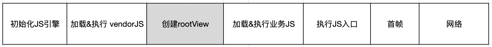

# 性能监控

---

## SDK启动加载性能指标

> 最低支持版本 `2.16.0`

### 介绍

`Hippy` Native SDK的加载执行过程如下图所示：



对应上述各个阶段，`Hippy` Native SDK提供了对应的耗时等性能指标方便开发者获取，如下表所示：

| 分类  | 指标  | 对应Key  |
|:----------|:----------|:----------|
| JS引擎 | 初始化JS引擎耗时（仅Android） | hippyInitJsFramework |
| vendor包    | vendor包加载耗时    | hippyCommonLoadSource |
| vendor包    | vendor包执行耗时    | hippyCommonExecuteSource |
| 业务包    | 业务包加载耗时    | hippySecondaryLoadSource |
| 业务包    | 业务包执行耗时    | hippySecondaryExecuteSource |
| 整体    | Bridge启动耗时    | hippyBridgeStartup |
| 整体    | JS入口执行耗时    | hippyRunApplication |
| 整体    | 首帧耗时  | hippyFirstPaint |


### Native 获取性能数据

#### Android API 指引

##### 1. 注入`HippyEngineMonitorAdapter`

```java
public class MyEngineMonitorAdapter extends DefaultEngineMonitorAdapter {
    @Override
    public void reportEngineLoadResult(int code, int loadTime,
        List<HippyEngineMonitorEvent> loadEvents, Throwable e) {
        // 引擎创建完成回调
    }

    @Override
    public void reportModuleLoadComplete(HippyRootView rootView, int loadTime,
        List<HippyEngineMonitorEvent> loadEvents) {
        // 业务JS加载完成，首帧回调
    }

    @Override
    public void reportCustomMonitorPoint(HippyRootView rootView, String eventName,
        long timeMillis) {
        // 自定义打点回调
    }

}
```

```java
HippyEngine.EngineInitParams initParams = new HippyEngine.EngineInitParams();
initParams.engineMonitor = new MyEngineMonitorAdapter();
……
HippyEngine engine = HippyEngine.create(initParams);
```

##### 2. 获取性能数据

推荐在reportModuleLoadComplete之后调用，以便获取完整的性能数据。

使用方法为

```java
TimeMonitor monitor = rootView == null ? null : rootView.getTimeMonitor();
if (monitor != null) {
    Map<String, Long> points = monitor.getAllPoints();
}
```

`HippyEngineMonitorPoint`类中定义了每个性能指标对应的常量，命名规则为：`hippyXxx`对应`XXX_START`和`XXX_END`。

#### iOS API 指引

推荐在HippyRootView加载完成（即收到`HippyContentDidAppearNotification` 通知后）进行性能指标的获取。

使用方法为

```objc
int64_t duration = [bridge.performanceLogger durationForTag:HippyPLxxx];
```

`HippyPLxxx`在`HippyPerformanceLogger`类中定义，为`HippyPLTag`枚举类型。

---

## Memory

提供全局 `performance` 对象，用于获取性能数据。

`performance.memory` 返回 js 引擎中内存的统计数据（仅 Android 支持，iOS 将返回 `undefined` ）。
> 最低支持版本 `2.15.0`

```javascript

global.performance.memory = undefined || {
  jsHeapSizeLimit: 4096, // 堆内存大小限制
  totalJSHeapSize: 2048, // 可使用的堆内存
  usedJSHeapSize: 1024, // 已使用的堆内存
  jsNumberOfNativeContexts: 1, // 当前活动的顶层上下文的数量（随着时间的推移，此数字的增加表示内存泄漏）
  jsNumberOfDetachedContexts: 0, // 已分离但尚未回收垃圾的上下文数（该数字不为零表示潜在的内存泄漏）
}

```

