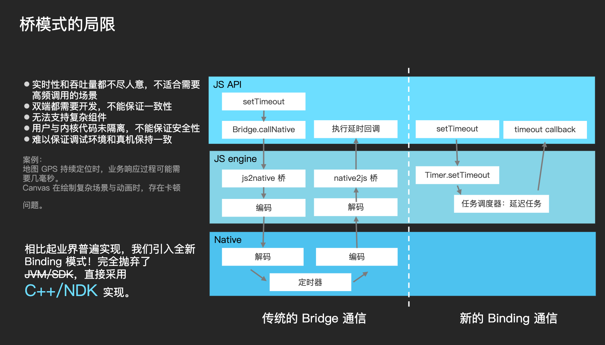

# HippyCore 架构

Hippy 开发的时候，前端 JS 经常需要访问一些双端（Android 和 iOS）通用能力，Hippy 推荐使用 `internalBinding` 来实现底层能力扩展（我们将这项能力称为 [Core 架构](//github.com/Tencent/Hippy/tree/master/core)），它和 Node.js 的 internalBinding 一样，使用 C++ 进行开发，直接共享 JS 和 C++ 运行环境和数据，提供了非常高的 JS 和终端通信性能。

它的原理是在 JS 环境中直接插入函数、类等方式，JS 使用这些函数或方法，可以直接访问 C++ 代码。

但如果涉及到平台相关，依然需要分平台桥接。

目前 Hippy 里的[定时器](../guide/timer.md)和[日志](../guide/console.md)模块都是使用 Core 实现。



# C++ 模块扩展

我们将以 TestModule 为例，从头扩展一个 Module，这个 Module 将展示前端如何调用终端能力，并且把结果返回给前端。

## 继承 ModuleBase

在 [core/modules/](//github.com/Tencent/Hippy/tree/master/core/modules) 下创建 test-module.h

```cpp
#ifndef CORE_MODULES_TEST_MODULE_H_
#define CORE_MODULES_TEST_MODULE_H_

#include "core/modules/module-base.h"
#include "core/napi/callback-info.h"

class TestModule : public ModuleBase {
  public:
    explicit TestModule(hippy::napi::napi_context context){};
    void RetStr(const hippy::napi::CallbackInfo& info);
    void Print(const hippy::napi::CallbackInfo& info);
};

#endif // CORE_MODULES_TEST_MODULE_H_
```

在 [core/modules/](//github.com/Tencent/Hippy/tree/master/core/modules) 下创建 test-module.cc

```cpp
#include "core/modules/module-register.h"
#include "core/modules/test-module.h"
#include "core/napi/js-native-api.h"
#include "core/base/logging.h"
REGISTER_MODULE(TestModule, RetStr)
REGISTER_MODULE(TestModule, Print)

void TestModule::RetStr(const hippy::napi::CallbackInfo& info) {
  std::shared_ptr<Environment> env = info.GetEnv();
  hippy::napi::napi_context context = env->getContext();
  HIPPY_CHECK(context);

  info.GetReturnValue()->Set(hippy::napi::napi_create_string(context, "hello world"));
}

void TestModule::Print(const hippy::napi::CallbackInfo& info) {
  std::shared_ptr<Environment> env = info.GetEnv();
  hippy::napi::napi_context context = env->getContext();
  HIPPY_CHECK(context);
  HIPPY_LOG(hippy::Debug, "hello world");

  info.GetReturnValue()->SetUndefined();
}

```

# JS 桥接

双平台通用模块一般放在 [core/js/global](//github.com/Tencent/Hippy/tree/master/core/js/global) 下，我们在 global 下 增加 TestModule.js

```js
const TestModule = internalBinding('TestModule');

global.TestModule = TestModule;
```

[core/js/entry/](//github.com/Tencent/Hippy/tree/master/core/js/entry) 下双平台 hippy.js 里增加

```js
require('../../global/TestModule.js');
```

在 Hippy 目录下运行 `npm run buildcore`，会生成对应双平台的 C++ 源代码：

* [native-source-code-android.cc](//github.com/Tencent/Hippy/blob/master/core/napi/v8/native-source-code-android.cc)
* [native-source-code-ios.cc](//github.com/Tencent/Hippy/blob/master/core/napi/jsc/native-source-code-ios.cc)

# 重新编译 Core

无需做别的改动，重新编译终端 SDK 即可，终端 SDK 能够链接到 `core` 目录中的对应 C++ 代码，需要注意 Android 需要准备好 cmake、ndk 等等编译环境。

# 效果

```js
global.TestModule.Print();
global.TestModule.RetStr();
2019-11-08 17:32:57.630 7004-7066/? D/HippyCore: hello world
```

