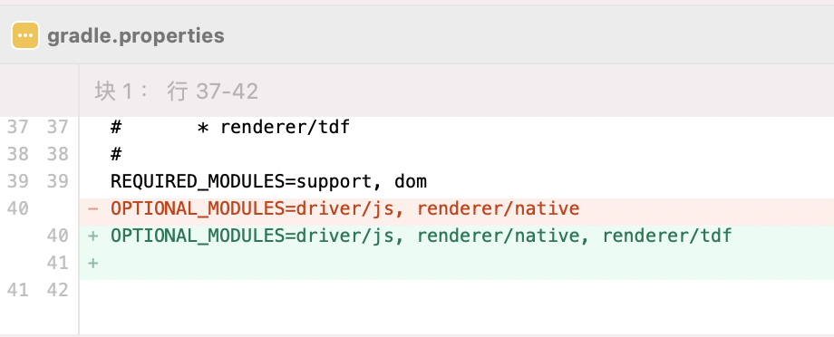
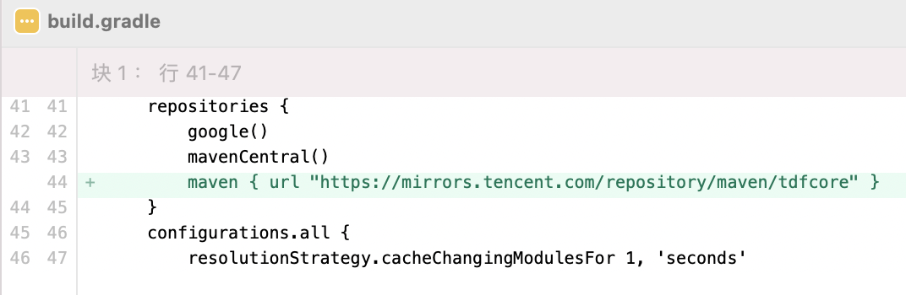
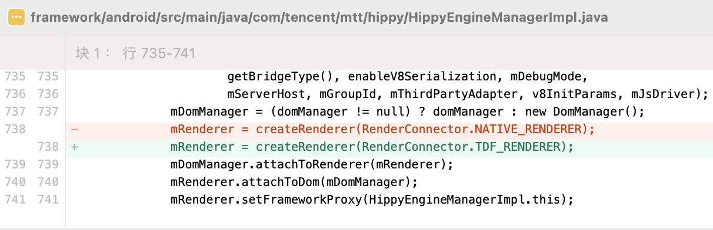
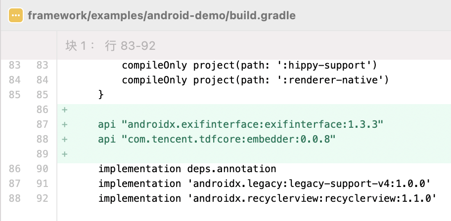

# TDFRender 介绍

TDFRender 是 c++ 实现的跨平台渲染器，统一了 Android / iOS 平台的组件实现和事件处理。

这篇教程，讲述了 Android / iOS 工程如何使用 TDFRender。

---

# Android / iOS 集成

集成 Hippy 的方法:

* Android 平台同 [Android 集成](../android/integration.md)
* iOS 平台同 [iOS 集成](../ios/integration.md)

# 使用 TDFRender

## Android Demo 体验

### 1.引入 TDFRender 模块

gradle.properties 文件修改：


### 2.引入暂用 maven 源

```text
maven { url "https://mirrors.tencent.com/repository/maven/tdfcore" }
```

build.gradle 文件修改：


### 3.打开 TDFRender

framework/android/src/main/java/com/tencent/mtt/hippy/HippyEngineManagerImpl.java 文件修改：


### 4.Demo 添加依赖

framework/examples/android-demo/build.gradle 文件修改：


## iOS Demo 体验

规划中。
